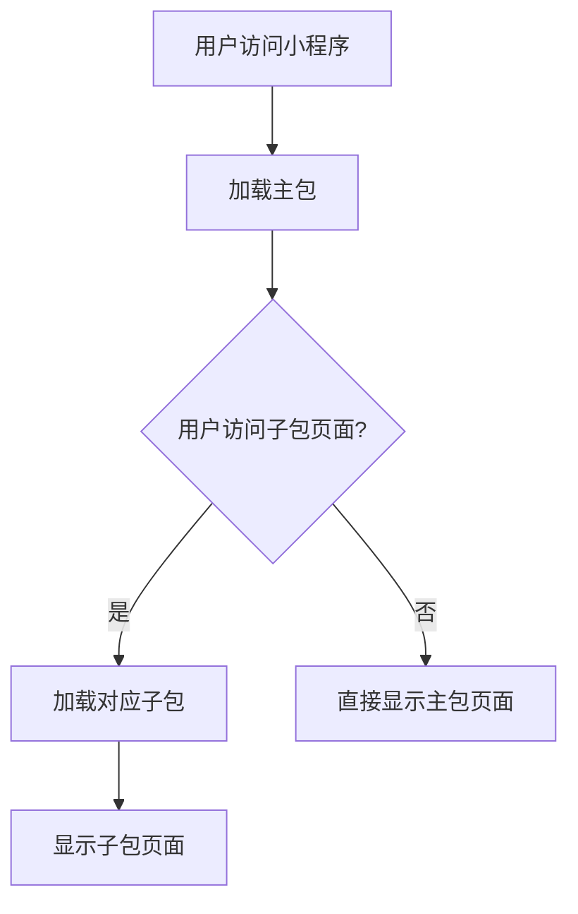

# 分包加载策略

在小程序开发中，随着功能的不断增加，代码体积也会逐渐增大。如果所有代码都打包在一个主包中，可能会导致小程序启动速度变慢，影响用户体验。为了解决这个问题，小程序提供了**分包加载策略**，允许开发者将代码分成多个包，按需加载，从而优化小程序的性能。

## 什么是分包加载？

分包加载是指将小程序的代码分成多个独立的包，主包包含核心功能和页面，而其他功能则放在子包中。当用户访问某个功能时，再动态加载对应的子包。这样可以减少主包的体积，加快小程序的启动速度。

:::note
分包加载是小程序性能优化的重要手段之一，特别适合功能复杂、页面较多的小程序。
:::

## 分包加载的优势

1. **减少主包体积**：将非核心功能放到子包中，减少主包的大小，提升启动速度。
2. **按需加载**：用户只有在访问特定功能时才会加载对应的子包，节省流量和内存。
3. **提升用户体验**：通过优化加载速度，用户可以更快地进入小程序的核心功能。

## 如何配置分包加载？

在小程序的 `app.json` 文件中，可以通过 `subPackages` 或 `subpackages` 字段来配置分包。每个分包需要指定 `root`（分包根目录）和 `pages`（分包中的页面路径）。

以下是一个简单的分包配置示例：

```json
{
  "pages": [
    "pages/index/index",
    "pages/logs/logs"
  ],
  "subPackages": [
    {
      "root": "packageA",
      "pages": [
        "pages/cat/cat",
        "pages/dog/dog"
      ]
    },
    {
      "root": "packageB",
      "pages": [
        "pages/apple/apple",
        "pages/banana/banana"
      ]
    }
  ]
}
```

在这个例子中：
- 主包包含 `pages/index/index` 和 `pages/logs/logs` 两个页面。
- `packageA` 分包包含 `pages/cat/cat` 和 `pages/dog/dog` 两个页面。
- `packageB` 分包包含 `pages/apple/apple` 和 `pages/banana/banana` 两个页面。

:::tip
分包的 `root` 字段指定了分包的根目录，`pages` 字段中的路径是相对于 `root` 的路径。
:::

## 分包加载的工作原理

当用户访问小程序时，主包会首先加载并启动。如果用户访问某个子包中的页面，小程序会动态加载对应的子包。这个过程对用户是透明的，开发者只需要配置好分包即可。



## 实际应用场景

### 场景 1：电商小程序

一个电商小程序可能包含首页、商品列表、商品详情、购物车、订单等多个功能模块。如果所有功能都放在主包中，主包体积会非常大，导致启动速度变慢。通过分包加载，可以将商品详情、购物车、订单等功能放到子包中，用户只有在访问这些功能时才会加载对应的子包。

### 场景 2：社交小程序

社交小程序可能包含聊天、朋友圈、动态发布等功能。通过分包加载，可以将朋友圈和动态发布功能放到子包中，减少主包体积，提升启动速度。

## 注意事项

1. **主包限制**：主包的大小不能超过 2MB，所有分包的总大小不能超过 20MB。
2. **分包独立性**：分包之间是相互独立的，不能直接访问其他分包的资源。
3. **公共代码**：如果多个分包需要共享某些代码或资源，可以将这些代码放到主包中。

:::caution
分包加载虽然能优化性能，但过度分包可能会导致加载次数增加，反而影响用户体验。因此，需要根据实际需求合理规划分包。
:::

## 总结

分包加载是小程序开发中非常重要的性能优化手段。通过合理配置分包，可以减少主包体积，提升小程序的启动速度和用户体验。在实际开发中，开发者应根据功能模块的复杂度和用户访问频率，合理规划分包策略。

## 附加资源与练习

1. **官方文档**：阅读 [微信小程序官方文档](https://developers.weixin.qq.com/miniprogram/dev/framework/subpackages.html) 了解更多关于分包加载的细节。
2. **练习**：尝试在自己的小程序项目中配置分包加载，观察主包体积和启动速度的变化。
3. **进阶学习**：了解如何通过分包预加载进一步优化小程序的性能。

通过以上内容，你应该对小程序的分包加载策略有了全面的了解。接下来，动手实践吧！