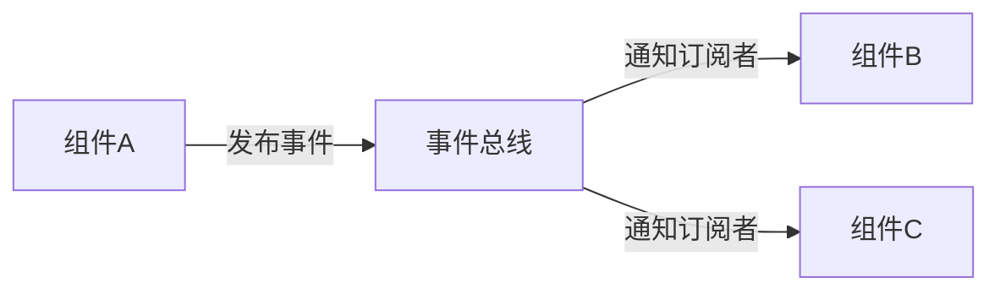

# 事件总线

事件总线（Event Bus）是一种设计模式，用于在应用程序的不同组件之间传递消息或事件。它允许组件之间进行松耦合的通信，而不需要直接引用彼此。在小程序开发中，事件总线常用于管理跨组件的状态或行为。

## 什么是事件总线？

事件总线是一个中心化的消息传递系统，允许组件发布（emit）和订阅（subscribe）事件。当一个组件发布一个事件时，所有订阅了该事件的组件都会收到通知并执行相应的操作。这种方式非常适合处理跨组件的通信，尤其是在组件层级较深或组件之间没有直接关联的情况下。

### 事件总线的工作原理

事件总线通常包含以下核心功能：

1. **发布事件**：组件可以通过事件总线发布一个事件，并附带一些数据。
2. **订阅事件**：组件可以订阅特定的事件，并在事件发生时执行回调函数。
3. **取消订阅**：组件可以取消对某个事件的订阅，停止接收该事件的通知。



## 如何实现事件总线？

在小程序中，我们可以通过自定义一个简单的事件总线类来实现这一功能。以下是一个基本的事件总线实现：

```javascript
class EventBus {
  constructor() {
    this.events = {};
  }

  // 订阅事件
  on(eventName, callback) {
    if (!this.events[eventName]) {
      this.events[eventName] = [];
    }
    this.events[eventName].push(callback);
  }

  // 发布事件
  emit(eventName, data) {
    if (this.events[eventName]) {
      this.events[eventName].forEach(callback => callback(data));
    }
  }

  // 取消订阅
  off(eventName, callback) {
    if (this.events[eventName]) {
      this.events[eventName] = this.events[eventName].filter(cb => cb !== callback);
    }
  }
}

// 创建一个全局事件总线实例
const eventBus = new EventBus();
```

### 使用事件总线

假设我们有两个组件：`ComponentA` 和 `ComponentB`。`ComponentA` 发布一个事件，`ComponentB` 订阅该事件并做出响应。

```javascript
// ComponentA
eventBus.emit('userLoggedIn', { username: 'Alice' });

// ComponentB
eventBus.on('userLoggedIn', (data) => {
  console.log(`User ${data.username} has logged in.`);
});
```

当 `ComponentA` 发布 `userLoggedIn` 事件时，`ComponentB` 会收到通知并打印出 `User Alice has logged in.`。

## 实际应用场景

事件总线在小程序开发中有许多实际应用场景，以下是一些常见的例子：

### 1. 用户登录状态管理

当用户登录或注销时，多个组件可能需要更新其状态。通过事件总线，我们可以在用户登录时发布一个事件，所有订阅了该事件的组件都会收到通知并更新其状态。

```javascript
// 用户登录时
eventBus.emit('userLoggedIn', { username: 'Alice' });

// 用户注销时
eventBus.emit('userLoggedOut');
```

### 2. 跨页面数据传递

在小程序中，页面之间的数据传递通常通过 URL 参数或全局变量实现。使用事件总线，我们可以在页面之间传递复杂的数据结构，而不需要依赖 URL 参数。

```javascript
// PageA
eventBus.emit('navigateToPageB', { data: 'Some complex data' });

// PageB
eventBus.on('navigateToPageB', (data) => {
  console.log('Received data:', data);
});
```

### 3. 全局错误处理

在应用程序中，我们可能希望集中处理所有未捕获的错误。通过事件总线，我们可以在任何地方发布错误事件，并在一个中心化的地方处理这些错误。

```javascript
// 在某个组件中捕获错误
try {
  // 一些可能抛出错误的代码
} catch (error) {
  eventBus.emit('errorOccurred', error);
}

// 全局错误处理
eventBus.on('errorOccurred', (error) => {
  console.error('An error occurred:', error);
});
```

## 总结

事件总线是一种强大的工具，可以帮助我们在小程序中实现松耦合的组件通信。通过事件总线，我们可以轻松地在不同组件之间传递消息，而不需要直接引用彼此。这对于管理跨组件的状态和行为非常有用。

### 附加资源

- [JavaScript 事件驱动编程](https://developer.mozilla.org/zh-CN/docs/Web/JavaScript/EventLoop)
- [小程序开发文档](https://developers.weixin.qq.com/miniprogram/dev/framework/)

### 练习

1. 尝试在小程序中实现一个简单的事件总线，并在两个页面之间传递数据。
2. 修改事件总线类，使其支持一次性订阅（即事件触发后自动取消订阅）。
3. 思考事件总线与 Redux 或 Vuex 等状态管理工具的区别，并尝试在小程序中使用这些工具替代事件总线。

:::tip
事件总线虽然强大，但在大型项目中可能会变得难以管理。因此，建议在小型项目或特定场景中使用事件总线，而在大型项目中使用更复杂的状态管理工具。
:::