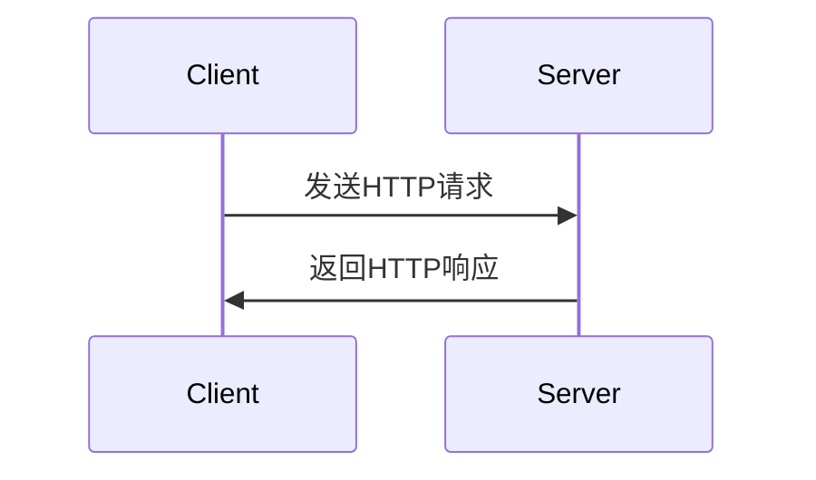

## 介绍

HTTP（超文本传输协议）是互联网上应用最广泛的协议之一，用于在客户端和服务器之间传输数据。无论是浏览网页、获取API数据，还是上传文件，HTTP请求都是这些操作的核心。本文将带你了解HTTP请求的基础知识，包括其工作原理、常见方法以及如何在实际开发中使用它。

## HTTP请求的工作原理

HTTP请求是一个客户端向服务器发送的请求，服务器处理请求后返回响应。整个过程可以分为以下几个步骤：

1. **客户端发送请求**：客户端（如浏览器或小程序）向服务器发送一个HTTP请求，请求中包含请求方法、URL、请求头等信息。
2. **服务器处理请求**：服务器接收到请求后，根据请求的内容进行处理。
3. **服务器返回响应**：服务器将处理结果封装成HTTP响应，返回给客户端。
4. **客户端处理响应**：客户端接收到响应后，根据响应的内容进行相应的操作，如渲染页面、显示数据等。



## HTTP请求方法

HTTP定义了多种请求方法，每种方法都有其特定的用途。以下是几种常见的HTTP请求方法：

- **GET**：用于请求指定的资源。GET请求通常用于获取数据，不会对服务器上的资源产生影响。
- **POST**：用于向服务器提交数据。POST请求通常用于创建新资源或提交表单数据。
- **PUT**：用于更新服务器上的资源。PUT请求会替换目标资源的所有内容。
- **DELETE**：用于删除服务器上的资源。

:::note
GET请求的参数通常附加在URL后面，而POST请求的参数则包含在请求体中。
:::

## HTTP请求示例

以下是一个简单的HTTP GET请求示例，使用JavaScript的`fetch` API发送请求：

```javascript
fetch('https://api.example.com/data')
  .then(response => response.json())
  .then(data => console.log(data))
  .catch(error => console.error('Error:', error));
```

在这个示例中，我们向`https://api.example.com/data`发送了一个GET请求，并将返回的JSON数据打印到控制台。

## HTTP请求头

HTTP请求头是请求的一部分，用于传递额外的信息给服务器。常见的请求头包括：

- **Content-Type**：指定请求体的媒体类型，如`application/json`或`application/x-www-form-urlencoded`。
- **Authorization**：用于传递认证信息，如Bearer Token。
- **User-Agent**：标识客户端的信息，如浏览器类型或操作系统。

以下是一个包含自定义请求头的HTTP POST请求示例：

```javascript
fetch('https://api.example.com/data', {
  method: 'POST',
  headers: {
    'Content-Type': 'application/json',
    'Authorization': 'Bearer your_token_here'
  },
  body: JSON.stringify({ key: 'value' })
})
  .then(response => response.json())
  .then(data => console.log(data))
  .catch(error => console.error('Error:', error));
```

## 实际应用场景

### 场景1：获取天气数据

假设你正在开发一个小程序，需要显示当前城市的天气信息。你可以通过发送HTTP GET请求到天气API来获取数据：

```javascript
fetch('https://api.weatherapi.com/v1/current.json?key=your_api_key&q=Beijing')
  .then(response => response.json())
  .then(data => {
    console.log(`当前温度: ${data.current.temp_c}°C`);
  })
  .catch(error => console.error('Error:', error));
```

### 场景2：提交用户注册信息

当用户在小程序中填写注册表单时，你可以通过HTTP POST请求将用户信息提交到服务器：

```javascript
fetch('https://api.example.com/register', {
  method: 'POST',
  headers: {
    'Content-Type': 'application/json'
  },
  body: JSON.stringify({
    username: 'user123',
    password: 'password123'
  })
})
  .then(response => response.json())
  .then(data => console.log(data))
  .catch(error => console.error('Error:', error));
```

## 总结

HTTP请求是客户端与服务器之间通信的基础。通过本文，你已经了解了HTTP请求的工作原理、常见方法以及如何在实际开发中使用它。掌握这些基础知识将为你进一步学习网络编程打下坚实的基础。

## 附加资源与练习

- **练习1**：尝试使用`fetch` API发送一个HTTP PUT请求，更新服务器上的资源。
- **练习2**：研究并实现一个带有分页功能的HTTP GET请求，获取分页数据。
- **附加资源**：
  - [MDN Web Docs: HTTP](https://developer.mozilla.org/zh-CN/docs/Web/HTTP)
  - [HTTP/1.1 规范](https://tools.ietf.org/html/rfc2616)
