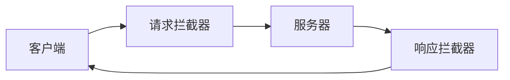

# 请求拦截器

在编程中，**请求拦截器**是一种强大的工具，用于在网络请求发送到服务器之前或从服务器返回之后对其进行拦截和修改。它可以帮助我们在请求和响应的生命周期中插入自定义逻辑，例如添加身份验证令牌、记录日志、处理错误等。

## 什么是请求拦截器？

请求拦截器是位于客户端和服务器之间的中间件。它允许我们在请求发送到服务器之前或响应返回客户端之前，对请求或响应进行修改。这种机制在许多现代编程框架和库中都有实现，例如 Axios、Fetch API 等。

### 请求拦截器的工作原理

请求拦截器的工作原理可以分为两个阶段：

1. **请求阶段**：在请求发送到服务器之前，拦截器可以修改请求的配置，例如添加请求头、修改请求体等。
2. **响应阶段**：在响应返回客户端之前，拦截器可以修改响应数据，例如处理错误、格式化数据等。



## 如何使用请求拦截器

让我们通过一个实际的例子来了解如何使用请求拦截器。我们将使用 Axios 库来演示如何在 JavaScript 中实现请求拦截器。

### 安装 Axios

首先，确保你已经安装了 Axios。如果没有安装，可以使用以下命令进行安装：

```bash
npm install axios
```

### 创建请求拦截器

以下是一个简单的示例，展示了如何使用 Axios 创建请求拦截器：

```javascript
import axios from 'axios';

// 创建请求拦截器
axios.interceptors.request.use(
  function (config) {
    // 在请求发送之前做一些处理
    console.log('请求拦截器 - 请求发送之前');
    config.headers.Authorization = 'Bearer your_token_here';
    return config;
  },
  function (error) {
    // 处理请求错误
    console.error('请求拦截器 - 请求错误', error);
    return Promise.reject(error);
  }
);

// 创建响应拦截器
axios.interceptors.response.use(
  function (response) {
    // 在响应返回之前做一些处理
    console.log('响应拦截器 - 响应返回之前');
    return response;
  },
  function (error) {
    // 处理响应错误
    console.error('响应拦截器 - 响应错误', error);
    return Promise.reject(error);
  }
);

// 发送请求
axios.get('https://api.example.com/data')
  .then(response => {
    console.log('请求成功', response.data);
  })
  .catch(error => {
    console.error('请求失败', error);
  });
```

### 代码解释

1. **请求拦截器**：我们在 `axios.interceptors.request.use` 中定义了一个请求拦截器。在请求发送之前，我们添加了一个 `Authorization` 头，并打印了一条日志。
2. **响应拦截器**：我们在 `axios.interceptors.response.use` 中定义了一个响应拦截器。在响应返回之前，我们打印了一条日志。
3. **发送请求**：我们使用 `axios.get` 发送了一个 GET 请求，并在请求成功或失败时打印相应的日志。

### 输入和输出

假设我们发送了一个 GET 请求到 `https://api.example.com/data`，以下是可能的输出：

```
请求拦截器 - 请求发送之前
响应拦截器 - 响应返回之前
请求成功 { data: '...' }
```

如果请求失败，输出可能是：

```
请求拦截器 - 请求发送之前
响应拦截器 - 响应错误 Error: Request failed with status code 404
请求失败 Error: Request failed with status code 404
```

## 实际应用场景

请求拦截器在实际开发中有许多应用场景，以下是一些常见的例子：

1. **身份验证**：在每次请求中添加身份验证令牌。
2. **日志记录**：记录每个请求和响应的详细信息，便于调试和监控。
3. **错误处理**：统一处理请求和响应中的错误，例如重试机制、错误提示等。
4. **数据格式化**：在请求发送之前或响应返回之后，对数据进行格式化处理。

:::tip
在实际项目中，建议将请求拦截器和响应拦截器的逻辑封装到单独的文件中，以便于维护和复用。
:::

## 总结

请求拦截器是一种强大的工具，可以帮助我们在网络请求的生命周期中插入自定义逻辑。通过使用请求拦截器，我们可以轻松地实现身份验证、日志记录、错误处理等功能。希望本文能帮助你理解请求拦截器的概念，并在实际项目中应用它。

## 附加资源

- [Axios 官方文档](https://axios-http.com/docs/intro)
- [Fetch API 文档](https://developer.mozilla.org/en-US/docs/Web/API/Fetch_API)
- [JavaScript Promises](https://developer.mozilla.org/en-US/docs/Web/JavaScript/Reference/Global_Objects/Promise)

## 练习

1. 尝试在请求拦截器中添加一个自定义的请求头，并在响应拦截器中打印该请求头。
2. 修改响应拦截器，使其在响应状态码为 404 时自动重试请求。
3. 创建一个新的 Axios 实例，并为该实例添加不同的请求和响应拦截器。

通过完成这些练习，你将更深入地理解请求拦截器的工作原理和应用场景。