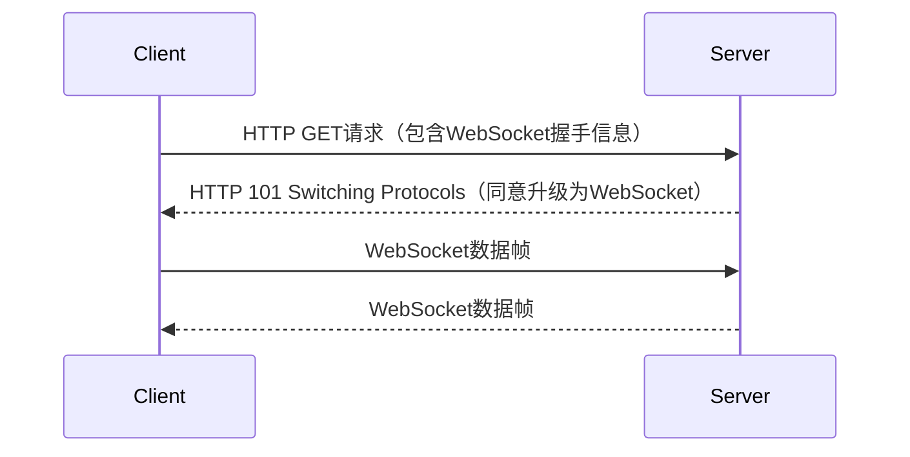

# WebSocket通信

在现代Web应用中，实时通信变得越来越重要。无论是聊天应用、在线游戏还是实时数据更新，都需要一种高效的双向通信机制。WebSocket正是为此而生的协议。本文将带你深入了解WebSocket通信的基础知识，并通过实际案例展示其应用场景。

## 什么是WebSocket？

WebSocket是一种在单个TCP连接上进行全双工通信的协议。与传统的HTTP请求-响应模式不同，WebSocket允许服务器和客户端之间进行实时、双向的数据传输。这意味着服务器可以在任何时候主动向客户端推送数据，而不需要客户端先发起请求。

:::note
WebSocket协议在2011年被标准化为[RFC 6455](https://tools.ietf.org/html/rfc6455)，并得到了广泛的支持。
:::

## WebSocket的工作原理

WebSocket通信的建立过程分为两个阶段：

1. **握手阶段**：客户端通过HTTP请求向服务器发起WebSocket连接请求。服务器响应后，双方升级协议为WebSocket。
2. **数据传输阶段**：一旦握手成功，客户端和服务器之间就可以通过WebSocket协议进行双向数据传输。



## 如何使用WebSocket

### 客户端代码示例

在JavaScript中，你可以使用`WebSocket`对象来创建和管理WebSocket连接。以下是一个简单的示例：

```javascript
// 创建WebSocket连接
const socket = new WebSocket('ws://example.com/socket');

// 连接成功时触发
socket.onopen = function(event) {
    console.log('WebSocket连接已打开');
    // 发送消息到服务器
    socket.send('Hello Server!');
};

// 接收到服务器消息时触发
socket.onmessage = function(event) {
    console.log('收到服务器消息:', event.data);
};

// 连接关闭时触发
socket.onclose = function(event) {
    console.log('WebSocket连接已关闭');
};

// 发生错误时触发
socket.onerror = function(error) {
    console.error('WebSocket错误:', error);
};
```

### 服务器端代码示例

在Node.js中，你可以使用`ws`库来创建WebSocket服务器。以下是一个简单的示例：

```javascript
const WebSocket = require('ws');

// 创建WebSocket服务器
const wss = new WebSocket.Server({ port: 8080 });

// 监听连接事件
wss.on('connection', function connection(ws) {
    console.log('新客户端连接');

    // 监听客户端消息
    ws.on('message', function incoming(message) {
        console.log('收到客户端消息:', message);
        // 向客户端发送消息
        ws.send('Hello Client!');
    });

    // 监听连接关闭事件
    ws.on('close', function close() {
        console.log('客户端断开连接');
    });
});
```

## 实际应用场景

WebSocket在许多实时应用中都有广泛的应用，以下是一些常见的场景：

1. **聊天应用**：WebSocket可以实现实时消息的发送和接收，非常适合聊天应用。
2. **在线游戏**：多人在线游戏需要实时同步玩家状态，WebSocket可以满足这一需求。
3. **实时数据更新**：例如股票行情、体育比赛比分等需要实时更新的数据，WebSocket可以确保数据的及时推送。

## 总结

WebSocket提供了一种高效的双向通信机制，非常适合需要实时数据传输的应用场景。通过本文的学习，你应该已经掌握了WebSocket的基础知识，并能够在实际项目中应用它。

## 附加资源与练习

- **练习**：尝试使用WebSocket实现一个简单的聊天应用，允许用户实时发送和接收消息。
- **资源**：
  - [MDN WebSocket文档](https://developer.mozilla.org/zh-CN/docs/Web/API/WebSocket)
  - [ws库文档](https://github.com/websockets/ws)

:::tip
如果你对WebSocket的高级用法感兴趣，可以进一步学习WebSocket的二进制数据传输、心跳机制等高级特性。
:::