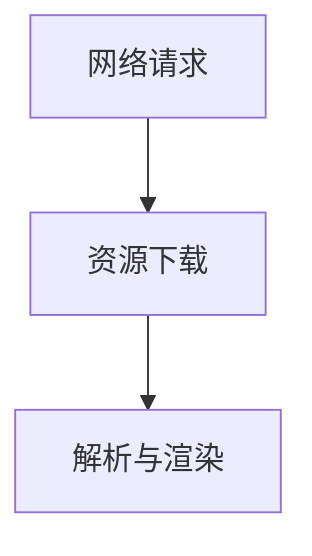

## 介绍

在小程序开发中，页面加载速度是影响用户体验的关键因素之一。用户期望页面能够快速加载，任何延迟都可能导致用户流失。因此，页面加载优化是每个开发者都需要掌握的重要技能。

本文将介绍页面加载优化的基本概念、常见问题以及解决方案，帮助初学者理解如何通过优化代码和资源加载来提升小程序的性能。

## 页面加载的基本流程

在深入优化之前，我们需要了解页面加载的基本流程。当用户打开一个小程序页面时，通常会经历以下几个阶段：

1. **网络请求**：小程序向服务器请求页面所需的资源（如 HTML、CSS、JavaScript 等）。
2. **资源下载**：浏览器下载这些资源。
3. **解析与渲染**：浏览器解析 HTML、CSS 和 JavaScript，并渲染页面。



## 常见的页面加载问题

在实际开发中，页面加载可能会遇到以下问题：

- **资源过大**：页面所需的资源（如图片、JavaScript 文件）过大，导致下载时间过长。
- **过多的网络请求**：页面需要加载的资源过多，导致网络请求次数增加，影响加载速度。
- **阻塞渲染的 JavaScript**：JavaScript 文件可能会阻塞页面的渲染，导致页面加载时间延长。

## 页面加载优化策略

### 1. 减少资源大小

**压缩资源**：通过压缩 JavaScript、CSS 和图片等资源，可以减少文件大小，从而加快下载速度。

```javascript
// 示例：使用工具压缩 JavaScript 文件
// 原始代码
function add(a, b) {
    return a + b;
}

// 压缩后代码
function add(a,b){return a+b;}
```

**使用图片优化工具**：对于图片资源，可以使用工具如 `ImageOptim` 或 `TinyPNG` 来压缩图片，减少文件大小。

### 2. 减少网络请求

**合并文件**：将多个 JavaScript 或 CSS 文件合并为一个文件，可以减少网络请求次数。

```javascript
// 示例：合并多个 JavaScript 文件
// 原始文件
// file1.js
function add(a, b) {
    return a + b;
}

// file2.js
function subtract(a, b) {
    return a - b;
}

// 合并后的文件
function add(a, b) {
    return a + b;
}

function subtract(a, b) {
    return a - b;
}
```

**使用 CDN**：将静态资源托管在 CDN（内容分发网络）上，可以加快资源的加载速度。

### 3. 异步加载 JavaScript

**使用 `async` 或 `defer` 属性**：在加载 JavaScript 文件时，使用 `async` 或 `defer` 属性可以避免阻塞页面渲染。

```html
<!-- 使用 async 属性 -->
<script src="script.js" async></script>

<!-- 使用 defer 属性 -->
<script src="script.js" defer></script>
```

:::tip
`async` 和 `defer` 的区别在于：
- `async`：脚本在下载完成后立即执行，可能会阻塞页面渲染。
- `defer`：脚本在页面解析完成后执行，不会阻塞页面渲染。
:::

### 4. 使用缓存

**浏览器缓存**：通过设置 HTTP 缓存头，可以让浏览器缓存静态资源，减少重复请求。

```http
Cache-Control: max-age=31536000
```

**Service Worker**：使用 Service Worker 可以实现更高级的缓存策略，甚至可以在离线时提供缓存内容。

```javascript
// 示例：注册 Service Worker
if ('serviceWorker' in navigator) {
    navigator.serviceWorker.register('/sw.js')
        .then(function(registration) {
            console.log('Service Worker 注册成功:', registration);
        })
        .catch(function(error) {
            console.log('Service Worker 注册失败:', error);
        });
}
```

## 实际案例

假设我们有一个小程序页面，加载时间较长。通过分析，我们发现页面加载了多个 JavaScript 文件和大量未压缩的图片。我们可以采取以下优化措施：

1. **合并 JavaScript 文件**：将多个 JavaScript 文件合并为一个文件，减少网络请求次数。
2. **压缩图片**：使用图片优化工具压缩图片，减少文件大小。
3. **使用 CDN**：将静态资源托管在 CDN 上，加快资源加载速度。
4. **启用浏览器缓存**：设置 HTTP 缓存头，让浏览器缓存静态资源。

经过这些优化后，页面加载速度显著提升，用户体验得到了改善。

## 总结

页面加载优化是提升小程序用户体验的关键。通过减少资源大小、减少网络请求、异步加载 JavaScript 和使用缓存等策略，可以显著提升页面加载速度。希望本文的内容能够帮助初学者掌握页面加载优化的基本技巧，并在实际开发中应用这些策略。

## 附加资源与练习

- **资源**：
  - [Google 的页面加载优化指南](https://developers.google.com/speed/docs/insights/rules)
  - [Web.dev 的性能优化教程](https://web.dev/learn/#performance)

- **练习**：
  - 尝试优化一个现有小程序的页面加载速度，记录优化前后的加载时间。
  - 使用 Chrome DevTools 分析页面加载性能，找出性能瓶颈并进行优化。
