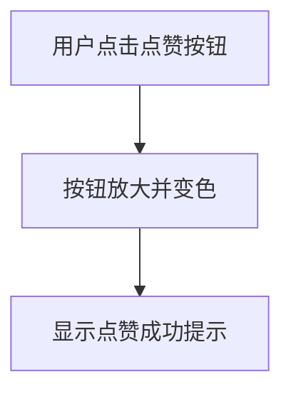
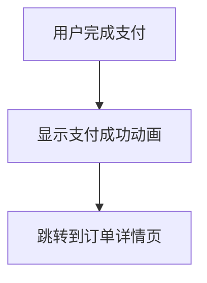

# 微交互设计

## 介绍

微交互（Microinteractions）是指用户与界面之间的小规模交互行为，通常用于完成单一任务或提供即时反馈。它们虽然看似微不足道，但在提升用户体验方面起着至关重要的作用。微交互可以是一个按钮的点击效果、输入框的提示信息，或者是加载动画等。

微交互的核心目标是让用户感受到界面的响应性和友好性，从而增强用户的操作信心和满意度。在小程序中，微交互设计尤为重要，因为小程序的轻量化和快速响应特性需要依赖这些细节来提升用户体验。

## 微交互的四个组成部分

微交互通常由以下四个部分组成：

1. **触发器（Trigger）**：触发微交互的事件，例如用户点击按钮、滑动屏幕或输入内容。
2. **规则（Rules）**：定义微交互的行为逻辑，例如点击按钮后会发生什么。
3. **反馈（Feedback）**：向用户展示交互的结果，例如按钮变色、弹出提示或播放动画。
4. **循环与模式（Loops and Modes）**：决定微交互的持续时间和重复模式，例如加载动画的循环播放。

## 微交互的实际应用场景

### 1. 按钮点击反馈

在小程序中，按钮点击是最常见的微交互场景之一。通过为按钮添加点击反馈，可以让用户明确知道他们的操作已被接收。

```jsx
<button
  onClick={() => alert('按钮已点击！')}
  style={{
    padding: '10px 20px',
    backgroundColor: '#007BFF',
    color: 'white',
    border: 'none',
    borderRadius: '5px',
    cursor: 'pointer',
  }}
>
  点击我
</button>
```

**输入**：用户点击按钮。<br />
**输出**：弹出提示框，显示“按钮已点击！”。

### 2. 表单输入验证

在表单输入过程中，实时验证用户输入的内容并提供即时反馈，可以有效减少用户错误。

```jsx
<input
  type="text"
  placeholder="请输入邮箱"
  onChange={(e) => {
    const email = e.target.value;
    if (!email.includes('@')) {
      alert('请输入有效的邮箱地址！');
    }
  }}
/>
```

**输入**：用户输入邮箱地址。<br />
**输出**：如果邮箱地址不包含“@”，则弹出提示框。

### 3. 加载动画

在小程序中，加载动画可以缓解用户等待的焦虑感，同时让用户知道系统正在处理他们的请求。

```jsx
<div style={{ textAlign: 'center' }}>
  <p>加载中...</p>
  <div style={{ width: '50px', height: '50px', border: '5px solid #f3f3f3', borderTop: '5px solid #3498db', borderRadius: '50%', animation: 'spin 1s linear infinite' }} />
</div>
```

**输入**：用户触发加载操作。<br />
**输出**：显示加载动画，直到操作完成。

## 微交互设计的最佳实践

1. **保持简洁**：微交互应该简单明了，避免过度设计。
2. **即时反馈**：确保用户操作的反馈是即时的，避免用户感到困惑。
3. **一致性**：在整个小程序中保持微交互的一致性，避免用户感到混乱。
4. **用户导向**：微交互的设计应以用户需求为中心，确保它们能够真正提升用户体验。

## 实际案例

### 案例 1：微信小程序的点赞动画

在微信小程序中，点赞按钮的微交互设计非常经典。当用户点击点赞按钮时，按钮会有一个短暂的放大效果，同时颜色发生变化，给用户明确的反馈。



### 案例 2：支付宝的支付成功动画

在支付宝小程序中，支付成功后会显示一个动态的“支付成功”图标，并伴有短暂的动画效果。这种微交互设计让用户明确知道支付已经完成。



## 总结

微交互设计是小程序用户体验中不可或缺的一部分。通过精心设计的微交互，可以显著提升用户的操作体验和满意度。无论是按钮点击反馈、表单输入验证，还是加载动画，微交互都能在小程序中发挥重要作用。

## 附加资源与练习

- **资源**：
  - [微交互设计指南](https://www.smashingmagazine.com/2018/01/microinteractions-designing-with-details/)
  - [小程序开发文档](https://developers.weixin.qq.com/miniprogram/dev/framework/)
- **练习**：
  - 尝试在小程序中实现一个按钮点击的微交互效果。
  - 设计一个表单输入验证的微交互，确保用户输入的内容符合要求。

通过不断实践和学习，你将能够掌握微交互设计的精髓，并应用到实际的小程序开发中。