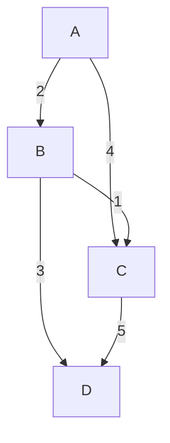

# 贪心算法

贪心算法（Greedy Algorithm）是一种在每一步选择中都采取当前状态下最优的选择，从而希望导致全局最优解的算法。贪心算法并不总是能得到全局最优解，但在某些问题中，它可以高效地找到一个接近最优的解。

## 贪心算法的基本思想

贪心算法的核心思想是：**每一步都选择当前最优的局部解，最终希望这些局部解能够组成全局最优解**。贪心算法通常用于解决优化问题，例如最短路径、最小生成树、背包问题等。

贪心算法的关键在于如何定义“最优”。不同的定义会导致不同的贪心策略，进而影响最终的结果。

## 贪心算法的步骤

1. **问题分解**：将问题分解为若干个子问题。
2. **选择最优解**：在每一步中，选择一个局部最优解。
3. **合并解**：将选择的局部最优解合并，形成最终的全局解。

## 贪心算法的适用条件

贪心算法并不适用于所有问题。它适用于满足以下两个条件的问题：

1. **贪心选择性质**：即每一步的最优选择能够导致全局最优解。
2. **最优子结构**：即问题的最优解包含其子问题的最优解。

如果一个问题满足这两个条件，那么贪心算法通常能够高效地解决它。

## 贪心算法的示例：找零问题

假设你是一个收银员，需要找给顾客一定数量的零钱。你手头有若干种面额的硬币，如何用最少数量的硬币找零？

### 问题描述

给定一个金额 `amount` 和一个硬币面额的数组 `coins`，找出最少数量的硬币来凑成这个金额。

### 贪心策略

每次选择面额最大的硬币，直到凑够金额。

### 代码示例

```python
def coinChange(coins, amount):
    coins.sort(reverse=True)  # 将硬币面额从大到小排序
    count = 0
    for coin in coins:
        while amount >= coin:
            amount -= coin
            count += 1
    return count if amount == 0 else -1

# 示例
coins = [1, 5, 10, 25]
amount = 63
print(coinChange(coins, amount))  # 输出: 6 (25+25+10+1+1+1)
```

### 输入和输出

- 输入：`coins = [1, 5, 10, 25]`, `amount = 63`
- 输出：`6`

:::note
注意：贪心算法在找零问题中并不总是能得到最优解。例如，如果硬币面额为 `[1, 3, 4]`，金额为 `6`，贪心算法会选择 `4 + 1 + 1`，而最优解是 `3 + 3`。
:::

## 贪心算法的实际应用

### 1. 最小生成树（Prim 算法）

最小生成树问题是指在一个带权的无向图中，找到一个包含所有顶点的子图，使得子图是一棵树，并且所有边的权重之和最小。

Prim 算法是一种贪心算法，它从一个顶点开始，每次选择一条权重最小的边，将一个新的顶点加入到生成树中。



### 2. 任务调度问题

假设有一组任务，每个任务有一个开始时间和结束时间。如何安排这些任务，使得在不冲突的情况下完成最多的任务？

贪心策略：每次选择结束时间最早的任务。

```python
def scheduleTasks(tasks):
    tasks.sort(key=lambda x: x[1])  # 按结束时间排序
    selected = []
    last_end = 0
    for task in tasks:
        if task[0] >= last_end:
            selected.append(task)
            last_end = task[1]
    return selected

# 示例
tasks = [(1, 3), (2, 5), (3, 9), (6, 8)]
print(scheduleTasks(tasks))  # 输出: [(1, 3), (6, 8)]
```

### 输入和输出

- 输入：`tasks = [(1, 3), (2, 5), (3, 9), (6, 8)]`
- 输出：`[(1, 3), (6, 8)]`

## 总结

贪心算法是一种简单而高效的算法，适用于满足贪心选择性质和最优子结构的问题。虽然它并不总是能得到全局最优解，但在许多实际问题中，贪心算法能够提供一个接近最优的解决方案。

## 附加资源与练习

- **练习 1**：尝试用贪心算法解决背包问题（分数背包）。
- **练习 2**：思考贪心算法在哪些情况下无法得到最优解，并举例说明。
- **资源**：推荐阅读《算法导论》中的贪心算法章节，深入了解贪心算法的理论基础。

:::tip
贪心算法的关键在于如何定义“最优”。在实际应用中，选择合适的贪心策略是解决问题的关键。
:::