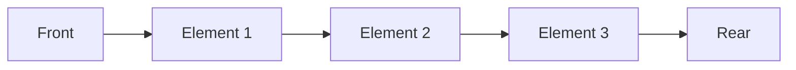

# 队列结构

队列（Queue）是一种常见的线性数据结构，它遵循**先进先出（FIFO, First In First Out）**的原则。这意味着最先进入队列的元素会最先被移除。队列在计算机科学中有广泛的应用，例如任务调度、缓冲区管理、广度优先搜索等。

## 队列的基本概念

队列可以看作是一个有序列表，其中元素的插入和删除操作分别在队列的两端进行：
- **队尾（Rear）**：新元素被插入的位置。
- **队头（Front）**：元素被移除的位置。

队列的操作主要包括：
1. **入队（Enqueue）**：在队尾插入一个新元素。
2. **出队（Dequeue）**：移除队头的元素。
3. **查看队头元素（Peek/Front）**：获取队头的元素但不移除它。
4. **判断队列是否为空（IsEmpty）**：检查队列中是否有元素。

以下是一个简单的队列示意图：



## 队列的实现

队列可以通过数组或链表来实现。以下是使用 Python 实现队列的示例代码：

```python
class Queue:
    def __init__(self):
        self.items = []

    def is_empty(self):
        return len(self.items) == 0

    def enqueue(self, item):
        self.items.append(item)

    def dequeue(self):
        if self.is_empty():
            return None
        return self.items.pop(0)

    def peek(self):
        if self.is_empty():
            return None
        return self.items[0]

# 示例用法
queue = Queue()
queue.enqueue(10)
queue.enqueue(20)
queue.enqueue(30)
print(queue.dequeue())  # 输出: 10
print(queue.peek())     # 输出: 20
```

:::note
在上面的代码中，我们使用 Python 的列表来实现队列。`enqueue` 方法将元素添加到列表末尾，而 `dequeue` 方法从列表的开头移除元素。
:::

## 队列的实际应用

队列在现实生活和计算机科学中有许多应用场景。以下是一些常见的例子：

1. **任务调度**：操作系统使用队列来管理等待执行的任务。例如，打印任务队列会按照提交的顺序依次处理。
2. **消息队列**：在分布式系统中，消息队列用于在不同服务之间传递消息，确保消息按顺序处理。
3. **广度优先搜索（BFS）**：在图或树的遍历中，队列用于存储待访问的节点，确保按层次遍历。

以下是一个使用队列实现广度优先搜索（BFS）的示例：

```python
from collections import deque

def bfs(graph, start):
    visited = set()
    queue = deque([start])

    while queue:
        node = queue.popleft()
        if node not in visited:
            print(node)  # 访问节点
            visited.add(node)
            queue.extend(graph[node] - visited)

# 示例图
graph = {
    'A': {'B', 'C'},
    'B': {'A', 'D', 'E'},
    'C': {'A', 'F'},
    'D': {'B'},
    'E': {'B', 'F'},
    'F': {'C', 'E'}
}

bfs(graph, 'A')  # 输出: A B C D E F
```

:::tip
在上面的 BFS 示例中，我们使用了 Python 的 `deque`（双端队列）来实现队列，因为它比列表在队头移除元素时更高效。
:::

## 总结

队列是一种简单但功能强大的数据结构，遵循先进先出的原则。它在任务调度、消息传递和算法实现中有着广泛的应用。通过理解队列的基本操作和实现方式，你可以更好地掌握其在实际编程中的应用。

## 附加资源与练习

- **练习 1**：尝试用链表实现一个队列，并测试其功能。
- **练习 2**：编写一个程序，模拟打印任务队列，随机生成任务并按照顺序处理。
- **资源推荐**：
  - [GeeksforGeeks 队列教程](https://www.geeksforgeeks.org/queue-data-structure/)
  - [LeetCode 队列相关题目](https://leetcode.com/tag/queue/)

通过不断练习和探索，你将能够更深入地理解队列及其应用场景！