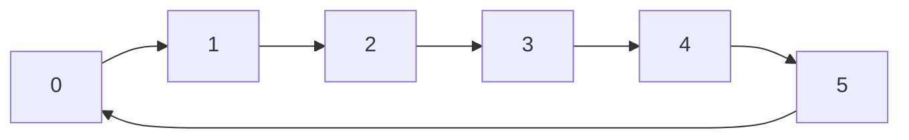

# 循环队列

## 介绍

循环队列（Circular Queue）是一种特殊的队列数据结构，它在普通队列的基础上进行了优化，解决了队列空间浪费的问题。普通队列在出队操作后，队首的空间会被空置，无法再次利用。而循环队列通过将队列的尾部与头部连接起来，形成一个环形结构，从而充分利用了队列的空间。

循环队列的核心思想是：当队列的尾部到达数组的末尾时，如果队列的头部有空闲空间，尾部可以“绕回”到数组的开头继续存储数据。这种设计使得队列的空间利用率更高，避免了普通队列的空间浪费问题。

## 循环队列的实现

### 基本操作

循环队列通常支持以下基本操作：

1. **入队（Enqueue）**：将元素添加到队列的尾部。
2. **出队（Dequeue）**：移除队列的头部元素。
3. **查看队首元素（Front）**：获取队列的头部元素，但不移除它。
4. **查看队尾元素（Rear）**：获取队列的尾部元素，但不移除它。
5. **判断队列是否为空（IsEmpty）**：检查队列是否为空。
6. **判断队列是否已满（IsFull）**：检查队列是否已满。

### 代码示例

以下是一个使用数组实现的循环队列的示例代码：

```python
class CircularQueue:
    def __init__(self, k):
        self.size = k
        self.queue = [None] * k
        self.front = self.rear = -1

    def enqueue(self, value):
        if self.is_full():
            print("队列已满，无法入队")
            return
        if self.is_empty():
            self.front = 0
        self.rear = (self.rear + 1) % self.size
        self.queue[self.rear] = value

    def dequeue(self):
        if self.is_empty():
            print("队列为空，无法出队")
            return
        if self.front == self.rear:
            self.front = self.rear = -1
        else:
            self.front = (self.front + 1) % self.size

    def front_element(self):
        if self.is_empty():
            print("队列为空")
            return
        return self.queue[self.front]

    def rear_element(self):
        if self.is_empty():
            print("队列为空")
            return
        return self.queue[self.rear]

    def is_empty(self):
        return self.front == -1

    def is_full(self):
        return (self.rear + 1) % self.size == self.front
```

### 示例输入与输出

```python
cq = CircularQueue(3)
cq.enqueue(1)
cq.enqueue(2)
cq.enqueue(3)
print(cq.front_element())  # 输出: 1
print(cq.rear_element())   # 输出: 3
cq.dequeue()
cq.enqueue(4)
print(cq.front_element())  # 输出: 2
print(cq.rear_element())   # 输出: 4
```

## 循环队列的工作原理

为了更好地理解循环队列的工作原理，我们可以通过以下图示来展示其结构：



在这个环形结构中，队列的头部和尾部可以“绕回”到数组的开头，从而形成一个循环。当队列的尾部到达数组的末尾时，如果队列的头部有空闲空间，尾部可以继续从数组的开头存储数据。

## 实际应用场景

循环队列在实际中有广泛的应用，特别是在需要高效利用内存的场景中。以下是一些常见的应用场景：

1. **缓冲区管理**：在操作系统中，循环队列常用于管理输入/输出缓冲区。例如，键盘输入缓冲区可以使用循环队列来存储用户的输入。
2. **任务调度**：在多任务操作系统中，循环队列可以用于管理任务队列，确保任务能够被公平地调度执行。
3. **网络数据包处理**：在网络通信中，循环队列可以用于存储待处理的数据包，确保数据包能够被及时处理。

## 总结

循环队列是一种高效利用内存的队列数据结构，通过将队列的尾部与头部连接起来，形成一个环形结构，从而避免了普通队列的空间浪费问题。循环队列在缓冲区管理、任务调度和网络数据包处理等场景中有广泛的应用。

通过本文的学习，你应该已经掌握了循环队列的基本概念、实现方式以及实际应用场景。希望这些知识能够帮助你在编程学习中更进一步。

## 附加资源与练习

- **练习**：尝试实现一个循环队列，并测试其基本操作（入队、出队、查看队首和队尾元素等）。
- **进一步学习**：了解其他类型的队列数据结构，如双端队列（Deque）和优先队列（Priority Queue）。
- **参考资源**：查阅相关的算法与数据结构书籍，深入理解队列及其变体的实现与应用。
