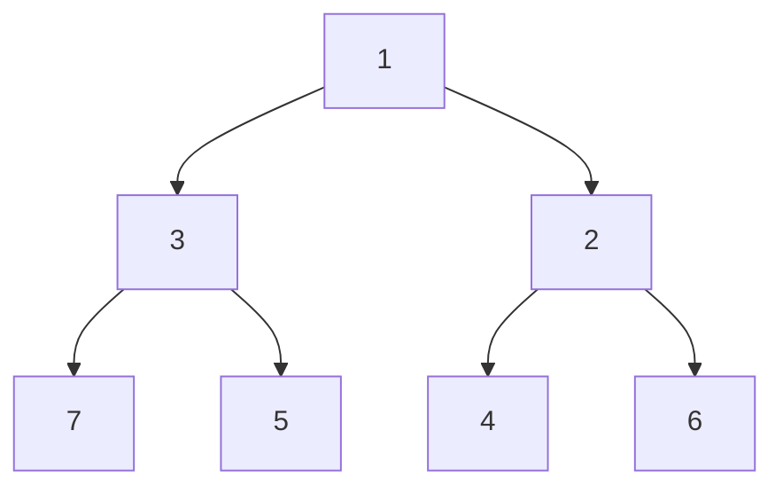

# 优先队列基础

优先队列（Priority Queue）是一种特殊的队列数据结构，其中的每个元素都有一个优先级。与普通队列不同，优先队列中的元素不是按照先进先出（FIFO）的顺序出队，而是按照优先级的高低出队。优先级最高的元素最先出队。

## 优先队列的基本概念

优先队列的核心思想是**优先级**。每个元素都有一个与之关联的优先级值，优先级高的元素会先被处理。优先队列通常用于需要动态管理一组元素并根据优先级进行处理的场景。

### 优先队列的操作
优先队列通常支持以下操作：
1. **插入（Insert）**：将一个新元素添加到队列中。
2. **删除最高优先级元素（Delete Max/Min）**：移除并返回优先级最高（或最低）的元素。
3. **查看最高优先级元素（Peek）**：返回优先级最高（或最低）的元素，但不移除它。

:::tip
优先队列的实现方式有很多种，常见的有**二叉堆**、**斐波那契堆**和**平衡二叉搜索树**等。其中，二叉堆是最常用的实现方式。
:::

## 优先队列的实现

### 二叉堆实现
二叉堆是一种完全二叉树，可以分为**最大堆**和**最小堆**：
- **最大堆**：每个节点的值都大于或等于其子节点的值，根节点是最大值。
- **最小堆**：每个节点的值都小于或等于其子节点的值，根节点是最小值。

以下是一个最小堆的示例：



在这个最小堆中，根节点 `1` 是最小值。

### 代码示例
以下是用 Python 实现的最小优先队列（基于最小堆）：

```python
import heapq

# 创建一个优先队列
priority_queue = []

# 插入元素
heapq.heappush(priority_queue, 5)
heapq.heappush(priority_queue, 3)
heapq.heappush(priority_queue, 7)
heapq.heappush(priority_queue, 1)

# 查看最小元素
print("最小元素:", priority_queue[0])  # 输出: 最小元素: 1

# 删除最小元素
min_element = heapq.heappop(priority_queue)
print("删除的最小元素:", min_element)  # 输出: 删除的最小元素: 1

# 查看剩余队列
print("剩余队列:", priority_queue)  # 输出: 剩余队列: [3, 5, 7]
```

:::note
`heapq` 是 Python 标准库中的一个模块，提供了基于最小堆的优先队列实现。
:::

## 优先队列的实际应用

优先队列在现实生活中有许多应用场景，以下是一些常见的例子：

1. **任务调度**：在操作系统中，优先队列用于调度任务。高优先级的任务会先被执行。
2. **Dijkstra 算法**：在图的最短路径算法中，优先队列用于选择当前距离起点最近的节点。
3. **数据压缩**：在哈夫曼编码中，优先队列用于构建最优二叉树。
4. **事件驱动模拟**：在模拟系统中，优先队列用于按时间顺序处理事件。

### 案例：任务调度
假设我们有一个任务列表，每个任务都有一个优先级。我们需要按照优先级从高到低的顺序执行任务。

```python
import heapq

tasks = [
    ("任务A", 3),
    ("任务B", 1),
    ("任务C", 2)
]

# 将任务插入优先队列（按优先级排序）
priority_queue = []
for task, priority in tasks:
    heapq.heappush(priority_queue, (priority, task))

# 按优先级执行任务
while priority_queue:
    priority, task = heapq.heappop(priority_queue)
    print(f"执行任务: {task} (优先级: {priority})")
```

**输出：**
```
执行任务: 任务B (优先级: 1)
执行任务: 任务C (优先级: 2)
执行任务: 任务A (优先级: 3)
```

## 总结

优先队列是一种非常有用的数据结构，适用于需要根据优先级动态管理元素的场景。通过二叉堆等实现方式，优先队列可以高效地支持插入、删除和查看操作。在实际应用中，优先队列被广泛用于任务调度、算法优化等领域。

:::caution
在使用优先队列时，需要注意优先级的定义。优先级可以是数值、时间戳或其他可比较的值。
:::

## 附加资源与练习

### 推荐资源
- [《算法导论》](https://mitpress.mit.edu/books/introduction-algorithms) - 详细介绍了优先队列及其实现。
- [GeeksforGeeks 优先队列教程](https://www.geeksforgeeks.org/priority-queue-set-1-introduction/) - 提供了丰富的代码示例和解释。

### 练习
1. 实现一个最大优先队列，并测试其功能。
2. 使用优先队列解决以下问题：给定一组任务及其优先级，按优先级从高到低输出任务名称。
3. 扩展优先队列的实现，使其支持动态调整元素的优先级。

通过学习和实践，你将更好地掌握优先队列的概念和应用！