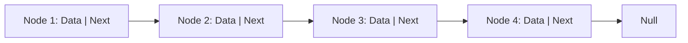

## 介绍

链表（Linked List）是一种常见的线性数据结构，它由一系列节点（Node）组成，每个节点包含数据和指向下一个节点的指针。与数组不同，链表中的元素在内存中并不连续存储，而是通过指针连接起来。这种结构使得链表在插入和删除操作上更加高效，但在访问元素时效率较低。

链表的主要类型包括：
- **单链表（Singly Linked List）**：每个节点只有一个指针，指向下一个节点。
- **双链表（Doubly Linked List）**：每个节点有两个指针，分别指向前一个节点和后一个节点。
- **循环链表（Circular Linked List）**：尾节点的指针指向头节点，形成一个环。

## 链表的结构

链表的基本结构可以用以下方式表示：



每个节点包含两个部分：
1. **数据（Data）**：存储节点的值。
2. **指针（Next）**：指向下一个节点的地址。

## 链表的操作

### 1. 创建链表

以下是一个简单的单链表的实现示例（使用 Python）：

```python
class Node:
    def __init__(self, data):
        self.data = data
        self.next = None

class LinkedList:
    def __init__(self):
        self.head = None

    def append(self, data):
        new_node = Node(data)
        if not self.head:
            self.head = new_node
            return
        last_node = self.head
        while last_node.next:
            last_node = last_node.next
        last_node.next = new_node

    def print_list(self):
        current_node = self.head
        while current_node:
            print(current_node.data, end=" -> ")
            current_node = current_node.next
        print("None")

# 示例用法
llist = LinkedList()
llist.append(1)
llist.append(2)
llist.append(3)
llist.print_list()
```

**输出：**
```
1 -> 2 -> 3 -> None
```

### 2. 插入节点

在链表中插入节点可以分为以下几种情况：
- 在链表头部插入
- 在链表尾部插入
- 在链表中间插入

以下是在链表头部插入节点的示例：

```python
def insert_at_head(self, data):
    new_node = Node(data)
    new_node.next = self.head
    self.head = new_node

# 示例用法
llist.insert_at_head(0)
llist.print_list()
```

**输出：**
```
0 -> 1 -> 2 -> 3 -> None
```

### 3. 删除节点

删除节点的操作也需要考虑节点的位置：
- 删除头节点
- 删除尾节点
- 删除中间节点

以下是删除头节点的示例：

```python
def delete_at_head(self):
    if not self.head:
        return
    self.head = self.head.next

# 示例用法
llist.delete_at_head()
llist.print_list()
```

**输出：**
```
1 -> 2 -> 3 -> None
```

## 实际应用场景

链表在以下场景中非常有用：
1. **动态内存分配**：链表可以动态地分配内存，适合处理不确定大小的数据。
2. **实现栈和队列**：链表可以高效地实现栈（LIFO）和队列（FIFO）数据结构。
3. **浏览器历史记录**：浏览器的前进和后退功能可以通过双链表实现。
4. **音乐播放列表**：播放列表中的歌曲可以通过链表来管理，方便插入和删除操作。

## 总结

链表是一种灵活且高效的数据结构，特别适合频繁插入和删除操作的场景。尽管它在访问元素时效率较低，但其动态内存分配的特性使其在许多实际应用中非常有用。

:::tip 提示
- 链表的插入和删除操作时间复杂度为 O(1)，但访问元素的时间复杂度为 O(n)。
- 双链表比单链表更灵活，但需要更多的内存来存储额外的指针。
:::

## 附加资源与练习

1. **练习**：尝试实现一个双链表，并添加插入和删除操作。
2. **深入学习**：研究循环链表的实现及其应用场景。
3. **扩展阅读**：了解链表与其他数据结构（如数组、栈、队列）的比较。

通过本文的学习，你应该对链表的基本概念和操作有了初步的了解。继续练习和探索，你将能够更熟练地运用链表解决实际问题。