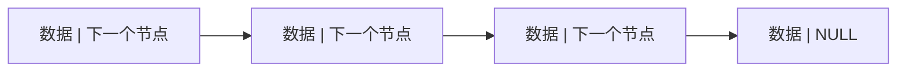

## 介绍

单向链表（Singly Linked List）是一种线性数据结构，它由一系列节点组成，每个节点包含两个部分：数据和指向下一个节点的指针。与数组不同，链表中的元素在内存中并不是连续存储的，而是通过指针连接在一起。这种结构使得链表在插入和删除操作时更加高效，但在访问元素时效率较低。

## 单向链表的结构

单向链表中的每个节点通常包含以下两个部分：

1. **数据域（Data）**：存储节点的值。
2. **指针域（Next）**：指向下一个节点的指针。



在上图中，每个节点都包含数据和指向下一个节点的指针。最后一个节点的指针指向 `NULL`，表示链表的结束。

## 单向链表的实现

下面是一个用 Python 实现的单向链表的简单示例：

```python
class Node:
    def __init__(self, data):
        self.data = data
        self.next = None

class SinglyLinkedList:
    def __init__(self):
        self.head = None

    def append(self, data):
        new_node = Node(data)
        if not self.head:
            self.head = new_node
            return
        last_node = self.head
        while last_node.next:
            last_node = last_node.next
        last_node.next = new_node

    def print_list(self):
        current_node = self.head
        while current_node:
            print(current_node.data, end=" -> ")
            current_node = current_node.next
        print("NULL")

# 示例用法
sll = SinglyLinkedList()
sll.append(1)
sll.append(2)
sll.append(3)
sll.print_list()
```

**输出：**
```
1 -> 2 -> 3 -> NULL
```

在这个示例中，我们定义了一个 `Node` 类来表示链表的节点，以及一个 `SinglyLinkedList` 类来管理链表。`append` 方法用于在链表末尾添加新节点，`print_list` 方法用于打印链表的内容。

## 单向链表的操作

### 插入节点

在单向链表中插入节点通常有三种情况：

1. **在链表头部插入**：将新节点插入到链表的头部。
2. **在链表尾部插入**：将新节点插入到链表的尾部。
3. **在链表中间插入**：将新节点插入到链表的指定位置。

```python
def insert_at_head(self, data):
    new_node = Node(data)
    new_node.next = self.head
    self.head = new_node

def insert_at_tail(self, data):
    self.append(data)

def insert_after(self, prev_node, data):
    if not prev_node:
        print("给定的前一个节点不能为空")
        return
    new_node = Node(data)
    new_node.next = prev_node.next
    prev_node.next = new_node
```

### 删除节点

删除节点也有几种情况：

1. **删除头节点**：删除链表的第一个节点。
2. **删除尾节点**：删除链表的最后一个节点。
3. **删除中间节点**：删除链表中指定位置的节点。

```python
def delete_at_head(self):
    if not self.head:
        return
    self.head = self.head.next

def delete_at_tail(self):
    if not self.head:
        return
    if not self.head.next:
        self.head = None
        return
    second_last = self.head
    while second_last.next.next:
        second_last = second_last.next
    second_last.next = None

def delete_node(self, key):
    current_node = self.head
    if current_node and current_node.data == key:
        self.head = current_node.next
        current_node = None
        return
    prev_node = None
    while current_node and current_node.data != key:
        prev_node = current_node
        current_node = current_node.next
    if not current_node:
        return
    prev_node.next = current_node.next
    current_node = None
```

## 实际应用场景

单向链表在许多实际应用中都有广泛的使用，例如：

1. **实现栈和队列**：链表可以用来实现栈（LIFO）和队列（FIFO）数据结构。
2. **内存管理**：操作系统中的内存管理通常使用链表来跟踪空闲内存块。
3. **图算法**：在图算法中，链表常用于表示图的邻接表。

:::tip
在实际开发中，链表常用于需要频繁插入和删除操作的场景，因为链表在这些操作上的时间复杂度为 O(1)，而数组则需要 O(n)。
:::

## 总结

单向链表是一种简单但强大的数据结构，适用于需要频繁插入和删除操作的场景。通过指针连接节点，链表在内存中不需要连续的空间，这使得它在某些情况下比数组更加灵活。然而，链表的访问效率较低，因此在选择数据结构时需要根据具体需求进行权衡。

## 附加资源与练习

- **练习**：尝试实现一个双向链表（Doubly Linked List），并比较它与单向链表的优缺点。
- **资源**：阅读更多关于链表的高级应用，如循环链表（Circular Linked List）和跳表（Skip List）。

:::caution
在实现链表时，务必注意指针的正确操作，避免内存泄漏或悬空指针的问题。
:::