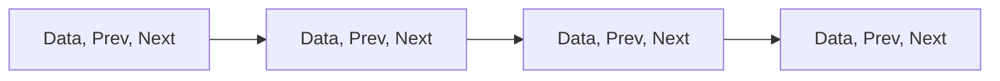

# 双向链表

双向链表（Doubly Linked List）是一种常见的线性数据结构，它由一系列节点组成，每个节点包含数据部分和两个指针：一个指向前一个节点，另一个指向下一个节点。与单向链表相比，双向链表允许从两个方向遍历链表，这使得某些操作更加高效。

## 双向链表的基本结构

双向链表的每个节点通常包含以下三个部分：
1. **数据域（Data）**：存储节点的数据。
2. **前驱指针（Prev）**：指向当前节点的前一个节点。
3. **后继指针（Next）**：指向当前节点的下一个节点。



## 双向链表的实现

下面是一个用 Python 实现双向链表的示例代码：

```python
class Node:
    def __init__(self, data):
        self.data = data
        self.prev = None
        self.next = None

class DoublyLinkedList:
    def __init__(self):
        self.head = None

    def append(self, data):
        new_node = Node(data)
        if not self.head:
            self.head = new_node
        else:
            current = self.head
            while current.next:
                current = current.next
            current.next = new_node
            new_node.prev = current

    def display(self):
        current = self.head
        while current:
            print(current.data, end=" <-> ")
            current = current.next
        print("None")

# 示例用法
dll = DoublyLinkedList()
dll.append(1)
dll.append(2)
dll.append(3)
dll.display()
```

**输出：**
```
1 <-> 2 <-> 3 <-> None
```

## 双向链表的操作

### 1. 插入节点
在双向链表中插入节点可以在链表的头部、尾部或中间进行。以下是插入节点的示例代码：

```python
def insert_at_head(self, data):
    new_node = Node(data)
    if self.head:
        self.head.prev = new_node
        new_node.next = self.head
    self.head = new_node

def insert_after(self, prev_node, data):
    if not prev_node:
        return
    new_node = Node(data)
    new_node.next = prev_node.next
    if prev_node.next:
        prev_node.next.prev = new_node
    prev_node.next = new_node
    new_node.prev = prev_node
```

### 2. 删除节点
删除节点时，需要更新前驱和后继节点的指针。以下是删除节点的示例代码：

```python
def delete_node(self, key):
    current = self.head
    while current:
        if current.data == key:
            if current.prev:
                current.prev.next = current.next
            else:
                self.head = current.next
            if current.next:
                current.next.prev = current.prev
            return
        current = current.next
```

### 3. 遍历链表
双向链表可以从头到尾或从尾到头遍历。以下是遍历链表的示例代码：

```python
def traverse_forward(self):
    current = self.head
    while current:
        print(current.data, end=" <-> ")
        current = current.next
    print("None")

def traverse_backward(self):
    current = self.head
    while current and current.next:
        current = current.next
    while current:
        print(current.data, end=" <-> ")
        current = current.prev
    print("None")
```

## 实际应用场景

双向链表在许多实际应用中都有广泛的使用，例如：
- **浏览器的历史记录**：用户可以向前或向后浏览访问过的页面。
- **音乐播放器的播放列表**：用户可以向前或向后切换歌曲。
- **撤销操作**：在文本编辑器中，用户可以撤销或重做操作。

## 总结

双向链表是一种功能强大的数据结构，它允许从两个方向遍历链表，使得插入、删除和遍历操作更加灵活和高效。通过理解双向链表的基本结构和操作，你可以更好地掌握线性数据结构的核心概念。

## 附加资源与练习

- **练习**：尝试实现一个双向链表，并添加更多功能，如查找节点、反转链表等。
- **资源**：阅读更多关于链表的数据结构书籍或在线教程，深入理解其应用和优化方法。

:::tip
提示：在学习双向链表时，建议动手编写代码并调试，以加深对概念的理解。
:::