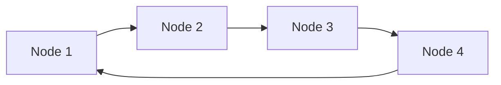

## 介绍

循环链表（Circular Linked List）是一种特殊的链表数据结构，它与普通链表的区别在于：循环链表的最后一个节点不再指向空（`null`），而是指向链表的第一个节点，形成一个闭环。这种结构使得链表可以从任意节点开始遍历整个链表，非常适合需要循环操作的场景。

循环链表可以是单向的，也可以是双向的。单向循环链表的每个节点只有一个指针，指向下一个节点；而双向循环链表的每个节点有两个指针，分别指向前一个节点和后一个节点。

## 循环链表的结构

让我们通过一个简单的单向循环链表来理解其结构：



在这个图中，`Node 4` 的指针不再指向 `null`，而是指向 `Node 1`，形成了一个循环。

## 实现循环链表

下面是一个用 Python 实现的单向循环链表的示例：

```python
class Node:
    def __init__(self, data):
        self.data = data
        self.next = None

class CircularLinkedList:
    def __init__(self):
        self.head = None

    def append(self, data):
        new_node = Node(data)
        if not self.head:
            self.head = new_node
            new_node.next = self.head
        else:
            temp = self.head
            while temp.next != self.head:
                temp = temp.next
            temp.next = new_node
            new_node.next = self.head

    def display(self):
        nodes = []
        temp = self.head
        if self.head:
            while True:
                nodes.append(temp.data)
                temp = temp.next
                if temp == self.head:
                    break
        print(" -> ".join(map(str, nodes)))

# 示例用法
clist = CircularLinkedList()
clist.append(1)
clist.append(2)
clist.append(3)
clist.display()
```

**输出：**
```
1 -> 2 -> 3
```

### 代码解释
1. `Node` 类定义了链表中的节点，每个节点包含数据 (`data`) 和指向下一个节点的指针 (`next`)。
2. `CircularLinkedList` 类实现了循环链表的基本操作：
   - `append` 方法用于在链表末尾添加新节点。
   - `display` 方法用于遍历并打印链表中的所有节点。

:::tip
在循环链表中，遍历时需要特别注意终止条件，避免无限循环。通常可以通过检查当前节点是否回到头节点来判断是否完成遍历。
:::

## 循环链表的实际应用

循环链表在许多实际场景中都有应用，以下是一些常见的例子：

1. **操作系统中的进程调度**  
   操作系统可以使用循环链表来管理多个进程的调度。每个进程可以表示为一个节点，循环链表可以确保每个进程都能公平地获得 CPU 时间。

2. **多人游戏中的玩家轮换**  
   在多人游戏中，玩家的轮换顺序可以通过循环链表来实现。每次轮到下一个玩家时，只需移动到链表的下一个节点。

3. **循环缓冲区**  
   循环链表可以用于实现循环缓冲区（Circular Buffer），这是一种常用于数据流处理的数据结构。

## 总结

循环链表是一种非常有用的数据结构，特别适合需要循环操作的场景。通过将链表的尾节点指向头节点，循环链表可以实现无限遍历，同时保持链表的灵活性。

:::note
如果你对链表还不熟悉，建议先学习普通链表的基本概念，再深入了解循环链表。
:::

## 附加资源与练习

1. **练习**  
   - 尝试实现一个双向循环链表。
   - 编写一个函数，检测给定的链表是否为循环链表。

2. **进一步学习**  
   - 学习其他链表变体，如双向链表和跳表。
   - 探索循环链表在算法中的应用，如约瑟夫问题（Josephus Problem）。

希望这篇内容能帮助你更好地理解循环链表！如果有任何问题，欢迎继续探索和学习。