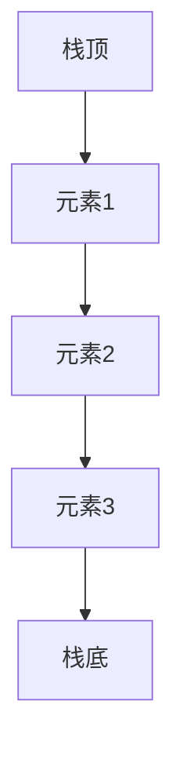

# 栈结构

栈（Stack）是一种线性数据结构，它遵循**后进先出（LIFO, Last In First Out）**的原则。这意味着最后一个被添加到栈中的元素将是第一个被移除的元素。栈的操作通常包括**入栈（Push）**和**出栈（Pop）**，以及查看栈顶元素（Peek）。

## 栈的基本操作

栈的核心操作非常简单，主要包括以下几种：

1. **Push**：将元素添加到栈的顶部。
2. **Pop**：移除并返回栈顶的元素。
3. **Peek**：查看栈顶的元素，但不移除它。
4. **IsEmpty**：检查栈是否为空。
5. **Size**：返回栈中元素的数量。

### 代码示例

以下是一个使用 Python 实现的栈结构示例：

```python
class Stack:
    def __init__(self):
        self.items = []

    def is_empty(self):
        return len(self.items) == 0

    def push(self, item):
        self.items.append(item)

    def pop(self):
        if not self.is_empty():
            return self.items.pop()
        else:
            return None

    def peek(self):
        if not self.is_empty():
            return self.items[-1]
        else:
            return None

    def size(self):
        return len(self.items)

# 示例使用
stack = Stack()
stack.push(1)
stack.push(2)
stack.push(3)

print(stack.pop())  # 输出: 3
print(stack.peek()) # 输出: 2
print(stack.size()) # 输出: 2
```

:::note
在上述代码中，我们使用 Python 的列表来实现栈。`append()` 方法用于入栈，`pop()` 方法用于出栈。
:::

## 栈的工作原理

栈可以想象成一摞盘子。你只能从顶部添加或移除盘子。当你添加一个新盘子时，它会被放在最上面；当你移除一个盘子时，最上面的盘子会被拿走。



:::tip
栈的 LIFO 特性使得它在某些场景下非常有用，例如回溯算法、函数调用栈等。
:::

## 栈的实际应用

栈在计算机科学中有许多实际应用，以下是一些常见的例子：

1. **函数调用栈**：在程序执行过程中，函数调用是通过栈来管理的。每次调用一个函数时，当前函数的上下文会被压入栈中；当函数返回时，上下文会从栈中弹出。

2. **撤销操作**：许多应用程序（如文本编辑器）使用栈来实现撤销功能。每次用户执行一个操作时，操作会被压入栈中；当用户选择撤销时，栈顶的操作会被弹出并执行反向操作。

3. **括号匹配**：栈可以用于检查表达式中的括号是否匹配。例如，在编译器中，栈用于检查代码中的括号是否正确嵌套。

### 括号匹配示例

以下是一个使用栈来检查括号是否匹配的示例：

```python
def is_balanced(expression):
    stack = Stack()
    for char in expression:
        if char in "({[":
            stack.push(char)
        elif char in ")}]":
            if stack.is_empty():
                return False
            top = stack.pop()
            if not matches(top, char):
                return False
    return stack.is_empty()

def matches(open, close):
    opens = "({["
    closes = ")}]"
    return opens.index(open) == closes.index(close)

# 示例使用
print(is_balanced("({[]})"))  # 输出: True
print(is_balanced("({[})"))   # 输出: False
```

:::caution
在实际应用中，栈的大小可能会受到限制。如果栈的大小超过了系统允许的最大值，可能会导致栈溢出（Stack Overflow）。
:::

## 总结

栈是一种简单但功能强大的数据结构，广泛应用于各种场景中。它的 LIFO 特性使得它在处理需要回溯或撤销操作的场景时非常有用。通过理解栈的基本操作和实际应用，你可以更好地掌握这一重要的数据结构。

## 附加资源与练习

- **练习**：尝试实现一个栈，并使用它来解决实际问题，例如反转字符串或计算后缀表达式。
- **资源**：阅读更多关于栈的进阶内容，例如栈在递归算法中的应用，或者如何实现一个栈的变体（如双栈）。

:::warning
在实现栈时，务必注意边界条件，例如在空栈上执行 `pop` 或 `peek` 操作时的情况。
:::