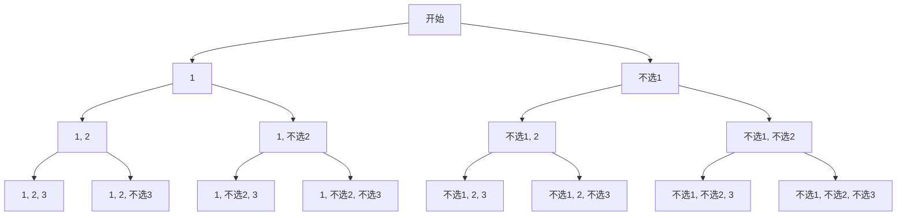

## 什么是状态空间树？

状态空间树（State Space Tree）是用于表示问题所有可能状态及其转换关系的树形结构。在回溯与分支限界算法中，状态空间树是解决问题的核心工具。每个节点代表问题的一个状态，而边代表从一个状态到另一个状态的转换。

状态空间树的根节点通常表示问题的初始状态，而叶子节点则代表问题的最终状态（可能是解或非解）。通过遍历状态空间树，我们可以系统地探索所有可能的解。

:::note
状态空间树的一个重要特点是它的分支数可能非常大，尤其是在问题的规模较大时。因此，回溯与分支限界算法通常会结合剪枝策略，以减少不必要的搜索。
:::

## 状态空间树的结构

为了更好地理解状态空间树，我们可以通过一个简单的例子来展示其结构。假设我们有一个问题：从一组数字中找出所有可能的子集。

### 示例：子集问题

给定一组数字 `[1, 2, 3]`，我们需要找出所有可能的子集。状态空间树的结构如下：



在这个树中，每个节点代表一个决策点，即是否选择当前数字。通过遍历这棵树，我们可以找到所有可能的子集。

## 代码示例：生成子集

让我们通过代码来实现上述子集问题的状态空间树遍历。我们将使用回溯算法来生成所有可能的子集。

```python
def subsets(nums):
    result = []
    backtrack(nums, 0, [], result)
    return result

def backtrack(nums, start, path, result):
    result.append(path[:])  # 将当前路径加入结果
    for i in range(start, len(nums)):
        path.append(nums[i])  # 选择当前数字
        backtrack(nums, i + 1, path, result)  # 递归
        path.pop()  # 撤销选择

# 示例输入
nums = [1, 2, 3]
print(subsets(nums))
```

**输出：**
```
[[], [1], [1, 2], [1, 2, 3], [1, 3], [2], [2, 3], [3]]
```

在这个代码中，`backtrack` 函数通过递归的方式遍历状态空间树，生成所有可能的子集。每次递归调用时，我们选择当前数字并将其加入路径，然后继续递归。当递归返回时，我们撤销选择，继续探索其他可能性。

## 实际应用场景

状态空间树在许多实际问题中都有应用，例如：

1. **八皇后问题**：在棋盘上放置八个皇后，使得它们互不攻击。状态空间树的每个节点代表一个皇后的放置位置，通过遍历树可以找到所有可能的解。
2. **0-1 背包问题**：给定一组物品和一个背包容量，选择一些物品放入背包，使得总价值最大。状态空间树的每个节点代表是否选择当前物品。
3. **旅行商问题**：找到一条最短路径，使得旅行商可以访问所有城市并返回起点。状态空间树的每个节点代表一个城市的选择。

## 总结

状态空间树是回溯与分支限界算法中的核心概念，它帮助我们系统地探索问题的所有可能解。通过理解状态空间树的结构和遍历方式，我们可以更好地应用这些算法解决实际问题。

:::tip
在实际应用中，状态空间树的分支数可能非常大，因此结合剪枝策略是提高算法效率的关键。
:::

## 附加资源与练习

1. **练习**：尝试修改上述子集问题的代码，使其只生成包含偶数个元素的子集。
2. **进一步学习**：阅读关于回溯与分支限界算法的更多资料，了解如何在实际问题中应用这些算法。

通过不断练习和探索，你将能够更深入地理解状态空间树及其在算法中的应用。