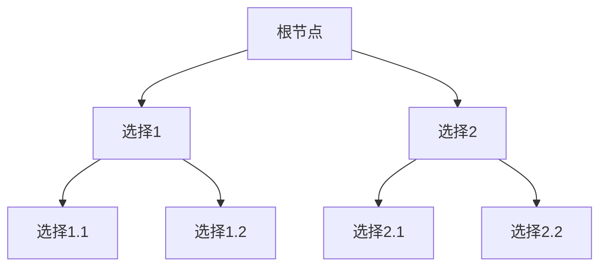
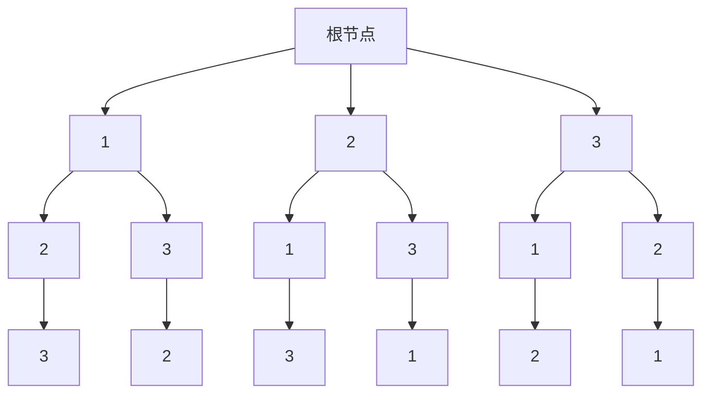

## 介绍

在回溯与分支限界算法中，**解空间**是一个非常重要的概念。解空间是指所有可能的解的集合，这些解可以是问题的候选解或最终解。理解解空间的结构和如何遍历它是设计高效回溯与分支限界算法的关键。

解空间通常可以表示为一棵树，树的每个节点代表一个部分解，而树的叶子节点则代表完整的解。通过系统地遍历这棵树，我们可以找到满足问题约束条件的解。

## 解空间的表示

解空间可以用树结构来表示。树的根节点代表初始状态，每个分支代表一个可能的选择，而叶子节点代表一个完整的解。例如，在解决排列问题时，解空间树可以表示所有可能的排列。



在这个简单的例子中，根节点有两个选择，每个选择又有两个子选择，最终形成四个叶子节点，代表四个可能的解。

## 解空间的遍历

解空间的遍历通常通过深度优先搜索（DFS）或广度优先搜索（BFS）来实现。回溯算法通常使用DFS，因为它可以逐步构建解并在发现不满足条件时回溯。

### 回溯算法的基本框架

以下是一个回溯算法的基本框架：

```python
def backtrack(路径, 选择列表):
    if 满足结束条件:
        结果.append(路径)
        return
    
    for 选择 in 选择列表:
        做选择
        backtrack(路径, 选择列表)
        撤销选择
```

在这个框架中，`路径`表示当前的解，`选择列表`表示当前可以做的选择。通过递归调用`backtrack`函数，我们可以遍历整个解空间。

## 实际案例：全排列问题

让我们通过一个实际的例子来理解解空间的概念。假设我们需要生成一个数组的所有排列。

### 问题描述

给定一个数组 `[1, 2, 3]`，生成所有可能的排列。

### 解空间树



在这个解空间树中，每个节点代表一个部分排列，叶子节点代表完整的排列。

### 代码实现

```python
def permute(nums):
    result = []
    
    def backtrack(path, choices):
        if not choices:
            result.append(path)
            return
        
        for i in range(len(choices)):
            backtrack(path + [choices[i]], choices[:i] + choices[i+1:])
    
    backtrack([], nums)
    return result

# 示例输入
nums = [1, 2, 3]
print(permute(nums))
```

### 输出

```python
[[1, 2, 3], [1, 3, 2], [2, 1, 3], [2, 3, 1], [3, 1, 2], [3, 2, 1]]
```

在这个例子中，我们通过回溯算法遍历了解空间树，生成了所有可能的排列。

## 总结

解空间是回溯与分支限界算法中的核心概念。通过将解空间表示为树结构，并系统地遍历这棵树，我们可以找到问题的所有可能解。理解解空间的结构和遍历方法对于设计高效的算法至关重要。

## 附加资源与练习

- **练习1**：尝试修改上述代码，使其能够处理包含重复元素的数组，并生成所有唯一的排列。
- **练习2**：实现一个回溯算法来解决N皇后问题，理解其解空间的结构。

:::tip
在解决实际问题时，尝试将问题转化为解空间树的形式，这有助于你更好地理解问题的结构和设计算法。
:::