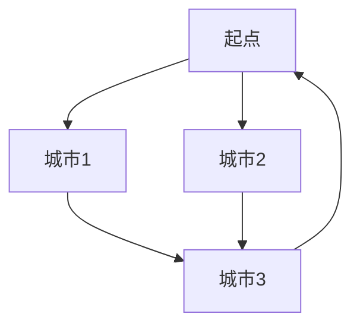

# 分支限界法

分支限界法（Branch and Bound）是一种用于解决组合优化问题的算法。它通过系统地搜索问题的解空间，同时利用界限函数来剪枝，从而减少搜索范围，提高效率。分支限界法常用于解决旅行商问题（TSP）、背包问题等。

## 什么是分支限界法？

分支限界法是一种基于树形结构的搜索算法。它将问题的解空间划分为多个子空间（分支），并通过计算每个子空间的界限（限界）来决定是否继续搜索。如果某个子空间的界限不优于当前已知的最优解，则该子空间会被剪枝，不再进一步搜索。

### 分支限界法的基本步骤

1. **初始化**：创建一个优先队列（通常是最小堆或最大堆），用于存储待搜索的子问题。
2. **分支**：从队列中取出一个子问题，并将其分解为更小的子问题。
3. **限界**：计算每个子问题的界限，并与当前最优解进行比较。
4. **剪枝**：如果子问题的界限不优于当前最优解，则剪枝，不再进一步搜索。
5. **更新最优解**：如果找到更优的解，则更新当前最优解。
6. **重复**：重复上述步骤，直到队列为空。

## 代码示例：0/1 背包问题

以下是一个使用分支限界法解决 0/1 背包问题的 Python 示例代码。

```python
import heapq

class Node:
    def __init__(self, level, profit, weight, bound, items):
        self.level = level
        self.profit = profit
        self.weight = weight
        self.bound = bound
        self.items = items

    def __lt__(self, other):
        return self.bound > other.bound

def bound(node, n, W, items):
    if node.weight >= W:
        return 0
    profit_bound = node.profit
    j = node.level + 1
    total_weight = node.weight
    while j < n and total_weight + items[j][1] <= W:
        total_weight += items[j][1]
        profit_bound += items[j][0]
        j += 1
    if j < n:
        profit_bound += (W - total_weight) * items[j][0] / items[j][1]
    return profit_bound

def knapsack(W, items):
    n = len(items)
    items.sort(key=lambda x: x[0]/x[1], reverse=True)
    queue = []
    root = Node(-1, 0, 0, 0, [])
    heapq.heappush(queue, root)
    max_profit = 0
    best_items = []
    while queue:
        node = heapq.heappop(queue)
        if node.level == n - 1:
            continue
        next_level = node.level + 1
        next_weight = node.weight + items[next_level][1]
        next_profit = node.profit + items[next_level][0]
        if next_weight <= W and next_profit > max_profit:
            max_profit = next_profit
            best_items = node.items + [items[next_level]]
        next_bound = bound(Node(next_level, next_profit, next_weight, 0, node.items + [items[next_level]]), n, W, items)
        if next_bound > max_profit:
            heapq.heappush(queue, Node(next_level, next_profit, next_weight, next_bound, node.items + [items[next_level]]))
        next_bound = bound(Node(next_level, node.profit, node.weight, 0, node.items), n, W, items)
        if next_bound > max_profit:
            heapq.heappush(queue, Node(next_level, node.profit, node.weight, next_bound, node.items))
    return max_profit, best_items

# 示例输入
W = 50
items = [(60, 10), (100, 20), (120, 30)]
max_profit, best_items = knapsack(W, items)
print("最大利润:", max_profit)
print("最佳物品:", best_items)
```

### 输入与输出

**输入**：
- `W = 50`（背包容量）
- `items = [(60, 10), (100, 20), (120, 30)]`（物品列表，每个物品表示为（价值，重量））

**输出**：
```
最大利润: 220
最佳物品: [(60, 10), (100, 20), (120, 30)]
```

## 实际应用案例

### 旅行商问题（TSP）

旅行商问题是一个经典的组合优化问题，目标是找到一条最短的路径，使得旅行商可以访问所有城市并返回起点。分支限界法可以有效地解决这个问题。



在上图中，分支限界法可以通过计算每个路径的界限来剪枝，从而减少搜索范围。

## 总结

分支限界法是一种强大的算法，适用于解决各种组合优化问题。通过分支和限界，它可以有效地减少搜索空间，提高算法的效率。本文通过 0/1 背包问题和旅行商问题的示例，展示了分支限界法的实际应用。

## 附加资源与练习

- **练习**：尝试使用分支限界法解决其他组合优化问题，如任务调度问题。
- **资源**：推荐阅读《算法导论》中的相关章节，深入了解分支限界法的理论基础。

:::tip
分支限界法的关键在于如何设计有效的界限函数。一个好的界限函数可以显著提高算法的效率。
:::