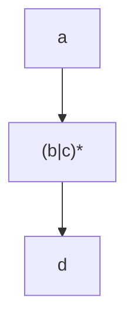
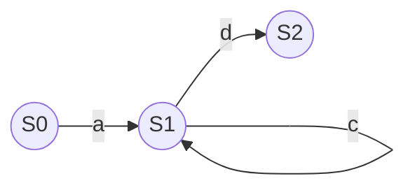

正则表达式（Regular Expression，简称 Regex）是一种强大的工具，用于在文本中查找、匹配和替换特定模式的字符串。正则表达式引擎是执行这些操作的核心组件。本文将逐步讲解正则表达式引擎的工作原理，并通过实际案例帮助你理解其应用。

## 什么是正则表达式引擎？

正则表达式引擎是一个程序或库，负责解析和执行正则表达式。它通过将正则表达式转换为一种内部数据结构（如有限状态自动机），并在输入文本上进行匹配操作。常见的正则表达式引擎有两种实现方式：

1. **回溯引擎**：通过尝试所有可能的匹配路径来找到结果，适用于大多数正则表达式场景。
2. **确定性有限自动机（DFA）引擎**：通过构建确定性的状态机来匹配文本，通常更快，但功能有限。

## 正则表达式引擎的工作原理

### 1. 解析正则表达式

正则表达式引擎首先会将用户输入的正则表达式解析为一个抽象语法树（AST）。例如，正则表达式 `a(b|c)*d` 会被解析为以下结构：



### 2. 转换为有限状态自动机

接下来，引擎会将 AST 转换为有限状态自动机（Finite State Automaton, FSA）。FSA 是一种数学模型，用于描述字符串匹配过程中的状态转换。例如，正则表达式 `a(b|c)*d` 可以转换为以下状态机：



### 3. 匹配输入文本

引擎会将输入文本逐个字符与状态机进行匹配。如果状态机能够从初始状态转移到接受状态，则匹配成功。例如，对于输入 `abccd`：

1. 读取 `a`，从 `S0` 转移到 `S1`。
2. 读取 `b`，从 `S1` 转移到 `S1`。
3. 读取 `c`，从 `S1` 转移到 `S1`。
4. 读取 `c`，从 `S1` 转移到 `S1`。
5. 读取 `d`，从 `S1` 转移到 `S2`。

最终，状态机停留在接受状态 `S2`，表示匹配成功。

## 实际案例

### 案例 1：匹配电子邮件地址

以下是一个简单的正则表达式，用于匹配电子邮件地址：

```regex
^[a-zA-Z0-9._%+-]+@[a-zA-Z0-9.-]+\.[a-zA-Z]{2,}$
```

**输入**：`user@example.com`  
**输出**：匹配成功

**输入**：`user@com`  
**输出**：匹配失败

### 案例 2：提取日期

以下正则表达式用于提取格式为 `YYYY-MM-DD` 的日期：

```regex
(\d{4})-(\d{2})-(\d{2})
```

**输入**：`2023-10-05`  
**输出**：  
- 年：`2023`  
- 月：`10`  
- 日：`05`

## 总结

正则表达式引擎通过解析正则表达式、构建状态机并在输入文本上进行匹配，实现了高效的字符串处理。理解其工作原理有助于编写更高效的正则表达式，并避免常见的性能问题。

:::tip 提示
正则表达式虽然强大，但复杂的表达式可能会导致性能问题。建议在实际使用中测试和优化正则表达式。
:::

## 附加资源与练习

1. **练习**：尝试编写一个正则表达式，匹配以下格式的电话号码：`(123) 456-7890`。
2. **资源**：  
   - [正则表达式教程](https://regexr.com/)  
   - [正则表达式引擎实现](https://swtch.com/~rsc/regexp/regexp1.html)  

通过不断练习和探索，你将能够熟练掌握正则表达式引擎的原理与应用！