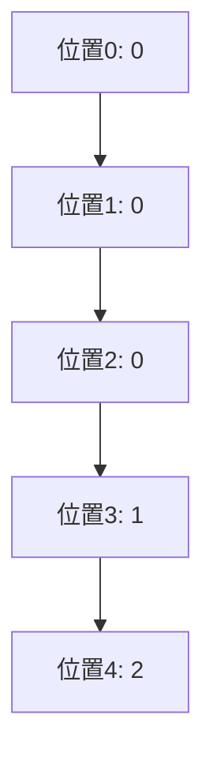

# KMP算法详解

## 介绍

KMP算法（Knuth-Morris-Pratt算法）是一种用于字符串匹配的高效算法。它的核心思想是通过预处理模式串（Pattern），构建一个部分匹配表（Partial Match Table），从而在匹配过程中避免不必要的回溯，提高匹配效率。

在传统的暴力匹配算法中，当字符不匹配时，模式串会回退到起始位置，而文本串也会回退到下一个字符重新开始匹配。这种方法的效率较低，尤其是在模式串较长时。KMP算法通过利用部分匹配表，避免了这种不必要的回退，从而将时间复杂度从O(m*n)降低到O(m+n)，其中m是模式串的长度，n是文本串的长度。

## 部分匹配表（Partial Match Table）

部分匹配表是KMP算法的核心。它记录了模式串中每个位置的最长公共前后缀的长度。具体来说，对于模式串中的每个位置i，部分匹配表的值表示模式串的前i个字符中，前缀和后缀的最长匹配长度。

### 构建部分匹配表

让我们通过一个例子来理解如何构建部分匹配表。假设模式串为 `"ABABC"`，我们逐步计算每个位置的部分匹配值。

1. **位置0**：模式串为空，部分匹配值为0。
2. **位置1**：模式串为 `"A"`，没有前缀和后缀，部分匹配值为0。
3. **位置2**：模式串为 `"AB"`，前缀为 `"A"`，后缀为 `"B"`，没有匹配，部分匹配值为0。
4. **位置3**：模式串为 `"ABA"`，前缀为 `"A"` 和 `"AB"`，后缀为 `"A"` 和 `"BA"`，最长匹配为 `"A"`，部分匹配值为1。
5. **位置4**：模式串为 `"ABAB"`，前缀为 `"A"`, `"AB"`, `"ABA"`，后缀为 `"B"`, `"AB"`, `"BAB"`，最长匹配为 `"AB"`，部分匹配值为2。

最终，部分匹配表为 `[0, 0, 0, 1, 2]`。



## KMP算法的实现

有了部分匹配表后，KMP算法的实现就变得相对简单。以下是KMP算法的Python实现：

```python
def compute_lps_array(pattern):
    lps = [0] * len(pattern)
    length = 0  # 最长公共前后缀的长度
    i = 1

    while i < len(pattern):
        if pattern[i] == pattern[length]:
            length += 1
            lps[i] = length
            i += 1
        else:
            if length != 0:
                length = lps[length - 1]
            else:
                lps[i] = 0
                i += 1
    return lps

def kmp_search(text, pattern):
    lps = compute_lps_array(pattern)
    i = 0  # text的索引
    j = 0  # pattern的索引

    while i < len(text):
        if pattern[j] == text[i]:
            i += 1
            j += 1

            if j == len(pattern):
                print("Pattern found at index", i - j)
                j = lps[j - 1]
        else:
            if j != 0:
                j = lps[j - 1]
            else:
                i += 1

# 示例
text = "ABABDABACDABABCABAB"
pattern = "ABABCABAB"
kmp_search(text, pattern)
```

**输出：**
```
Pattern found at index 10
```

## 实际应用场景

KMP算法在实际中有广泛的应用，尤其是在需要高效字符串匹配的场景中。例如：

- **文本编辑器中的查找功能**：当你在文本编辑器中查找某个单词或短语时，KMP算法可以帮助快速定位匹配的位置。
- **生物信息学中的DNA序列匹配**：在生物信息学中，KMP算法可以用于在DNA序列中查找特定的基因片段。
- **网络安全中的模式匹配**：在网络安全领域，KMP算法可以用于检测恶意代码或攻击模式。

## 总结

KMP算法通过预处理模式串，构建部分匹配表，从而在字符串匹配过程中避免了不必要的回溯，大大提高了匹配效率。虽然KMP算法的实现相对复杂，但它的时间复杂度为O(m+n)，在处理大规模文本时具有显著优势。

:::tip
如果你对KMP算法感兴趣，可以尝试以下练习：
1. 手动计算不同模式串的部分匹配表。
2. 实现KMP算法并测试其在各种文本和模式串上的表现。
3. 尝试优化KMP算法，使其在特定场景下表现更好。
:::

## 附加资源

- [Knuth-Morris-Pratt Algorithm - Wikipedia](https://en.wikipedia.org/wiki/Knuth%E2%80%93Morris%E2%80%93Pratt_algorithm)
- [KMP Algorithm - GeeksforGeeks](https://www.geeksforgeeks.org/kmp-algorithm-for-pattern-searching/)

通过本文的学习，你应该对KMP算法有了深入的理解。希望你能在实际应用中灵活运用这一高效的字符串匹配算法！