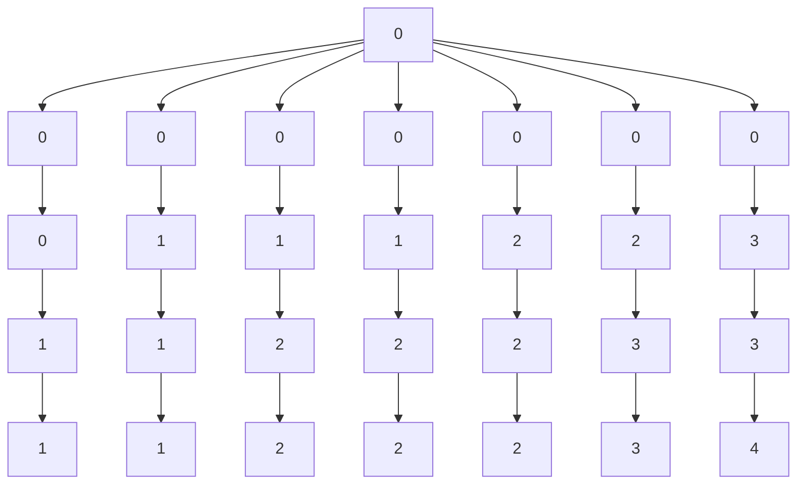

# 最长公共子序列

## 介绍

最长公共子序列（Longest Common Subsequence，简称 LCS）是计算机科学中一个经典的字符串算法问题。它用于找到两个或多个字符串中最长的子序列，这个子序列不需要在原字符串中连续出现，但必须保持字符的相对顺序。

:::note
**子序列**：子序列是从原字符串中删除一些字符（可以不连续）后得到的序列。例如，字符串 "abcde" 的子序列可以是 "ace" 或 "bde"。
:::

LCS 问题在生物信息学、文本比较、版本控制等领域有广泛的应用。例如，在比较两个版本的代码时，LCS 可以帮助我们找到它们之间的共同部分。

## 问题定义

给定两个字符串 `X` 和 `Y`，找到它们的最长公共子序列的长度。例如：

- 输入：`X = "ABCBDAB"`, `Y = "BDCAB"`
- 输出：`4`（最长公共子序列为 `"BCAB"` 或 `"BDAB"`）

## 动态规划解法

LCS 问题通常使用动态规划（Dynamic Programming，DP）来解决。动态规划是一种将复杂问题分解为更小的子问题的方法，通过存储子问题的解来避免重复计算。

### 动态规划表

我们使用一个二维数组 `dp` 来存储子问题的解。`dp[i][j]` 表示字符串 `X` 的前 `i` 个字符和字符串 `Y` 的前 `j` 个字符的最长公共子序列的长度。

### 状态转移方程

- 如果 `X[i-1] == Y[j-1]`，那么 `dp[i][j] = dp[i-1][j-1] + 1`。
- 如果 `X[i-1] != Y[j-1]`，那么 `dp[i][j] = max(dp[i-1][j], dp[i][j-1])`。

### 代码实现

以下是 Python 实现 LCS 的代码：

```python
def longest_common_subsequence(X, Y):
    m = len(X)
    n = len(Y)
    dp = [[0] * (n + 1) for _ in range(m + 1)]

    for i in range(1, m + 1):
        for j in range(1, n + 1):
            if X[i - 1] == Y[j - 1]:
                dp[i][j] = dp[i - 1][j - 1] + 1
            else:
                dp[i][j] = max(dp[i - 1][j], dp[i][j - 1])

    return dp[m][n]

# 示例
X = "ABCBDAB"
Y = "BDCAB"
print(longest_common_subsequence(X, Y))  # 输出: 4
```

### 动态规划表可视化

我们可以通过以下 `mermaid` 图表来可视化动态规划表：



## 实际应用场景

### 1. 文本比较

在文本编辑器中，LCS 用于比较两个文本文件的差异。例如，Git 使用 LCS 来显示代码的更改。

### 2. 生物信息学

在 DNA 序列分析中，LCS 用于比较不同物种的基因序列，以找到它们的共同部分。

### 3. 版本控制

在版本控制系统中，LCS 用于合并不同版本的代码，找到它们之间的共同部分并解决冲突。

## 总结

最长公共子序列（LCS）是一个经典的字符串算法问题，广泛应用于文本比较、生物信息学和版本控制等领域。通过动态规划，我们可以高效地解决这个问题。理解 LCS 不仅有助于掌握动态规划的基本思想，还能为处理更复杂的字符串问题打下基础。

## 附加资源与练习

- **练习**：尝试实现一个函数，不仅返回 LCS 的长度，还返回 LCS 本身。
- **资源**：阅读更多关于动态规划的内容，了解如何将其应用于其他问题，如背包问题、最短路径问题等。

:::tip
**提示**：在实现 LCS 时，可以尝试使用递归和记忆化搜索来优化动态规划的实现。
:::