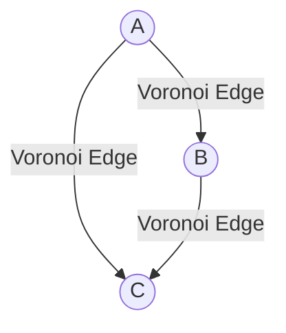

# Voronoi图

## 介绍

Voronoi图（Voronoi Diagram）是计算几何中的一个重要概念，用于将空间划分为多个区域，每个区域包含一个特定的点（称为站点），并且该区域内的所有点到该站点的距离比到其他站点更近。Voronoi图在计算机图形学、地理信息系统、机器人路径规划等领域有广泛应用。

## 基本概念

### 定义

给定平面上的一个点集 `P = {p1, p2, ..., pn}`，Voronoi图将平面划分为 `n` 个区域，每个区域 `V(pi)` 包含所有到 `pi` 的距离比到其他点 `pj (j ≠ i)` 更近的点。数学上，Voronoi区域 `V(pi)` 可以表示为：

```
V(pi) = {x | d(x, pi) ≤ d(x, pj) for all j ≠ i}
```

其中 `d(x, pi)` 表示点 `x` 到点 `pi` 的欧几里得距离。

### 示例

假设平面上有三个点 `A(1, 1)`、`B(4, 2)` 和 `C(3, 5)`，我们可以绘制它们的Voronoi图：



在这个图中，每个点周围的区域就是它的Voronoi区域。

## 算法实现

### 增量法

增量法是一种常见的构建Voronoi图的算法。其基本思想是逐个添加点，并在每一步更新当前的Voronoi图。

#### 伪代码

```plaintext
1. 初始化Voronoi图为空
2. 对于每个点 pi in P:
    a. 找到当前Voronoi图中与 pi 最近的区域
    b. 更新Voronoi图，添加 pi 的Voronoi区域
3. 返回最终的Voronoi图
```

#### Python 实现

```python
import matplotlib.pyplot as plt
import numpy as np
from scipy.spatial import Voronoi, voronoi_plot_2d

# 定义点集
points = np.array([[1, 1], [4, 2], [3, 5]])

# 计算Voronoi图
vor = Voronoi(points)

# 绘制Voronoi图
voronoi_plot_2d(vor)
plt.show()
```

#### 输入与输出

- **输入**: 点集 `points = [[1, 1], [4, 2], [3, 5]]`
- **输出**: 绘制的Voronoi图

:::tip
你可以使用 `scipy.spatial.Voronoi` 来快速计算和绘制Voronoi图。
:::

## 实际应用

### 地理信息系统

在地理信息系统中，Voronoi图常用于划分服务区域。例如，城市中的每个消防站可以看作一个站点，Voronoi图可以帮助确定每个消防站负责的区域。

### 机器人路径规划

在机器人路径规划中，Voronoi图可以用于生成安全路径。机器人可以沿着Voronoi图的边缘移动，以最大化与障碍物的距离。

### 图像处理

在图像处理中，Voronoi图可以用于图像分割和纹理分析。通过将图像中的像素点作为站点，Voronoi图可以帮助识别图像中的不同区域。

## 总结

Voronoi图是计算几何中的一个重要工具，广泛应用于多个领域。通过理解其基本概念和算法实现，你可以更好地应用它来解决实际问题。

## 附加资源与练习

- **资源**:
  - [Computational Geometry: Algorithms and Applications](https://www.amazon.com/Computational-Geometry-Applications-Mark-Berg/dp/3540779736)
  - [Voronoi Diagrams on Wikipedia](https://en.wikipedia.org/wiki/Voronoi_diagram)

- **练习**:
  1. 尝试使用不同的点集生成Voronoi图，并观察其变化。
  2. 实现一个简单的增量法算法来构建Voronoi图。
  3. 思考如何将Voronoi图应用于你感兴趣的领域。

:::caution
在实际应用中，Voronoi图的构建可能会遇到性能问题，特别是在点集较大的情况下。优化算法和数据结构是解决这些问题的关键。
:::