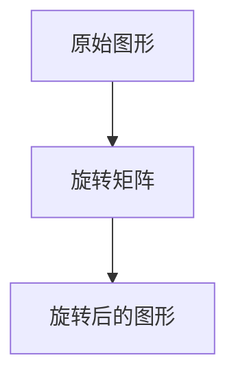

# 矩阵运算算法

矩阵是数学和计算机科学中非常重要的数据结构，广泛应用于线性代数、图形学、机器学习等领域。矩阵运算算法是处理矩阵数据的基础工具，掌握这些算法可以帮助你解决许多实际问题。

## 什么是矩阵？

矩阵是一个由数字排列成的矩形阵列，通常用大写字母表示。例如，一个 2x3 的矩阵可以表示为：

```
A = [
  [1, 2, 3],
  [4, 5, 6]
]
```

矩阵的行数和列数分别称为矩阵的维度。在上面的例子中，矩阵 `A` 是一个 2 行 3 列的矩阵。

## 矩阵的基本运算

### 1. 矩阵加法

矩阵加法是指将两个相同维度的矩阵对应位置的元素相加。例如：

```python
A = [
  [1, 2],
  [3, 4]
]

B = [
  [5, 6],
  [7, 8]
]

# 矩阵加法
C = [
  [A[0][0] + B[0][0], A[0][1] + B[0][1]],
  [A[1][0] + B[1][0], A[1][1] + B[1][1]]
]

print(C)  # 输出: [[6, 8], [10, 12]]
```

### 2. 矩阵乘法

矩阵乘法是指将两个矩阵相乘，生成一个新的矩阵。矩阵乘法的规则是：第一个矩阵的列数必须等于第二个矩阵的行数。例如：

```python
A = [
  [1, 2],
  [3, 4]
]

B = [
  [5, 6],
  [7, 8]
]

# 矩阵乘法
C = [
  [A[0][0] * B[0][0] + A[0][1] * B[1][0], A[0][0] * B[0][1] + A[0][1] * B[1][1]],
  [A[1][0] * B[0][0] + A[1][1] * B[1][0], A[1][0] * B[0][1] + A[1][1] * B[1][1]]
]

print(C)  # 输出: [[19, 22], [43, 50]]
```

:::note
矩阵乘法不满足交换律，即 `A * B` 不一定等于 `B * A`。
:::

### 3. 矩阵转置

矩阵转置是指将矩阵的行和列互换。例如：

```python
A = [
  [1, 2, 3],
  [4, 5, 6]
]

# 矩阵转置
A_transpose = [
  [A[0][0], A[1][0]],
  [A[0][1], A[1][1]],
  [A[0][2], A[1][2]]
]

print(A_transpose)  # 输出: [[1, 4], [2, 5], [3, 6]]
```

## 矩阵运算的实际应用

### 1. 图形变换

在计算机图形学中，矩阵运算用于实现图形的平移、旋转和缩放等变换。例如，一个二维图形的旋转可以通过矩阵乘法来实现。



### 2. 机器学习

在机器学习中，矩阵运算用于处理大量的数据。例如，线性回归模型中的参数更新通常通过矩阵运算来实现。

```python
# 线性回归中的矩阵运算示例
X = [
  [1, 2],
  [3, 4]
]

y = [
  [5],
  [6]
]

# 计算参数 theta
theta = (X.T * X)^-1 * X.T * y
```

## 总结

矩阵运算算法是数值计算中的重要组成部分，掌握这些算法可以帮助你解决许多实际问题。本文介绍了矩阵的基本概念、常见运算及其实际应用场景。希望这些内容能帮助你更好地理解矩阵运算。

## 附加资源

- [线性代数入门](https://example.com/linear-algebra)
- [矩阵运算的 Python 实现](https://example.com/matrix-python)
- [矩阵运算在机器学习中的应用](https://example.com/matrix-ml)

## 练习

1. 编写一个 Python 函数，实现两个矩阵的加法。
2. 编写一个 Python 函数，实现两个矩阵的乘法。
3. 尝试使用矩阵运算实现一个简单的图形旋转算法。

:::tip
如果你对矩阵运算有任何疑问，欢迎在评论区留言，我们会尽快回复你！
:::