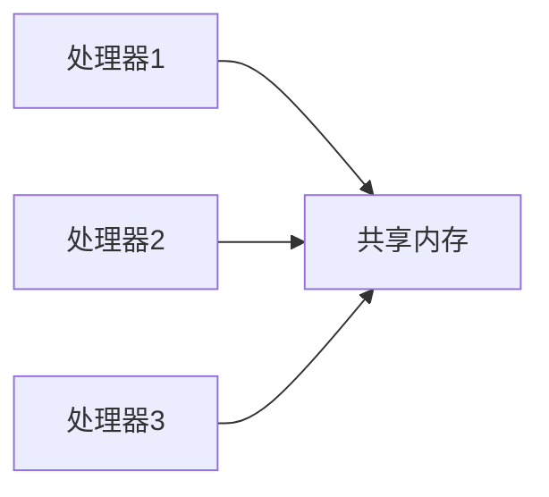
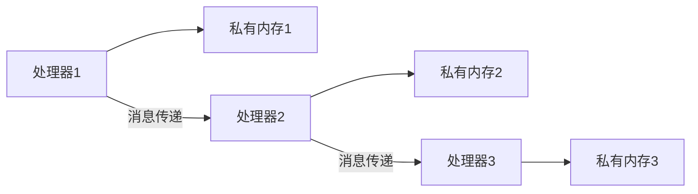
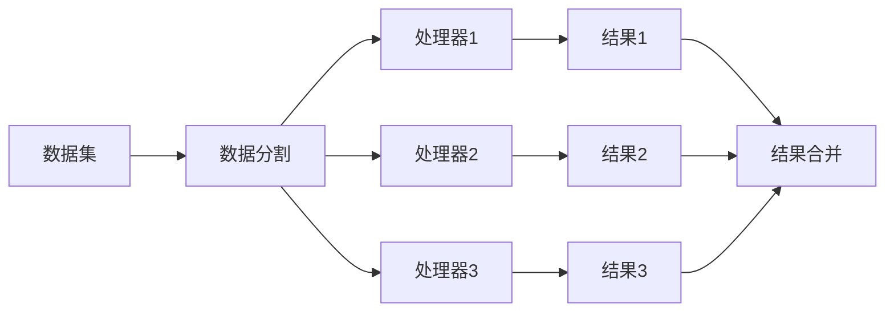

# 并行计算模型

并行计算模型是计算机科学中用于描述并行计算任务如何被分解、分配和执行的理论框架。它帮助我们理解如何利用多个处理器或计算资源来加速计算任务。对于初学者来说，理解并行计算模型是掌握并行与分布式算法的第一步。

## 什么是并行计算模型？

并行计算模型是一种抽象的计算框架，用于描述并行计算任务的结构和执行方式。它定义了如何将任务分解为多个子任务，以及这些子任务如何在多个处理器或计算节点上并行执行。常见的并行计算模型包括**共享内存模型**、**分布式内存模型**和**数据并行模型**。

### 共享内存模型

在共享内存模型中，多个处理器共享同一块内存空间。处理器之间通过读写共享内存来交换数据。这种模型的优点是编程简单，因为所有处理器都可以直接访问共享数据。然而，它也存在一些挑战，比如需要处理数据竞争和同步问题。



### 分布式内存模型

在分布式内存模型中，每个处理器都有自己的私有内存。处理器之间通过消息传递来交换数据。这种模型适用于大规模并行计算，因为它可以扩展到大量的处理器。然而，编程复杂度较高，因为需要显式地管理消息传递。



### 数据并行模型

数据并行模型是一种将数据分割成多个部分，并在不同的处理器上并行处理这些部分的模型。每个处理器执行相同的操作，但处理不同的数据。这种模型非常适合处理大规模数据集。



## 实际案例：矩阵乘法

让我们通过一个实际的例子来理解并行计算模型的应用。假设我们要计算两个矩阵的乘积。在串行计算中，我们需要依次计算每个元素的值。而在并行计算中，我们可以将矩阵分割成多个子矩阵，并在不同的处理器上并行计算这些子矩阵的乘积。

### 代码示例

以下是一个使用 Python 和 `multiprocessing` 模块实现的简单并行矩阵乘法示例：

```python
import numpy as np
from multiprocessing import Pool

def multiply_row_col(row, col):
    return sum(row[i] * col[i] for i in range(len(row)))

def matrix_multiply_parallel(A, B):
    n = len(A)
    m = len(B[0])
    p = len(B)
    
    # 将矩阵 B 转置以便按列访问
    B_T = list(zip(*B))
    
    # 创建进程池
    with Pool() as pool:
        # 并行计算每个元素
        results = pool.starmap(multiply_row_col, [(A[i], B_T[j]) for i in range(n) for j in range(m)])
    
    # 将结果重新组织成矩阵形式
    result_matrix = np.array(results).reshape(n, m)
    return result_matrix

# 示例矩阵
A = [[1, 2, 3], [4, 5, 6]]
B = [[7, 8], [9, 10], [11, 12]]

# 并行计算矩阵乘积
result = matrix_multiply_parallel(A, B)
print(result)
```

**输入：**
```python
A = [[1, 2, 3], [4, 5, 6]]
B = [[7, 8], [9, 10], [11, 12]]
```

**输出：**
```python
[[ 58  64]
 [139 154]]
```

:::tip
在实际应用中，矩阵乘法的并行化可以通过更高级的库（如 `NumPy` 或 `MPI`）来实现，以获得更高的性能。
:::

## 总结

并行计算模型为我们提供了一种有效的方式来利用多个处理器或计算资源来加速计算任务。通过理解不同的并行计算模型（如共享内存模型、分布式内存模型和数据并行模型），我们可以选择最适合特定任务的模型，并设计出高效的并行算法。

## 附加资源与练习

- **资源：**
  - [并行计算导论](https://www.example.com/intro-to-parallel-computing)
  - [MPI 编程指南](https://www.example.com/mpi-programming-guide)

- **练习：**
  1. 尝试修改上面的矩阵乘法代码，使其支持更大的矩阵。
  2. 研究并实现一个简单的分布式内存模型下的并行算法。
  3. 探索如何使用 `NumPy` 的并行功能来加速矩阵运算。

:::caution
在编写并行程序时，务必注意数据竞争和同步问题，以确保程序的正确性。
:::