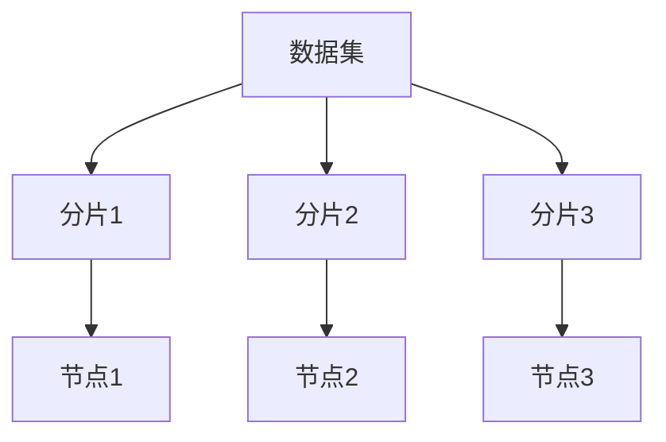
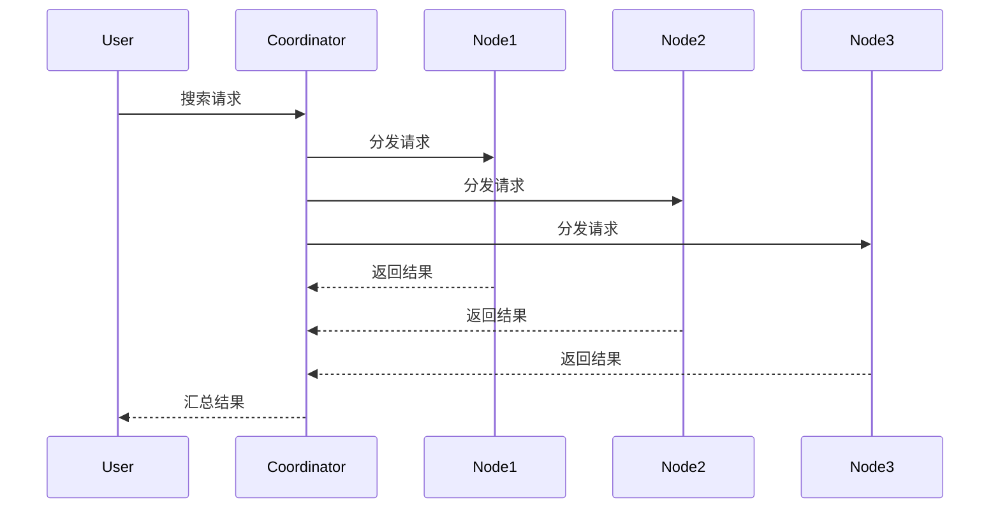

# 分布式搜索

## 介绍

分布式搜索是一种在多个计算节点上并行执行搜索任务的技术。与传统的单机搜索不同，分布式搜索通过将数据分布在多个节点上，利用这些节点的计算能力来加速搜索过程。这种方法特别适用于处理大规模数据集，例如搜索引擎、分布式数据库和推荐系统等。

在分布式搜索中，数据通常被分割成多个部分，每个部分存储在不同的节点上。当用户发起搜索请求时，系统会将请求分发到所有相关节点，每个节点在自己的数据部分中执行搜索，最后将结果汇总返回给用户。

## 分布式搜索的基本原理

### 数据分片

分布式搜索的第一步是将数据分片（Sharding）。数据分片是指将数据集分割成多个较小的部分，每个部分存储在不同的节点上。分片的方式可以根据数据的特性来选择，例如按范围、哈希值或关键字等。



### 搜索请求分发

当用户发起搜索请求时，系统会将请求分发到所有存储相关数据分片的节点上。每个节点在自己的数据分片中执行搜索，并将结果返回给协调节点（Coordinator Node）。



### 结果汇总

协调节点负责将所有节点的搜索结果汇总，并根据一定的规则（如排序、去重等）生成最终的结果返回给用户。

## 代码示例

以下是一个简单的分布式搜索的伪代码示例，展示了如何在多个节点上执行搜索并汇总结果。

```python
# 假设我们有三个节点，每个节点存储一部分数据
nodes = {
    "node1": ["apple", "banana", "cherry"],
    "node2": ["date", "elderberry", "fig"],
    "node3": ["grape", "honeydew", "kiwi"]
}

def search_in_node(node, query):
    # 在单个节点中执行搜索
    return [item for item in node if query in item]

def distributed_search(query):
    results = []
    for node_name, data in nodes.items():
        # 在每个节点上执行搜索
        node_results = search_in_node(data, query)
        results.extend(node_results)
    return results

# 示例搜索
query = "a"
print(distributed_search(query))  # 输出: ['apple', 'banana', 'grape', 'honeydew']
```

:::note
在实际的分布式系统中，节点之间的通信、数据同步和错误处理等问题会更加复杂。上述代码仅用于演示分布式搜索的基本原理。
:::

## 实际应用场景

### 搜索引擎

搜索引擎是分布式搜索的典型应用。例如，Google 使用分布式搜索技术来索引和搜索整个互联网的内容。数据被分片存储在成千上万的服务器上，当用户发起搜索请求时，系统会并行地在这些服务器上执行搜索，并将结果汇总返回给用户。

### 分布式数据库

分布式数据库（如 Elasticsearch）也广泛使用分布式搜索技术。在这些系统中，数据被分片存储在多个节点上，查询请求会被分发到所有相关节点，最后将结果汇总返回。

### 推荐系统

推荐系统通常需要处理大量的用户行为数据和商品信息。通过分布式搜索，系统可以快速地从海量数据中找到与用户兴趣匹配的内容，从而生成个性化的推荐。

## 总结

分布式搜索是一种强大的技术，能够有效地处理大规模数据集的搜索任务。通过将数据分片存储在多个节点上，并并行执行搜索请求，分布式搜索可以显著提高搜索效率。在实际应用中，分布式搜索被广泛应用于搜索引擎、分布式数据库和推荐系统等领域。

## 附加资源与练习

- **练习 1**：尝试实现一个简单的分布式搜索系统，使用多个线程模拟不同的节点，并在每个线程中执行搜索任务。
- **练习 2**：研究 Elasticsearch 或 Apache Solr 等分布式搜索引擎的实现原理，了解它们如何处理数据分片、请求分发和结果汇总。
- **附加资源**：
  - [Elasticsearch 官方文档](https://www.elastic.co/guide/en/elasticsearch/reference/current/index.html)
  - [Apache Solr 官方文档](https://solr.apache.org/guide/)

通过学习和实践，你将能够更好地理解分布式搜索的工作原理，并能够将其应用到实际项目中。