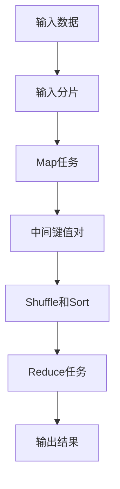

# MapReduce框架

MapReduce是一种用于处理大规模数据集的编程模型和框架，广泛应用于并行与分布式计算中。它由Google提出，旨在简化大规模数据处理的复杂性，使开发者能够专注于业务逻辑，而无需担心底层的分布式系统细节。

## 什么是MapReduce？

MapReduce的核心思想是将数据处理任务分解为两个主要阶段：**Map**和**Reduce**。这两个阶段分别处理数据的不同部分，最终将结果汇总。

- **Map阶段**：将输入数据分割成多个独立的块，并对每个块应用一个映射函数，生成一组中间键值对。
- **Reduce阶段**：将Map阶段生成的中间键值对按照键进行分组，并对每组应用一个归约函数，生成最终的输出结果。

## MapReduce的工作原理

为了更好地理解MapReduce的工作原理，我们可以通过一个简单的例子来说明。

### 示例：单词计数

假设我们有一个文本文件，内容如下：

```
hello world
hello mapreduce
world mapreduce
```

我们的目标是统计每个单词在文本中出现的次数。

#### Map阶段

在Map阶段，我们将每一行文本分割成单词，并为每个单词生成一个键值对，其中键是单词，值是1。

```python
def map_function(line):
    words = line.split()
    for word in words:
        yield (word, 1)
```

应用Map函数后，我们得到以下中间键值对：

```
(hello, 1)
(world, 1)
(hello, 1)
(mapreduce, 1)
(world, 1)
(mapreduce, 1)
```

#### Reduce阶段

在Reduce阶段，我们将相同键的值进行累加，得到每个单词的总出现次数。

```python
def reduce_function(word, counts):
    yield (word, sum(counts))
```

应用Reduce函数后，我们得到最终的输出结果：

```
(hello, 2)
(world, 2)
(mapreduce, 2)
```

### MapReduce的执行流程

MapReduce的执行流程可以总结为以下几个步骤：

1. **输入分片**：将输入数据分割成多个独立的分片，每个分片由一个Map任务处理。
2. **Map任务**：对每个分片应用Map函数，生成中间键值对。
3. **Shuffle和Sort**：将中间键值对按照键进行分组和排序，以便Reduce任务处理。
4. **Reduce任务**：对每个键的分组应用Reduce函数，生成最终结果。
5. **输出**：将Reduce任务的输出写入文件系统。



## MapReduce的实际应用

MapReduce框架在大数据处理中有着广泛的应用，以下是一些常见的应用场景：

- **搜索引擎**：用于索引网页内容，统计词频等。
- **日志分析**：分析服务器日志，统计访问量、错误率等。
- **数据挖掘**：处理大规模数据集，进行聚类、分类等操作。
- **机器学习**：用于训练大规模机器学习模型，如推荐系统。

### 案例：搜索引擎的网页索引

在搜索引擎中，MapReduce可以用于构建网页索引。Map任务负责解析网页内容并提取关键词，Reduce任务则负责将关键词与网页URL进行关联，最终生成倒排索引。

```python
def map_function(webpage):
    words = extract_keywords(webpage.content)
    for word in words:
        yield (word, webpage.url)

def reduce_function(word, urls):
    yield (word, list(urls))
```

通过这种方式，搜索引擎可以快速定位包含特定关键词的网页。

## 总结

MapReduce框架通过将复杂的数据处理任务分解为简单的Map和Reduce操作，极大地简化了大规模数据处理的复杂性。它不仅适用于文本处理，还可以应用于各种大数据场景，如日志分析、数据挖掘和机器学习等。

:::tip
如果你想进一步学习MapReduce，可以尝试以下练习：
1. 实现一个简单的MapReduce程序，统计一段文本中每个字母的出现次数。
2. 使用MapReduce框架处理一个真实的日志文件，统计每个IP地址的访问次数。
:::

## 附加资源

- [Google MapReduce论文](https://research.google/pubs/pub62/)
- [Hadoop MapReduce教程](https://hadoop.apache.org/docs/current/hadoop-mapreduce-client/hadoop-mapreduce-client-core/MapReduceTutorial.html)
- [MapReduce编程模型详解](https://www.oreilly.com/library/view/hadoop-the-definitive/9781491901687/ch04.html)
