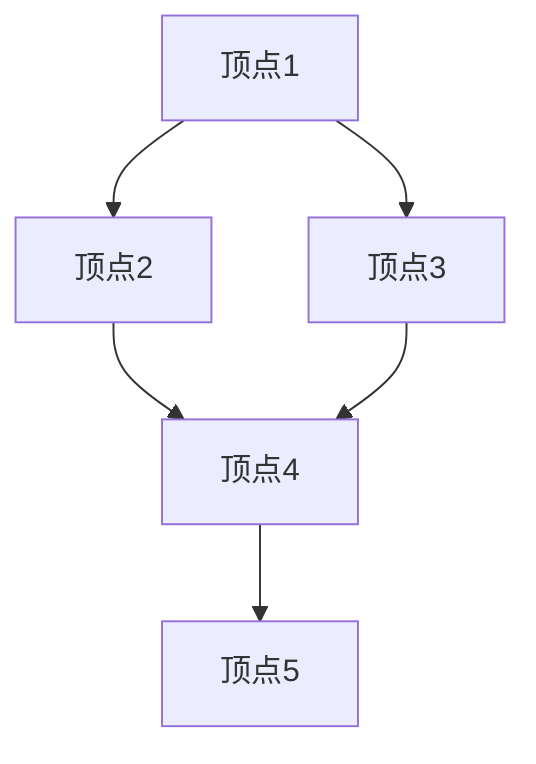

# 分布式图处理

分布式图处理是一种在分布式系统中处理大规模图数据的技术。随着数据规模的不断增长，传统的单机图处理算法已经无法满足需求。分布式图处理通过将图数据分割到多个计算节点上，利用并行计算能力高效地解决图相关问题。

## 什么是分布式图处理？

图是由节点（顶点）和边组成的数据结构，常用于表示复杂的关系网络，例如社交网络、网页链接、交通网络等。分布式图处理的目标是将这些图数据分布到多个计算节点上，并通过并行计算来加速图算法的执行。

### 为什么需要分布式图处理？

1. **数据规模大**：现代应用中的图数据通常包含数百万甚至数十亿的节点和边，单机无法存储和处理。
2. **计算复杂度高**：许多图算法（如最短路径、PageRank等）的计算复杂度较高，分布式计算可以显著加速。
3. **容错性**：分布式系统可以通过冗余和故障恢复机制提高系统的可靠性。

## 分布式图处理的基本概念

### 图分割

在分布式图处理中，首先需要将图数据分割到多个计算节点上。常见的分割方法包括：

- **顶点分割**：将图的顶点分配到不同的节点上，每个节点存储其顶点的邻接表。
- **边分割**：将图的边分配到不同的节点上，每个节点存储一部分边。



### 分布式图处理模型

常见的分布式图处理模型包括：

1. **BSP（Bulk Synchronous Parallel）模型**：将计算分为多个超步（superstep），每个超步包含计算、通信和同步三个阶段。
2. **Pregel模型**：由Google提出，基于BSP模型，每个顶点在每个超步中执行用户定义的函数。

### 分布式图处理算法

#### PageRank算法

PageRank是一种用于网页排名的算法，也可以用于其他图数据。其核心思想是通过迭代计算每个节点的权重。

```python
# 伪代码示例
def pagerank(graph, iterations=10, damping_factor=0.85):
    rank = {node: 1.0 / len(graph) for node in graph}
    for _ in range(iterations):
        new_rank = {}
        for node in graph:
            new_rank[node] = (1 - damping_factor) / len(graph)
            for neighbor in graph[node]:
                new_rank[node] += damping_factor * rank[neighbor] / len(graph[neighbor])
        rank = new_rank
    return rank
```

#### 输入与输出

- **输入**：一个图，表示为邻接表。
- **输出**：每个节点的PageRank值。

### 实际应用场景

1. **社交网络分析**：通过分布式图处理，可以快速分析社交网络中的社区结构、影响力传播等。
2. **推荐系统**：利用图算法分析用户-物品关系，生成个性化推荐。
3. **路径规划**：在交通网络中，分布式图处理可以用于实时计算最短路径。

## 总结

分布式图处理是处理大规模图数据的关键技术。通过将图数据分布到多个计算节点上，并利用并行计算能力，可以高效地解决复杂的图相关问题。本文介绍了分布式图处理的基本概念、常见算法以及实际应用场景。

## 附加资源与练习

- **资源**：
  - [Pregel: A System for Large-Scale Graph Processing](https://research.google/pubs/pub37252/)
  - [Apache Giraph](https://giraph.apache.org/)：一个开源的分布式图处理系统。
- **练习**：
  1. 实现一个简单的PageRank算法，并在小规模图上测试。
  2. 尝试使用分布式图处理框架（如Apache Giraph）处理大规模图数据。

:::tip
分布式图处理的学习需要结合实践，建议在学习理论的同时，动手编写代码并运行实验。
:::