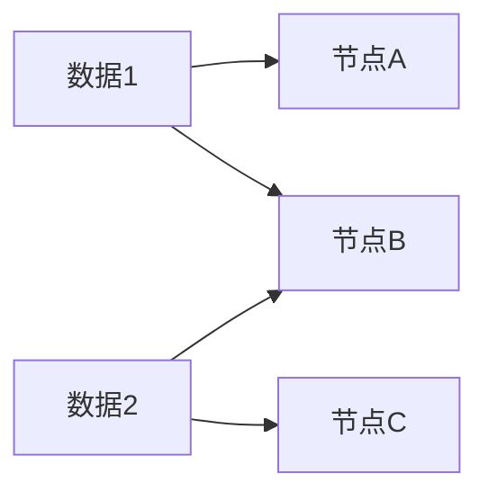
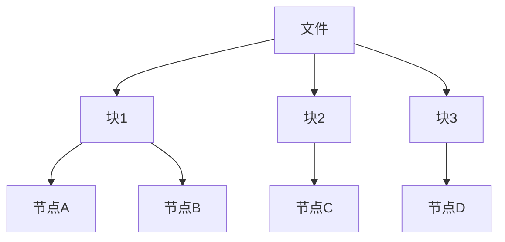

# 分布式存储算法

## 介绍

在现代计算环境中，数据量呈指数级增长，传统的单机存储系统已经无法满足需求。分布式存储算法应运而生，它通过将数据分散存储在多个节点上，实现了高可用性、高扩展性和容错性。本文将详细介绍分布式存储算法的核心概念、实现方式以及实际应用场景。

## 什么是分布式存储算法？

分布式存储算法是一种将数据分布在多个存储节点上的算法。它的主要目标是确保数据的高可用性、一致性和容错性。常见的分布式存储算法包括一致性哈希、分布式哈希表（DHT）和分布式文件系统（如HDFS）等。

## 核心概念

### 1. 一致性哈希

一致性哈希是一种特殊的哈希算法，用于在分布式系统中分配数据到多个节点。它的主要优点是当节点增加或减少时，数据的重新分配最小化。



### 2. 分布式哈希表（DHT）

分布式哈希表是一种分布式系统，用于存储和检索键值对。每个节点负责存储一部分数据，并通过哈希函数确定数据的存储位置。

```python
class DHT:
    def __init__(self):
        self.nodes = {}

    def add_node(self, node_id):
        self.nodes[node_id] = {}

    def store(self, key, value):
        node_id = hash(key) % len(self.nodes)
        self.nodes[node_id][key] = value

    def retrieve(self, key):
        node_id = hash(key) % len(self.nodes)
        return self.nodes[node_id].get(key, None)
```

### 3. 分布式文件系统

分布式文件系统（如HDFS）将大文件分割成多个块，并将这些块分散存储在多个节点上。每个块都有多个副本，以确保数据的容错性。



## 实际应用场景

### 1. 云存储

云存储服务（如Amazon S3、Google Cloud Storage）使用分布式存储算法来存储和管理海量数据。这些服务通过分布式存储算法实现了高可用性和容错性。

### 2. 分布式数据库

分布式数据库（如Cassandra、MongoDB）使用分布式存储算法来存储和检索数据。这些数据库通过分布式存储算法实现了高扩展性和一致性。

### 3. 内容分发网络（CDN）

内容分发网络（CDN）使用分布式存储算法来缓存和分发内容。CDN通过将内容分散存储在多个节点上，实现了快速的内容访问和分发。

## 总结

分布式存储算法是现代分布式系统的核心组成部分。通过将数据分散存储在多个节点上，分布式存储算法实现了高可用性、高扩展性和容错性。本文介绍了一致性哈希、分布式哈希表和分布式文件系统等核心概念，并展示了这些算法在云存储、分布式数据库和内容分发网络中的实际应用。

## 附加资源

- [一致性哈希算法详解](https://en.wikipedia.org/wiki/Consistent_hashing)
- [分布式哈希表（DHT）](https://en.wikipedia.org/wiki/Distributed_hash_table)
- [Hadoop分布式文件系统（HDFS）](https://hadoop.apache.org/docs/stable/hadoop-project-dist/hadoop-hdfs/HdfsDesign.html)

## 练习

1. 实现一个简单的一致性哈希算法，并测试其在节点增加和减少时的表现。
2. 使用Python实现一个简单的分布式哈希表（DHT），并测试其存储和检索功能。
3. 研究HDFS的架构，并尝试在本地环境中搭建一个简单的HDFS集群。
