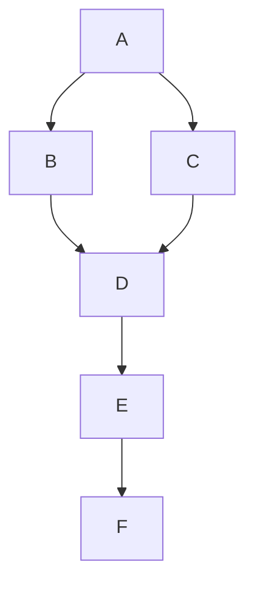

# 数据分解策略

在并行与分布式算法中，**数据分解策略**是一种将数据分割为多个部分的技术，以便多个处理器或计算节点可以同时处理这些部分。通过合理的数据分解，我们可以显著提升计算效率，减少计算时间。本文将详细介绍数据分解策略的基本概念、常见方法以及实际应用。

## 什么是数据分解策略？

数据分解策略的核心思想是将一个大型数据集分解为多个较小的子集，每个子集可以由不同的处理器或计算节点独立处理。这种分解方式使得多个任务可以并行执行，从而加速整体计算过程。

数据分解策略的选择通常取决于问题的性质、数据的结构以及计算资源的分布。常见的数据分解策略包括**块分解**、**循环分解**和**不规则分解**。

## 常见的数据分解策略

### 1. 块分解（Block Decomposition）

块分解是最简单的数据分解策略之一。它将数据均匀地划分为若干块，每个块分配给一个处理器或计算节点。块分解适用于数据分布均匀且计算任务相似的情况。

#### 示例：矩阵乘法中的块分解

假设我们有一个矩阵 `A`，我们希望将其分解为 4 个块，每个块由一个处理器处理。

```python
# 假设矩阵 A 是一个 4x4 的矩阵
A = [
    [1, 2, 3, 4],
    [5, 6, 7, 8],
    [9, 10, 11, 12],
    [13, 14, 15, 16]
]

# 将矩阵 A 分解为 4 个 2x2 的块
block1 = [row[:2] for row in A[:2]]  # 左上角块
block2 = [row[2:] for row in A[:2]]  # 右上角块
block3 = [row[:2] for row in A[2:]]  # 左下角块
block4 = [row[2:] for row in A[2:]]  # 右下角块
```

每个块可以由不同的处理器独立处理，最后将结果合并。

### 2. 循环分解（Cyclic Decomposition）

循环分解将数据按循环方式分配给不同的处理器。与块分解不同，循环分解适用于数据分布不均匀或计算任务差异较大的情况。

#### 示例：循环分解

假设我们有一个数组 `data = [1, 2, 3, 4, 5, 6, 7, 8]`，我们希望将其分配给 3 个处理器。

```python
data = [1, 2, 3, 4, 5, 6, 7, 8]
processors = [[], [], []]

for i, value in enumerate(data):
    processors[i % 3].append(value)

# 结果：
# processors[0] = [1, 4, 7]
# processors[1] = [2, 5, 8]
# processors[2] = [3, 6]
```

每个处理器处理分配到的数据，最后将结果合并。

### 3. 不规则分解（Irregular Decomposition）

不规则分解适用于数据结构复杂或数据分布不均匀的情况。在这种情况下，数据分解的方式可能不固定，需要根据具体问题进行调整。

#### 示例：图分解

假设我们有一个图，我们希望将其分解为多个子图，每个子图由一个处理器处理。由于图的结构可能不规则，分解方式需要根据图的连通性进行调整。



在这个图中，我们可以将节点 `A`、`B`、`C` 分配给处理器 1，节点 `D`、`E` 分配给处理器 2，节点 `F` 分配给处理器 3。

## 实际应用场景

### 1. 大规模矩阵运算

在大规模矩阵运算中，数据分解策略可以显著提升计算效率。例如，在矩阵乘法中，块分解可以将矩阵划分为多个子矩阵，每个子矩阵由不同的处理器计算，最后将结果合并。

### 2. 图像处理

在图像处理中，图像可以被分解为多个区域，每个区域由不同的处理器处理。例如，在图像滤波中，每个处理器可以独立处理图像的一个区域，最后将处理后的图像合并。

### 3. 分布式数据库

在分布式数据库中，数据分解策略用于将数据分布到多个节点上。例如，在分布式哈希表中，数据根据哈希值被分配到不同的节点上，从而实现高效的数据存储和检索。

## 总结

数据分解策略是并行与分布式算法中的关键技术之一。通过合理的数据分解，我们可以充分利用计算资源，提升计算效率。本文介绍了块分解、循环分解和不规则分解三种常见的数据分解策略，并展示了它们在实际应用中的使用场景。

:::tip 提示
在实际应用中，选择合适的数据分解策略需要根据问题的性质、数据的结构以及计算资源的分布进行综合考虑。
:::

## 附加资源与练习

1. **练习**：尝试将一个 8x8 的矩阵分解为 4 个 4x4 的块，并编写代码模拟并行处理。
2. **资源**：阅读更多关于并行算法的书籍，如《Introduction to Parallel Computing》。

通过不断练习和学习，你将能够更好地掌握数据分解策略，并在实际项目中应用这些技术。