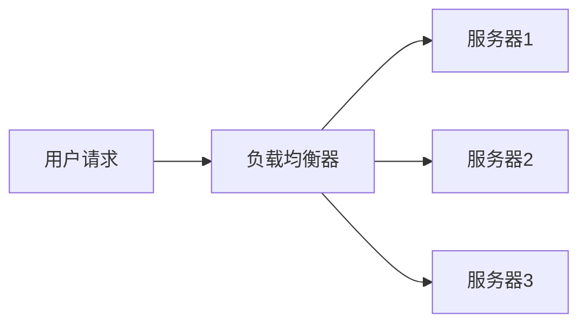

# 负载均衡

## 介绍

在并行与分布式系统中，负载均衡（Load Balancing）是一种关键技术，用于将工作负载均匀分配到多个计算资源（如处理器、服务器或节点）上。通过负载均衡，系统可以最大化资源利用率，减少任务完成时间，并提高整体性能和可靠性。

负载均衡的核心目标是避免某些资源过载，而其他资源闲置。这对于处理大规模数据或高并发请求的系统尤为重要。

## 负载均衡的基本概念

### 1. 什么是负载均衡？

负载均衡是一种分配机制，用于将任务或请求均匀分配到多个计算资源上。这些资源可以是物理服务器、虚拟机、处理器核心或其他计算单元。

### 2. 为什么需要负载均衡？

- **提高性能**：通过均匀分配任务，系统可以更快地完成任务。
- **提高可靠性**：避免单点故障，即使某个资源失效，系统仍能继续运行。
- **资源优化**：确保所有资源都被充分利用，避免资源浪费。

## 负载均衡的实现方式

### 1. 静态负载均衡

静态负载均衡在任务分配之前就确定了每个资源的负载量。这种方法适用于任务量已知且变化不大的场景。

#### 示例：轮询调度

轮询调度是一种简单的静态负载均衡方法，任务按顺序分配给每个资源。

```python
resources = ['Resource1', 'Resource2', 'Resource3']
tasks = ['Task1', 'Task2', 'Task3', 'Task4', 'Task5']

for i, task in enumerate(tasks):
    resource = resources[i % len(resources)]
    print(f"Assigning {task} to {resource}")
```

**输出：**
```
Assigning Task1 to Resource1
Assigning Task2 to Resource2
Assigning Task3 to Resource3
Assigning Task4 to Resource1
Assigning Task5 to Resource2
```

### 2. 动态负载均衡

动态负载均衡根据系统的实时状态动态调整任务分配。这种方法适用于任务量变化较大或资源状态不稳定的场景。

#### 示例：基于负载的调度

动态负载均衡可以根据每个资源的当前负载情况来分配任务。

```python
resources = {'Resource1': 0, 'Resource2': 0, 'Resource3': 0}
tasks = ['Task1', 'Task2', 'Task3', 'Task4', 'Task5']

for task in tasks:
    resource = min(resources, key=resources.get)
    resources[resource] += 1
    print(f"Assigning {task} to {resource} (Load: {resources[resource]})")
```

**输出：**
```
Assigning Task1 to Resource1 (Load: 1)
Assigning Task2 to Resource2 (Load: 1)
Assigning Task3 to Resource3 (Load: 1)
Assigning Task4 to Resource1 (Load: 2)
Assigning Task5 to Resource2 (Load: 2)
```

## 负载均衡的实际应用

### 1. Web 服务器负载均衡

在高流量的网站中，负载均衡器用于将用户请求分配到多个服务器上，以确保每个服务器的负载均衡，从而提高响应速度和可靠性。



### 2. 分布式计算

在分布式计算中，负载均衡用于将计算任务分配到多个节点上，以加快数据处理速度。例如，MapReduce 框架中的任务调度器就是一个负载均衡的典型应用。

## 总结

负载均衡是并行与分布式系统中的关键技术，能够显著提高系统的性能和可靠性。通过静态或动态的负载均衡方法，系统可以更有效地利用资源，避免过载和资源浪费。

## 附加资源与练习

- **练习**：尝试实现一个简单的动态负载均衡算法，模拟多个任务分配到多个资源的过程。
- **进一步阅读**：
  - [负载均衡算法详解](https://example.com/load-balancing-algorithms)
  - [分布式系统中的负载均衡策略](https://example.com/distributed-load-balancing)

:::tip
在实际应用中，选择合适的负载均衡策略需要根据具体的系统需求和资源状况来决定。动态负载均衡通常更适合复杂和变化的环境。
:::