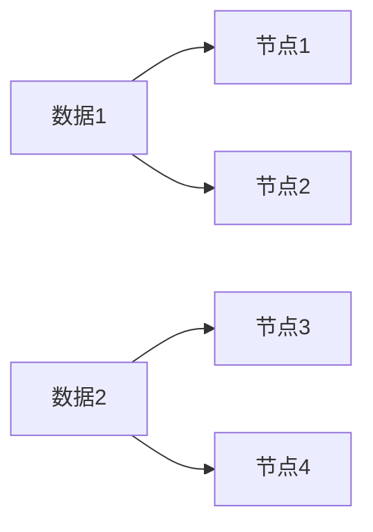

# 分布式算法基础

## 介绍

分布式算法是计算机科学中的一个重要领域，它研究如何在多个独立的计算节点（如服务器、计算机或设备）之间协同工作，以解决复杂的问题。与传统的单机算法不同，分布式算法需要考虑节点之间的通信、同步、故障处理等问题。

分布式算法的核心思想是将任务分解为多个子任务，并在不同的节点上并行执行这些子任务。通过这种方式，分布式算法可以显著提高计算效率，并处理单机无法胜任的大规模问题。

## 分布式算法的核心概念

### 1. 节点与通信
在分布式系统中，每个计算单元被称为**节点**。节点之间通过网络进行通信。通信的方式可以是同步的（节点等待其他节点的响应）或异步的（节点无需等待）。

:::tip
**同步通信**适用于需要严格协调的场景，而**异步通信**则更适合高延迟或不可靠的网络环境。
:::

### 2. 一致性
分布式系统中的节点需要就某些状态或决策达成一致。**一致性算法**（如 Paxos 或 Raft）是确保所有节点在相同状态下工作的关键。

### 3. 容错性
分布式系统需要能够处理节点故障或网络分区等问题。**容错性**是分布式算法设计中的重要考虑因素。

### 4. 负载均衡
为了充分利用所有节点的计算能力，分布式算法通常需要实现**负载均衡**，即将任务均匀分配到各个节点上。

## 分布式算法的实际应用

### 案例 1：分布式排序
假设我们有一个包含数百万条记录的数据集，需要对其进行排序。单机排序可能无法在合理时间内完成，因此我们可以使用分布式排序算法。

#### 示例代码
以下是一个简单的分布式排序算法的伪代码：

```python
# 主节点
def distributed_sort(data):
    # 将数据分割为多个块
    chunks = split_data(data, num_nodes)
    
    # 将每个块发送到不同的节点
    for i, chunk in enumerate(chunks):
        send_to_node(i, chunk)
    
    # 等待所有节点完成排序
    sorted_chunks = []
    for i in range(num_nodes):
        sorted_chunk = receive_from_node(i)
        sorted_chunks.append(sorted_chunk)
    
    # 合并排序后的块
    final_result = merge_sorted_chunks(sorted_chunks)
    return final_result

# 从节点
def node_sort(chunk):
    sorted_chunk = sort(chunk)
    return sorted_chunk
```

#### 输入与输出
- **输入**：一个未排序的大数据集。
- **输出**：一个全局排序后的数据集。

### 案例 2：分布式哈希表（DHT）
分布式哈希表是一种用于在分布式系统中存储和查找数据的结构。它通过将数据分散到多个节点上，实现了高效的查找和存储。



:::note
分布式哈希表广泛应用于 P2P 网络和分布式存储系统中。
:::

## 总结

分布式算法是处理大规模计算问题的关键技术。通过将任务分解并分配到多个节点上，分布式算法能够显著提高计算效率，并处理单机无法胜任的任务。本文介绍了分布式算法的核心概念，并通过实际案例展示了其应用场景。

## 附加资源与练习

- **资源**：
  - 《分布式系统：概念与设计》—— Andrew S. Tanenbaum
  - [Raft 一致性算法](https://raft.github.io/) 官方文档
- **练习**：
  1. 实现一个简单的分布式排序算法。
  2. 研究并实现一个分布式哈希表的基本功能。

通过学习和实践，你将逐步掌握分布式算法的核心思想，并能够将其应用于实际项目中。