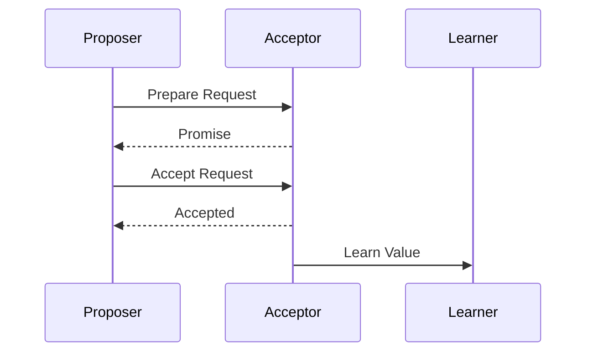
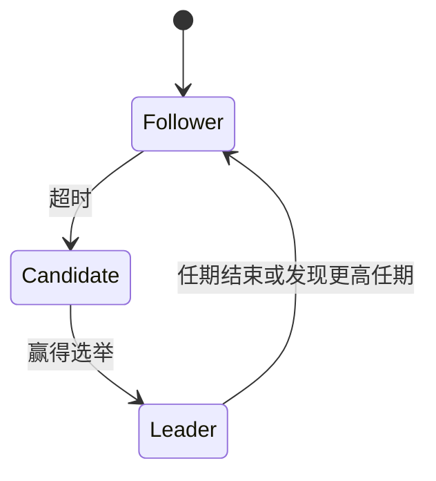

# 一致性协议

在分布式系统中，**一致性协议**是确保多个节点在共享数据时保持一致性的关键机制。由于分布式系统中的节点可能分布在不同的地理位置，网络延迟、节点故障等问题可能导致数据不一致。一致性协议的目标是解决这些问题，确保所有节点在某个时间点上对数据的状态达成一致。

## 什么是分布式一致性？

分布式一致性是指在分布式系统中，多个节点对某个数据的状态达成一致。例如，在一个分布式数据库中，多个副本可能存储相同的数据。当其中一个副本更新数据时，其他副本也需要同步更新，以确保数据的一致性。

:::note
**注意**：分布式一致性并不意味着所有节点在同一时间点看到完全相同的数据，而是指系统最终会达到一致的状态。
:::

## 一致性协议的类型

一致性协议可以根据其实现方式和目标分为多种类型，以下是几种常见的一致性协议：

1. **强一致性（Strong Consistency）**：所有节点在任何时刻看到的数据都是一致的。例如，Paxos 和 Raft 协议。
2. **最终一致性（Eventual Consistency）**：系统最终会达到一致状态，但在某个时间点，不同节点可能看到不同的数据。例如，Dynamo 系统。
3. **因果一致性（Causal Consistency）**：如果两个操作之间存在因果关系，则系统会保证它们的顺序一致性。

## Paxos 协议

Paxos 是一种经典的分布式一致性协议，由 Leslie Lamport 提出。它用于在分布式系统中达成一致，即使在存在网络分区或节点故障的情况下也能正常工作。

### Paxos 的工作原理

Paxos 协议分为三个阶段：**准备阶段（Prepare）**、**接受阶段（Accept）** 和 **学习阶段（Learn）**。

1. **准备阶段**：提议者（Proposer）向大多数接受者（Acceptor）发送准备请求，请求接受者承诺不再接受比当前提议编号更小的提议。
2. **接受阶段**：如果提议者收到大多数接受者的承诺，它会向接受者发送一个包含提议值的接受请求。
3. **学习阶段**：一旦提议被大多数接受者接受，学习者（Learner）会学习到这个值，并将其传播给其他节点。



### Paxos 的代码示例

以下是一个简化的 Paxos 协议的伪代码示例：

```python
class Paxos:
    def __init__(self):
        self.proposed_value = None
        self.accepted_value = None

    def prepare(self, proposal_id):
        # 发送准备请求
        pass

    def accept(self, proposal_id, value):
        # 发送接受请求
        pass

    def learn(self, value):
        # 学习最终值
        pass
```

## Raft 协议

Raft 是另一种分布式一致性协议，旨在比 Paxos 更易于理解和实现。Raft 通过选举一个领导者（Leader）来管理日志复制，从而确保一致性。

### Raft 的工作原理

Raft 协议将时间划分为多个任期（Term），每个任期内有一个领导者负责处理客户端请求。领导者将日志条目复制到其他节点，并在大多数节点确认后提交日志。



### Raft 的代码示例

以下是一个简化的 Raft 协议的伪代码示例：

```python
class Raft:
    def __init__(self):
        self.current_term = 0
        self.voted_for = None
        self.log = []

    def request_vote(self):
        # 请求投票
        pass

    def append_entries(self):
        # 追加日志条目
        pass
```

## 实际应用场景

一致性协议在分布式数据库、分布式文件系统和区块链等领域有广泛应用。例如：

- **分布式数据库**：如 Google Spanner 使用 Paxos 协议来确保数据的一致性。
- **区块链**：如以太坊使用 Raft 协议来管理共识机制。

## 总结

一致性协议是分布式系统中确保数据一致性的核心机制。通过 Paxos 和 Raft 等协议，系统能够在网络分区和节点故障的情况下仍然保持一致性。理解这些协议的工作原理对于设计和实现可靠的分布式系统至关重要。

## 附加资源

- [Paxos Made Simple](https://lamport.azurewebsites.net/pubs/paxos-simple.pdf) - Leslie Lamport 的经典论文。
- [Raft 官方网站](https://raft.github.io/) - Raft 协议的详细文档和实现。

## 练习

1. 实现一个简单的 Paxos 协议模拟器，模拟多个节点之间的通信过程。
2. 阅读 Raft 协议的论文，并尝试实现一个基本的 Raft 领导者选举机制。