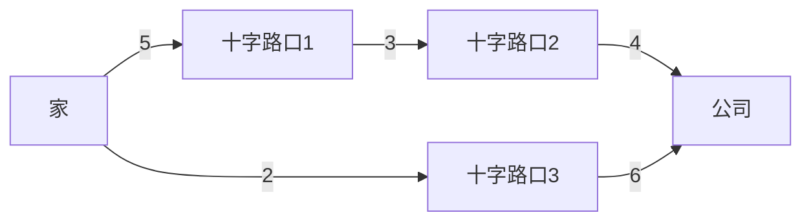

# 问题抽象化

在编程和算法设计中，**问题抽象化**是一个至关重要的技巧。它帮助我们将复杂的问题简化为更易于理解和解决的形式。通过抽象化，我们可以忽略不必要的细节，专注于问题的核心部分，从而设计出高效的算法。

## 什么是问题抽象化？

问题抽象化是指将现实世界中的复杂问题转化为计算机可以处理的简化模型。这个过程通常包括以下几个步骤：

1. **识别问题的核心**：确定问题的关键要素，忽略无关的细节。
2. **建立模型**：用数学或逻辑的方式描述问题。
3. **设计算法**：基于模型设计解决方案。
4. **验证和优化**：测试算法的正确性和效率，并进行必要的优化。

:::tip
抽象化的关键在于找到问题的本质，而不是被表面的复杂性所迷惑。
:::

## 问题抽象化的步骤

### 1. 识别问题的核心

假设我们需要解决一个现实世界中的问题：**“如何找到从家到公司的最短路径？”**

在这个问题中，核心要素包括：
- **起点**：家
- **终点**：公司
- **路径**：连接起点和终点的道路
- **权重**：每条路径的长度或时间

其他细节，如道路的宽度、交通信号灯的数量等，可以暂时忽略。

### 2. 建立模型

我们可以将这个问题抽象为一个**图论问题**。具体来说：
- **节点**：代表地点（如家、公司、十字路口等）
- **边**：代表道路
- **权重**：代表路径的长度或时间



在这个图中，我们需要找到从节点 `A`（家）到节点 `D`（公司）的最短路径。

### 3. 设计算法

基于这个模型，我们可以使用**Dijkstra算法**来找到最短路径。Dijkstra算法是一种经典的图搜索算法，适用于带权重的图。

```python
import heapq

def dijkstra(graph, start):
    distances = {node: float('inf') for node in graph}
    distances[start] = 0
    queue = [(0, start)]
    
    while queue:
        current_distance, current_node = heapq.heappop(queue)
        
        if current_distance > distances[current_node]:
            continue
        
        for neighbor, weight in graph[current_node].items():
            distance = current_distance + weight
            if distance < distances[neighbor]:
                distances[neighbor] = distance
                heapq.heappush(queue, (distance, neighbor))
    
    return distances

# 示例图
graph = {
    'A': {'B': 5, 'E': 2},
    'B': {'C': 3},
    'C': {'D': 4},
    'D': {},
    'E': {'D': 6}
}

# 计算从A到各节点的最短距离
distances = dijkstra(graph, 'A')
print(distances)
```

**输出：**
```python
{'A': 0, 'B': 5, 'C': 8, 'D': 8, 'E': 2}
```

从输出中可以看出，从 `A` 到 `D` 的最短路径长度为 `8`。

### 4. 验证和优化

在实际应用中，我们可能需要考虑更多的因素，如交通拥堵、道路封闭等。这些因素可以通过调整权重或引入动态算法来处理。

:::caution
在实际应用中，算法的正确性和效率至关重要。务必进行充分的测试和优化。
:::

## 实际案例

### 案例1：社交网络中的最短路径

在社交网络中，我们可以将用户抽象为节点，将好友关系抽象为边。通过抽象化，我们可以使用图论算法来找到两个用户之间的最短路径（即最少的中介人）。

### 案例2：物流配送

在物流配送中，我们需要找到从仓库到客户的最短路径。通过抽象化，我们可以将仓库、客户和道路抽象为图，并使用最短路径算法来优化配送路线。

## 总结

问题抽象化是算法设计中的核心技巧之一。通过将复杂问题简化为数学模型，我们可以更容易地设计出高效的算法。在实际应用中，抽象化帮助我们专注于问题的本质，从而找到最优的解决方案。

:::note
**附加资源：**
- [图论基础](https://en.wikipedia.org/wiki/Graph_theory)
- [Dijkstra算法详解](https://en.wikipedia.org/wiki/Dijkstra%27s_algorithm)
:::

**练习：**
1. 尝试将“如何在图书馆中找到最短的借书路径”抽象为一个图论问题，并设计算法解决。
2. 修改上述Dijkstra算法，使其能够处理负权边（提示：考虑使用Bellman-Ford算法）。