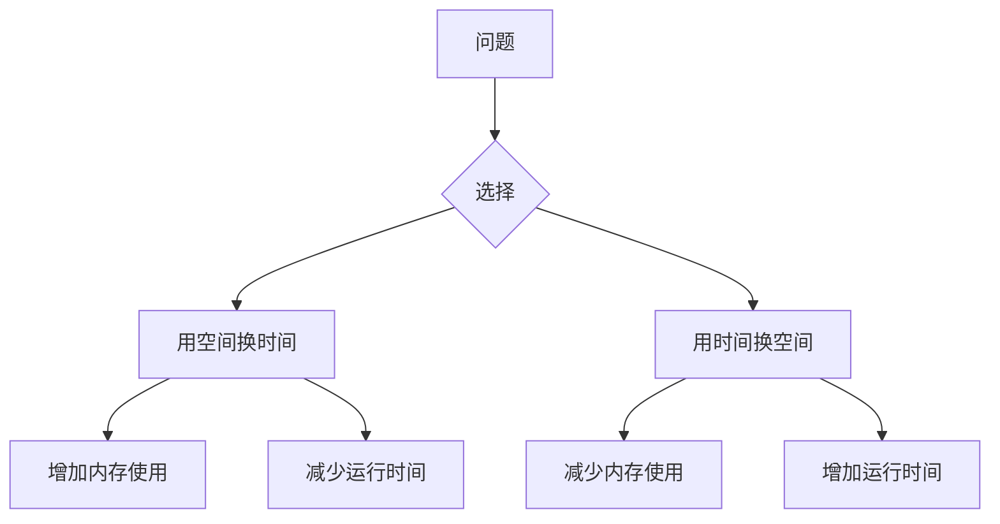

# 时空权衡技巧

在算法设计中，**时空权衡**（Time-Space Tradeoff）是一种常见的优化策略。它指的是在时间复杂度和空间复杂度之间进行权衡，以达到更好的性能。简单来说，我们可以通过增加内存使用来减少运行时间，或者通过增加运行时间来减少内存使用。理解这一技巧对于设计高效的算法至关重要。

## 什么是时空权衡？

时空权衡的核心思想是：**用空间换时间，或用时间换空间**。具体来说：

- **用空间换时间**：通过预先计算并存储一些数据，减少运行时的计算量。例如，使用缓存（Cache）或查找表（Lookup Table）来加速查询。
- **用时间换空间**：通过减少内存使用，但增加运行时间。例如，使用递归算法而不是迭代算法，虽然递归可能占用更多栈空间，但有时可以减少额外的内存分配。

:::tip
时空权衡并不是绝对的“好”或“坏”，而是需要根据具体问题和场景进行选择。
:::

## 时空权衡的实际案例

### 案例 1：查找表（Lookup Table）

假设我们需要频繁计算某个数学函数的值，例如阶乘（Factorial）。如果每次都重新计算，时间复杂度会很高。我们可以通过预先计算并存储结果，来减少运行时的计算量。

```python
# 预先计算阶乘结果
factorial_table = [1]  # 0! = 1
for i in range(1, 10):
    factorial_table.append(factorial_table[-1] * i)

# 查询阶乘
def factorial(n):
    return factorial_table[n]

# 示例输入输出
print(factorial(5))  # 输出: 120
```

在这个例子中，我们通过增加空间复杂度（存储阶乘表）来减少时间复杂度（直接查询结果）。

### 案例 2：动态规划（Dynamic Programming）

动态规划是时空权衡的经典应用。它通过存储子问题的解，避免重复计算，从而优化时间复杂度。

例如，计算斐波那契数列的第 n 项：

```python
# 使用动态规划计算斐波那契数列
def fibonacci(n):
    if n <= 1:
        return n
    dp = [0] * (n + 1)
    dp[0], dp[1] = 0, 1
    for i in range(2, n + 1):
        dp[i] = dp[i - 1] + dp[i - 2]
    return dp[n]

# 示例输入输出
print(fibonacci(10))  # 输出: 55
```

在这个例子中，我们通过增加空间复杂度（存储中间结果）来减少时间复杂度（从指数级降低到线性级）。

## 时空权衡的图表表示

以下是一个简单的图表，展示了时空权衡的关系：



## 总结

时空权衡是算法设计中的重要技巧，它帮助我们在时间和空间之间找到最佳平衡点。通过预先计算、缓存、动态规划等方法，我们可以显著优化算法的性能。

:::note
在实际应用中，选择哪种策略取决于问题的具体需求。例如，在内存有限的嵌入式系统中，可能更倾向于用时间换空间；而在高性能计算中，可能更倾向于用空间换时间。
:::

## 附加资源与练习

### 资源
- [《算法导论》](https://mitpress.mit.edu/books/introduction-algorithms) - 深入理解算法设计与分析。
- [LeetCode](https://leetcode.com/) - 练习算法题目，提升编程能力。

### 练习
1. 实现一个查找表，用于存储平方数，并测试其性能。
2. 使用动态规划解决“背包问题”，并分析其时间复杂度和空间复杂度。
3. 尝试用递归和迭代两种方式实现斐波那契数列，比较它们的性能差异。

通过以上内容，你应该对时空权衡技巧有了初步的理解。继续练习和探索，你将能够更熟练地应用这一技巧！