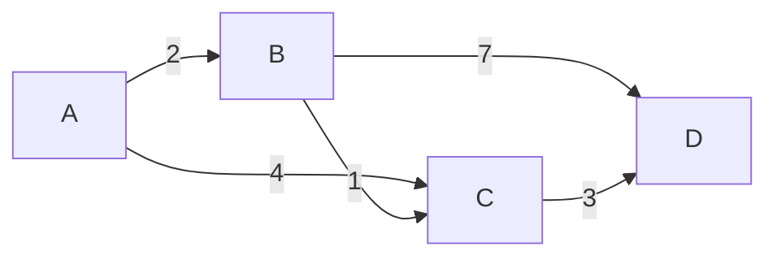

## 介绍

网络路由算法是计算机网络中用于确定数据包从源节点到目标节点传输路径的算法。它是互联网通信的基础，确保数据能够高效、可靠地传输。路由算法的核心目标是最小化传输延迟、最大化网络吞吐量，并避免网络拥塞。

路由算法可以分为两大类：
1. **静态路由算法**：路径是预先确定的，不会根据网络状态动态调整。
2. **动态路由算法**：路径会根据网络状态（如流量、链路故障等）动态调整。

本文将重点介绍几种常见的动态路由算法，并通过实际案例展示它们的应用。

---

## 常见网络路由算法

### 1. 最短路径优先算法（Dijkstra 算法）

Dijkstra 算法是一种经典的静态路由算法，用于计算从源节点到网络中所有其他节点的最短路径。它基于贪心策略，逐步扩展最短路径树。

#### 算法步骤：
1. 初始化：设置源节点的距离为 0，其他节点的距离为无穷大。
2. 选择当前距离最小的节点，标记为已访问。
3. 更新其邻居节点的距离。
4. 重复步骤 2 和 3，直到所有节点都被访问。

#### 代码示例

```python
import heapq

def dijkstra(graph, start):
    distances = {node: float('inf') for node in graph}
    distances[start] = 0
    queue = [(0, start)]

    while queue:
        current_distance, current_node = heapq.heappop(queue)

        if current_distance > distances[current_node]:
            continue

        for neighbor, weight in graph[current_node].items():
            distance = current_distance + weight
            if distance < distances[neighbor]:
                distances[neighbor] = distance
                heapq.heappush(queue, (distance, neighbor))

    return distances
```

#### 输入与输出

假设有以下图结构：



输入图表示为字典：

```python
graph = {
    'A': {'B': 2, 'C': 4},
    'B': {'C': 1, 'D': 7},
    'C': {'D': 3},
    'D': {}
}
```

调用 `dijkstra(graph, 'A')` 的输出为：

```python
{'A': 0, 'B': 2, 'C': 3, 'D': 6}
```

:::tip
Dijkstra 算法适用于没有负权边的图。如果图中存在负权边，可以考虑使用 Bellman-Ford 算法。
:::

---

### 2. 距离向量路由算法（Distance Vector Routing）

距离向量路由算法是一种动态路由算法，每个节点维护一个到其他节点的距离向量，并通过与邻居节点交换信息来更新路由表。

#### 算法特点：
- 每个节点仅与直接邻居通信。
- 使用 Bellman-Ford 方程更新距离向量。
- 适用于小型网络，但在大型网络中可能收敛较慢。

#### 实际应用：RIP 协议

路由信息协议（RIP）是一种基于距离向量路由算法的协议，广泛应用于小型网络中。RIP 通过定期广播路由表来更新路径信息。

---

### 3. 链路状态路由算法（Link State Routing）

链路状态路由算法是一种动态路由算法，每个节点通过洪泛法向整个网络广播其链路状态信息，然后使用 Dijkstra 算法计算最短路径。

#### 算法特点：
- 每个节点需要知道整个网络的拓扑结构。
- 适用于大型网络，收敛速度快。
- 典型应用：OSPF 协议。

---

## 实际应用案例

### 案例 1：互联网路由

互联网中的路由器使用动态路由算法（如 OSPF 或 BGP）来确定数据包的最佳传输路径。例如，当某个链路发生故障时，路由器会动态调整路由表，确保数据包能够通过其他路径到达目的地。

### 案例 2：数据中心网络

在数据中心内部，网络路由算法用于优化服务器之间的通信。例如，使用最短路径优先算法可以减少数据传输延迟，提高整体性能。

---

## 总结

网络路由算法是计算机网络的核心技术之一，它决定了数据包在网络中的传输路径。本文介绍了 Dijkstra 算法、距离向量路由算法和链路状态路由算法的基本原理，并通过代码示例和实际案例展示了它们的应用。

:::note
路由算法的选择取决于网络规模、动态性和性能需求。在实际应用中，通常需要结合多种算法来满足不同的需求。
:::

---

## 附加资源与练习

### 资源
- [《计算机网络：自顶向下方法》](https://example.com) - 一本经典的计算机网络教材。
- [OSPF 协议详解](https://example.com) - 深入了解链路状态路由算法的实际应用。

### 练习
1. 实现 Bellman-Ford 算法，并比较其与 Dijkstra 算法的性能。
2. 模拟一个小型网络，使用 RIP 协议动态更新路由表。
3. 研究 BGP 协议的工作原理，并分析其在互联网中的应用。