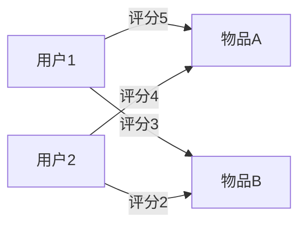

# 推荐系统算法

推荐系统是现代互联网应用中不可或缺的一部分。无论是电商平台、视频网站还是社交媒体，推荐系统都在帮助用户发现他们可能感兴趣的内容。本文将介绍推荐系统的基本概念、常见算法以及实际应用案例。

## 什么是推荐系统？

推荐系统是一种信息过滤系统，旨在预测用户对物品（如商品、电影、音乐等）的偏好，并向用户推荐他们可能感兴趣的物品。推荐系统通常基于用户的历史行为、物品的属性以及用户与物品之间的交互数据。

## 推荐系统的类型

推荐系统主要分为以下几种类型：

1. **基于内容的推荐**：根据物品的属性（如文本、标签等）推荐与用户过去喜欢的物品相似的物品。
2. **协同过滤推荐**：基于用户的历史行为（如评分、购买记录等）推荐其他相似用户喜欢的物品。
3. **混合推荐**：结合基于内容的推荐和协同过滤推荐，以提高推荐的准确性。

## 协同过滤推荐算法

协同过滤是推荐系统中最常用的算法之一。它基于用户的历史行为数据，通过计算用户之间的相似性或物品之间的相似性来进行推荐。

### 用户-物品矩阵

协同过滤的核心是用户-物品矩阵，其中每一行代表一个用户，每一列代表一个物品，矩阵中的值表示用户对物品的评分或交互行为。



### 基于用户的协同过滤

基于用户的协同过滤通过计算用户之间的相似性，找到与目标用户相似的用户，然后推荐这些相似用户喜欢的物品。

```python
from sklearn.metrics.pairwise import cosine_similarity
import numpy as np

# 用户-物品矩阵
user_item_matrix = np.array([
    [5, 3, 0, 1],
    [4, 0, 0, 1],
    [1, 1, 0, 5],
    [1, 0, 0, 4],
    [0, 1, 5, 4],
])

# 计算用户之间的相似性
user_similarity = cosine_similarity(user_item_matrix)

# 输出用户相似性矩阵
print(user_similarity)
```

### 基于物品的协同过滤

基于物品的协同过滤通过计算物品之间的相似性，找到与目标物品相似的物品，然后推荐这些相似物品给用户。

```python
# 计算物品之间的相似性
item_similarity = cosine_similarity(user_item_matrix.T)

# 输出物品相似性矩阵
print(item_similarity)
```

## 实际应用案例

### 电商平台推荐

电商平台如亚马逊使用推荐系统来向用户推荐商品。基于用户的浏览历史、购买记录和评分，系统会推荐用户可能感兴趣的商品，从而提高用户的购买率和满意度。

### 视频网站推荐

视频网站如Netflix使用推荐系统来向用户推荐电影和电视剧。基于用户的观看历史、评分和偏好，系统会推荐用户可能喜欢的视频内容，从而提高用户的观看时长和留存率。

### 社交媒体推荐

社交媒体平台如Facebook和Twitter使用推荐系统来向用户推荐好友、群组和内容。基于用户的社交网络、互动行为和兴趣，系统会推荐用户可能感兴趣的内容和人际关系，从而提高用户的参与度和活跃度。

## 总结

推荐系统算法是现代互联网应用中的重要组成部分。通过理解推荐系统的基本概念和常见算法，初学者可以更好地掌握推荐系统的实现方法，并将其应用到实际项目中。

## 附加资源

- [推荐系统：原理与实践](https://www.oreilly.com/library/view/recommender-systems-the/9781449364116/)
- [协同过滤算法详解](https://towardsdatascience.com/collaborative-filtering-based-recommendation-systems-exemplified-ecbffe1c20b1)
- [推荐系统实战](https://www.coursera.org/learn/recommender-systems)

## 练习

1. 实现一个基于用户的协同过滤算法，并使用一个小型数据集进行测试。
2. 尝试使用基于物品的协同过滤算法，比较其与基于用户的协同过滤算法的效果。
3. 思考如何将基于内容的推荐与协同过滤推荐结合起来，设计一个混合推荐系统。