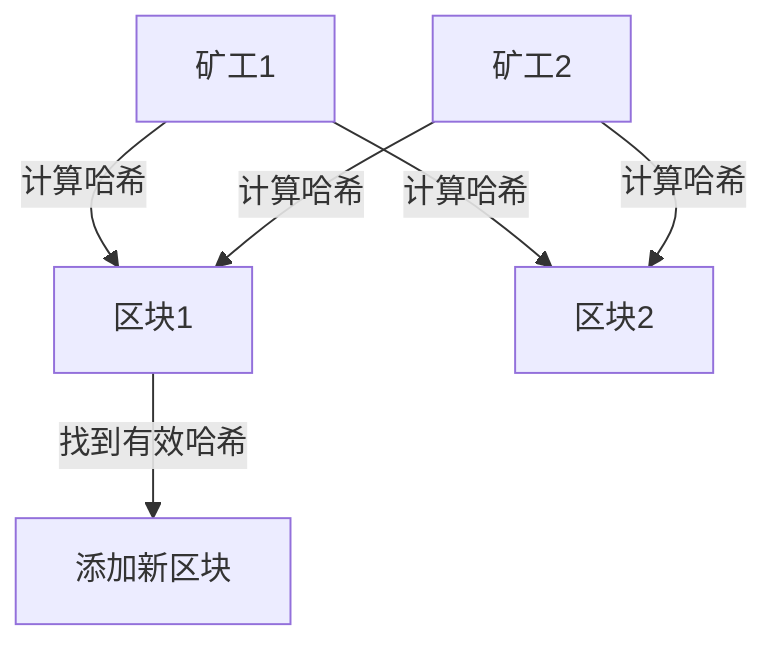
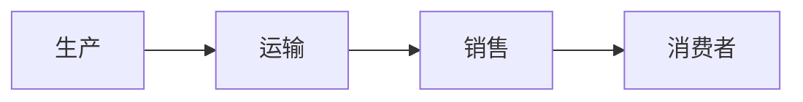

## 介绍

区块链是一种去中心化的分布式账本技术，其核心在于通过算法确保数据的安全性和一致性。区块链算法是区块链技术的基石，主要包括哈希函数、共识机制和区块链数据结构。本文将逐步讲解这些概念，并通过实际案例展示其应用。

## 哈希函数

哈希函数是区块链中用于确保数据完整性和安全性的核心工具。它将任意长度的输入数据转换为固定长度的输出（哈希值），并且具有以下特性：

- **确定性**：相同的输入总是产生相同的输出。
- **快速计算**：哈希值的计算速度非常快。
- **不可逆性**：从哈希值无法推导出原始输入。
- **抗碰撞性**：很难找到两个不同的输入产生相同的哈希值。

### 代码示例

以下是一个使用 Python 计算 SHA-256 哈希值的示例：

```python
import hashlib

def calculate_hash(data):
    return hashlib.sha256(data.encode()).hexdigest()

data = "Hello, Blockchain!"
hash_value = calculate_hash(data)
print(f"Hash of '{data}': {hash_value}")
```

**输入**：`"Hello, Blockchain!"`  
**输出**：`"a591a6d40bf420404a011733cfb7b190d62c65bf0bcda32b57b277d9ad9f146e"`

:::note
哈希函数在区块链中用于生成区块的唯一标识（哈希值），并确保区块内容未被篡改。
:::

## 共识机制

共识机制是区块链网络中节点达成一致的方式。常见的共识机制包括：

1. **工作量证明（PoW）**：节点通过解决复杂的数学问题来竞争记账权，比特币使用的就是这种机制。
2. **权益证明（PoS）**：节点根据其持有的代币数量和时间来竞争记账权，以太坊正在向这种机制过渡。
3. **委托权益证明（DPoS）**：代币持有者投票选出少数节点来负责记账。

### 实际案例：比特币的 PoW

比特币网络中的矿工通过解决哈希难题来竞争记账权。第一个找到符合条件的哈希值的矿工可以将新区块添加到区块链中，并获得比特币奖励。



:::tip
共识机制确保了区块链网络的安全性和去中心化，但也可能带来能源消耗（如 PoW）或中心化风险（如 DPoS）。
:::

## 区块链数据结构

区块链是由多个区块组成的链式结构，每个区块包含以下部分：

1. **区块头**：包含前一个区块的哈希值、时间戳、Nonce（用于 PoW）等信息。
2. **交易数据**：记录该区块中包含的所有交易。
3. **区块哈希**：通过对区块头进行哈希计算得到的唯一标识。

### 代码示例

以下是一个简单的区块链数据结构示例：

```python
class Block:
    def __init__(self, previous_hash, transactions, nonce=0):
        self.previous_hash = previous_hash
        self.transactions = transactions
        self.nonce = nonce
        self.hash = self.calculate_hash()

    def calculate_hash(self):
        block_data = str(self.previous_hash) + str(self.transactions) + str(self.nonce)
        return hashlib.sha256(block_data.encode()).hexdigest()

# 创建创世区块
genesis_block = Block("0", ["First Transaction"])
print(f"Genesis Block Hash: {genesis_block.hash}")

# 创建第二个区块
second_block = Block(genesis_block.hash, ["Second Transaction"])
print(f"Second Block Hash: {second_block.hash}")
```

**输出**：
```
Genesis Block Hash: 5e9f5b5f5e9f5b5f5e9f5b5f5e9f5b5f5e9f5b5f5e9f5b5f5e9f5b5f5e9f5b5f
Second Block Hash: 6f8d6f8d6f8d6f8d6f8d6f8d6f8d6f8d6f8d6f8d6f8d6f8d6f8d6f8d6f8d
```

:::caution
区块链数据结构的设计直接影响其性能和扩展性。例如，比特币的区块大小限制为 1MB，这可能导致交易拥堵。
:::

## 实际应用案例

### 案例 1：供应链管理

区块链可以用于追踪产品的供应链信息。每个区块记录产品的生产、运输和销售信息，确保数据的透明性和不可篡改性。



### 案例 2：去中心化金融（DeFi）

DeFi 应用利用区块链技术实现无需中介的金融服务，如借贷、交易和保险。智能合约（运行在区块链上的程序）自动执行交易规则，确保公平和透明。

## 总结

区块链算法是区块链技术的核心，包括哈希函数、共识机制和区块链数据结构。这些算法确保了区块链的安全性、一致性和去中心化特性。通过实际案例，我们可以看到区块链在供应链管理、金融等领域的广泛应用。

## 附加资源

- [比特币白皮书](https://bitcoin.org/bitcoin.pdf)
- [以太坊官方文档](https://ethereum.org/en/developers/docs/)
- [区块链技术指南](https://blockchain.info/)

## 练习

1. 编写一个 Python 程序，模拟简单的区块链结构，并添加新的区块。
2. 研究不同的共识机制（如 PoW、PoS、DPoS），并比较它们的优缺点。
3. 尝试使用智能合约平台（如以太坊）部署一个简单的去中心化应用（DApp）。