# 操作系统调度算法

操作系统调度算法是操作系统中用于管理进程执行顺序的核心机制。它的主要目标是优化资源利用率、提高系统吞吐量、减少响应时间以及确保公平性。对于初学者来说，理解调度算法是掌握操作系统工作原理的重要一步。

## 什么是调度算法？

调度算法是操作系统内核的一部分，负责决定哪个进程可以访问 CPU 资源以及何时访问。在多任务操作系统中，多个进程可能同时竞争 CPU 资源，调度算法的作用就是决定这些进程的执行顺序。

调度算法的核心目标包括：
- **公平性**：确保所有进程都能获得 CPU 时间。
- **效率**：最大化 CPU 利用率。
- **响应时间**：减少用户感知的延迟。
- **吞吐量**：在单位时间内完成尽可能多的任务。

## 常见的调度算法

以下是几种常见的调度算法，每种算法都有其独特的优势和适用场景。

### 1. 先来先服务（FCFS, First-Come, First-Served）

FCFS 是最简单的调度算法，按照进程到达的顺序依次执行。它的优点是实现简单，但缺点是可能导致“饥饿”问题，即长任务阻塞短任务的执行。

**示例：**
假设有三个进程 P1、P2 和 P3，它们的到达时间和执行时间如下：

| 进程 | 到达时间 | 执行时间 |
|------|----------|----------|
| P1   | 0        | 5        |
| P2   | 1        | 3        |
| P3   | 2        | 8        |

按照 FCFS 算法，执行顺序为 P1 → P2 → P3。

```mermaid
gantt
    title FCFS 调度算法
    dateFormat  X
    axisFormat %s
    section 进程
    P1 : 0, 5
    P2 : 5, 8
    P3 : 8, 16
```

### 2. 最短作业优先（SJF, Shortest Job First）

SJF 算法选择执行时间最短的进程优先执行。这种算法可以最小化平均等待时间，但需要预先知道每个进程的执行时间，这在实际应用中可能难以实现。

**示例：**
使用与 FCFS 相同的进程数据，SJF 的执行顺序为 P2 → P1 → P3。

```mermaid
gantt
    title SJF 调度算法
    dateFormat  X
    axisFormat %s
    section 进程
    P2 : 1, 4
    P1 : 4, 9
    P3 : 9, 17
```

### 3. 轮转调度（RR, Round Robin）

轮转调度算法为每个进程分配一个固定的时间片（time slice），当时间片用完后，进程会被放到队列的末尾，等待下一次调度。这种算法适用于交互式系统，能够保证公平性。

**示例：**
假设时间片为 2，执行顺序如下：

```mermaid
gantt
    title RR 调度算法（时间片=2）
    dateFormat  X
    axisFormat %s
    section 进程
    P1 : 0, 2
    P2 : 2, 4
    P3 : 4, 6
    P1 : 6, 8
    P2 : 8, 9
    P3 : 9, 11
    P1 : 11, 13
    P3 : 13, 16
```

### 4. 优先级调度（Priority Scheduling）

优先级调度算法根据进程的优先级决定执行顺序。优先级可以是静态的（在进程创建时确定）或动态的（根据系统状态调整）。高优先级的进程会优先执行。

**示例：**
假设 P1 优先级为 1（最高），P2 为 2，P3 为 3，执行顺序为 P1 → P2 → P3。

## 实际应用场景

调度算法在现实生活中有广泛的应用，以下是一些典型的例子：

1. **多任务操作系统**：如 Windows、Linux 和 macOS，都使用调度算法来管理多个进程的执行。
2. **实时系统**：如航空控制系统和医疗设备，需要确保高优先级任务能够及时执行。
3. **云计算**：云服务提供商使用调度算法来分配计算资源，确保用户任务能够高效完成。

## 总结

操作系统调度算法是操作系统的核心组成部分，它决定了进程的执行顺序和资源分配方式。通过理解 FCFS、SJF、RR 和优先级调度等常见算法，你可以更好地理解操作系统的工作原理。

:::tip 提示
如果你想进一步深入学习，可以尝试实现这些调度算法，或者研究更复杂的调度策略，如多级反馈队列调度（MLFQ）。
:::

## 附加资源

- [操作系统概念（第10版）](https://www.os-book.com/)：一本经典的操作系统教材，深入讲解调度算法。
- [调度算法模拟器](https://www.cs.rutgers.edu/~pxk/416/notes/07-scheduling.html)：在线工具，帮助你直观理解调度算法的工作原理。

## 练习

1. 编写一个简单的程序，模拟 FCFS 调度算法。
2. 修改上述程序，使其支持 SJF 和 RR 调度算法。
3. 研究 Linux 内核中的调度算法实现，并撰写一篇短文总结其特点。

希望这篇内容能帮助你更好地理解操作系统调度算法！如果还有疑问，欢迎在评论区留言讨论。