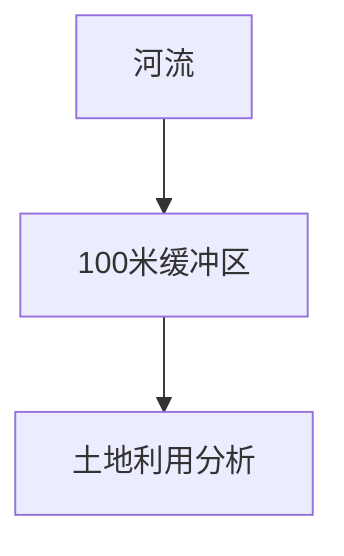
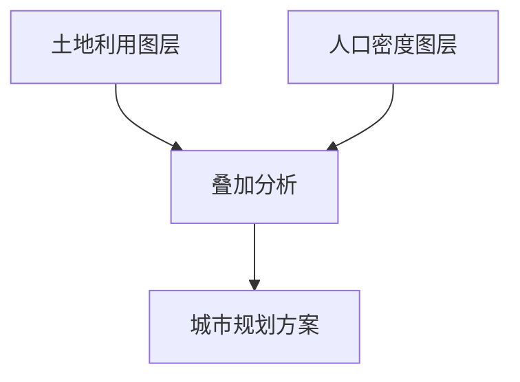

# 地理信息系统算法

地理信息系统（Geographic Information System，简称 GIS）是一种用于捕获、存储、分析和显示地理数据的系统。GIS 算法是 GIS 的核心，它们帮助处理和分析地理数据，从而解决实际问题。本文将介绍 GIS 中的一些常见算法，并通过实际案例展示它们的应用。

## 1. 什么是地理信息系统算法？

GIS 算法是用于处理地理数据的数学和逻辑方法。这些算法可以帮助我们解决诸如路径规划、空间分析、地图绘制等问题。常见的 GIS 算法包括：

- **最短路径算法**：用于找到两点之间的最短路径。
- **空间插值算法**：用于根据已知点的数据推断未知点的值。
- **缓冲区分析**：用于创建地理对象的缓冲区区域。
- **叠加分析**：用于将多个地理图层叠加在一起进行分析。

## 2. 最短路径算法

最短路径算法是 GIS 中最常用的算法之一。它用于找到两点之间的最短路径。常见的算法包括 Dijkstra 算法和 A* 算法。

### Dijkstra 算法

Dijkstra 算法是一种经典的图搜索算法，用于找到图中两点之间的最短路径。以下是一个简单的 Python 实现：

```python
import heapq

def dijkstra(graph, start):
    distances = {node: float('inf') for node in graph}
    distances[start] = 0
    queue = [(0, start)]
    
    while queue:
        current_distance, current_node = heapq.heappop(queue)
        
        if current_distance > distances[current_node]:
            continue
        
        for neighbor, weight in graph[current_node].items():
            distance = current_distance + weight
            
            if distance < distances[neighbor]:
                distances[neighbor] = distance
                heapq.heappush(queue, (distance, neighbor))
    
    return distances

# 示例图
graph = {
    'A': {'B': 1, 'C': 4},
    'B': {'A': 1, 'C': 2, 'D': 5},
    'C': {'A': 4, 'B': 2, 'D': 1},
    'D': {'B': 5, 'C': 1}
}

# 计算从节点 'A' 到其他节点的最短距离
distances = dijkstra(graph, 'A')
print(distances)
```

**输入：**
```python
graph = {
    'A': {'B': 1, 'C': 4},
    'B': {'A': 1, 'C': 2, 'D': 5},
    'C': {'A': 4, 'B': 2, 'D': 1},
    'D': {'B': 5, 'C': 1}
}
```

**输出：**
```python
{'A': 0, 'B': 1, 'C': 3, 'D': 4}
```

### 实际应用：路径规划

最短路径算法在实际中有广泛的应用，例如在导航系统中找到从起点到终点的最短路径。假设你正在开发一个导航应用，用户输入起点和终点后，你可以使用 Dijkstra 算法计算出最短路径并显示给用户。

## 3. 空间插值算法

空间插值算法用于根据已知点的数据推断未知点的值。常见的插值方法包括反距离加权插值（IDW）和克里金插值（Kriging）。

### 反距离加权插值（IDW）

IDW 是一种简单的插值方法，它假设未知点的值是已知点值的加权平均，权重与距离成反比。

```python
def idw_interpolation(points, target_point, power=2):
    numerator = 0
    denominator = 0
    
    for point in points:
        distance = ((point['x'] - target_point['x'])**2 + (point['y'] - target_point['y'])**2) ** 0.5
        if distance == 0:
            return point['value']
        weight = 1 / (distance ** power)
        numerator += point['value'] * weight
        denominator += weight
    
    return numerator / denominator

# 示例数据
points = [
    {'x': 1, 'y': 1, 'value': 10},
    {'x': 2, 'y': 2, 'value': 20},
    {'x': 3, 'y': 3, 'value': 30}
]

# 目标点
target_point = {'x': 2, 'y': 1}

# 插值计算
interpolated_value = idw_interpolation(points, target_point)
print(interpolated_value)
```

**输入：**
```python
points = [
    {'x': 1, 'y': 1, 'value': 10},
    {'x': 2, 'y': 2, 'value': 20},
    {'x': 3, 'y': 3, 'value': 30}
]
target_point = {'x': 2, 'y': 1}
```

**输出：**
```python
15.0
```

### 实际应用：气象数据插值

空间插值算法在气象学中有广泛应用。例如，气象站通常分布不均匀，但我们需要知道整个区域的温度分布。通过使用 IDW 插值，我们可以根据已知气象站的数据推断出未知区域的温度。

## 4. 缓冲区分析

缓冲区分析用于创建地理对象的缓冲区区域。例如，我们可以为一条河流创建一个 100 米的缓冲区，以分析该区域内的人类活动。

### 实际应用：环境保护

假设你正在开发一个环境保护系统，需要分析河流周围的土地利用情况。你可以使用缓冲区分析创建一个 100 米的缓冲区，然后分析该区域内的土地利用类型。



## 5. 叠加分析

叠加分析用于将多个地理图层叠加在一起进行分析。例如，我们可以将土地利用图层和人口密度图层叠加，以分析不同土地利用类型下的人口分布。

### 实际应用：城市规划

在城市规划中，叠加分析可以帮助我们分析不同区域的土地利用和人口分布情况，从而制定更合理的城市规划方案。



## 6. 总结

地理信息系统算法是 GIS 的核心，它们帮助我们处理和分析地理数据，从而解决实际问题。本文介绍了最短路径算法、空间插值算法、缓冲区分析和叠加分析，并通过实际案例展示了它们的应用。

## 7. 附加资源与练习

- **练习 1**：使用 Dijkstra 算法计算一个更复杂的图中的最短路径。
- **练习 2**：实现克里金插值算法，并与 IDW 插值进行比较。
- **附加资源**：
  - [GIS 算法与数据结构](https://www.example.com/gis-algorithms)
  - [Python 地理数据处理库](https://www.example.com/python-gis)

:::tip
如果你对 GIS 算法感兴趣，可以尝试使用 Python 的 `geopandas` 和 `shapely` 库来处理地理数据。
:::