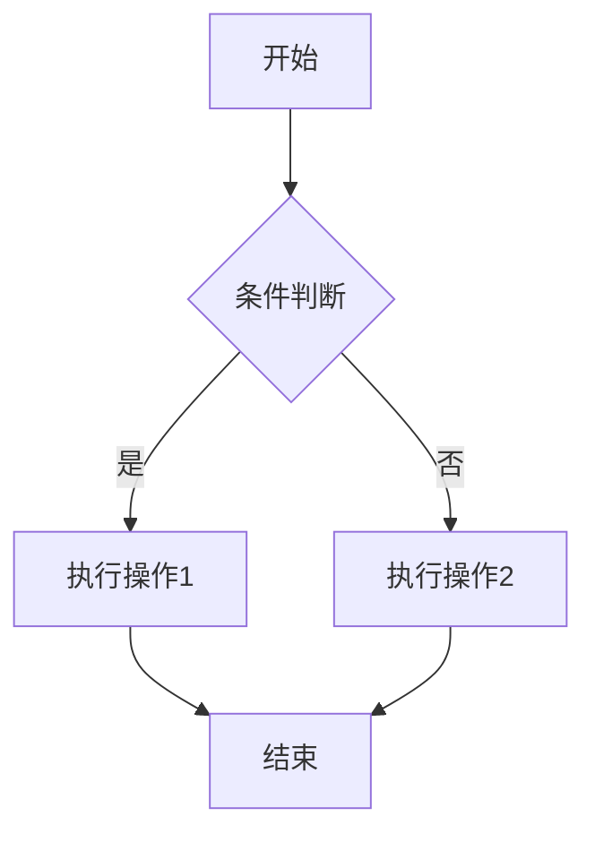
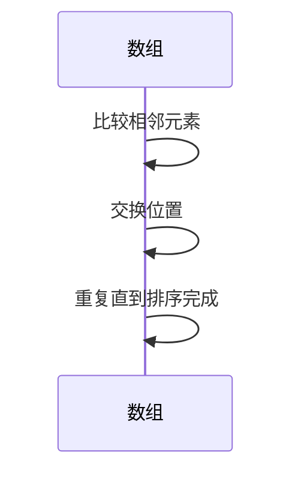
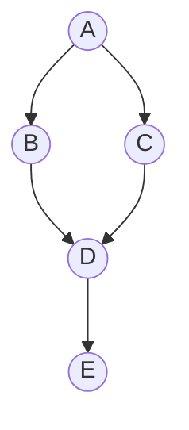

## 介绍

算法可视化表达是指通过图形、动画或其他视觉手段来展示算法的执行过程。它帮助开发者更直观地理解算法的逻辑、时间和空间复杂度，以及算法的执行步骤。对于初学者来说，算法可视化是学习算法的强大工具，因为它将抽象的概念转化为具体的视觉信息，从而降低理解难度。

在算法竞赛和面试中，能够清晰地表达算法的思路和执行过程是非常重要的。面试官或评委不仅关注算法的正确性，还关注你是否能够清晰地解释算法的逻辑。因此，掌握算法可视化表达技巧是提升竞争力的关键。

---

## 为什么需要算法可视化？

1. **降低理解难度**：复杂的算法逻辑通过图形或动画展示后，更容易被理解。
2. **提高调试效率**：通过可视化，可以快速发现算法中的错误或瓶颈。
3. **增强表达能力**：在面试或竞赛中，能够清晰地表达算法思路是加分项。
4. **优化算法设计**：通过观察算法的执行过程，可以更好地优化算法。

---

## 算法可视化的基本方法

### 1. 使用图表展示算法流程
图表是算法可视化中最常用的工具之一。例如，可以使用流程图来表示算法的执行步骤。



### 2. 使用动画展示算法执行过程
动画可以动态展示算法的执行过程。例如，展示排序算法（如冒泡排序）的每一步操作。



### 3. 使用代码注释和输出
在代码中添加注释，并通过输出展示算法的执行过程。

```python
def bubble_sort(arr):
    n = len(arr)
    for i in range(n):
        for j in range(0, n-i-1):
            if arr[j] > arr[j+1]:
                # 交换元素
                arr[j], arr[j+1] = arr[j+1], arr[j]
                print(f"交换 {arr[j]} 和 {arr[j+1]}：{arr}")
    return arr

# 示例输入
arr = [64, 34, 25, 12, 22, 11, 90]
print("排序前：", arr)
sorted_arr = bubble_sort(arr)
print("排序后：", sorted_arr)
```

**输出：**
```
排序前： [64, 34, 25, 12, 22, 11, 90]
交换 34 和 64：[34, 64, 25, 12, 22, 11, 90]
交换 25 和 64：[34, 25, 64, 12, 22, 11, 90]
交换 12 和 64：[34, 25, 12, 64, 22, 11, 90]
交换 22 和 64：[34, 25, 12, 22, 64, 11, 90]
交换 11 和 64：[34, 25, 12, 22, 11, 64, 90]
交换 25 和 34：[25, 34, 12, 22, 11, 64, 90]
交换 12 和 34：[25, 12, 34, 22, 11, 64, 90]
交换 22 和 34：[25, 12, 22, 34, 11, 64, 90]
交换 11 和 34：[25, 12, 22, 11, 34, 64, 90]
交换 12 和 25：[12, 25, 22, 11, 34, 64, 90]
交换 22 和 25：[12, 22, 25, 11, 34, 64, 90]
交换 11 和 25：[12, 22, 11, 25, 34, 64, 90]
交换 11 和 22：[12, 11, 22, 25, 34, 64, 90]
交换 11 和 12：[11, 12, 22, 25, 34, 64, 90]
排序后： [11, 12, 22, 25, 34, 64, 90]
```

---

## 实际案例

### 案例 1：图的遍历算法可视化
在图算法中，深度优先搜索（DFS）和广度优先搜索（BFS）是常见的遍历方法。通过可视化，可以清晰地展示节点的访问顺序。



**DFS 遍历顺序：** A → B → D → E → C  
**BFS 遍历顺序：** A → B → C → D → E

### 案例 2：动态规划算法可视化
动态规划（DP）算法通常涉及状态转移方程。通过表格可视化，可以更好地理解状态的变化。

例如，计算斐波那契数列：

```python
def fibonacci(n):
    dp = [0] * (n + 1)
    dp[0], dp[1] = 0, 1
    for i in range(2, n + 1):
        dp[i] = dp[i - 1] + dp[i - 2]
        print(f"dp[{i}] = {dp[i]}")
    return dp[n]

# 示例输入
n = 5
print("斐波那契数列第", n, "项：", fibonacci(n))
```

**输出：**
```
dp[2] = 1
dp[3] = 2
dp[4] = 3
dp[5] = 5
斐波那契数列第 5 项： 5
```

---

## 总结

算法可视化表达是学习、调试和优化算法的重要工具。通过图表、动画和代码注释，可以将复杂的算法逻辑转化为直观的视觉信息，从而降低理解难度。在算法竞赛和面试中，掌握这一技能不仅能提高解题效率，还能增强表达能力。

---

## 附加资源与练习

1. **练习 1**：尝试用流程图表示快速排序算法的执行过程。
2. **练习 2**：编写一个归并排序算法，并通过输出展示每一步的合并过程。
3. **资源推荐**：
   - [Visualgo](https://visualgo.net/)：一个在线的算法可视化工具。
   - [Algorithm Visualizer](https://algorithm-visualizer.org/)：交互式算法可视化平台。

:::tip
尝试将你学到的算法用可视化工具展示出来，这将帮助你更深入地理解算法的执行过程。
:::