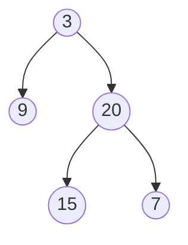

## 介绍

在算法面试中，面试官通常会考察候选人对基础算法的理解、问题分析能力以及代码实现能力。常见的算法面试题涵盖了数组、字符串、链表、树、图、动态规划等多个领域。掌握这些常见题目的解题思路，不仅有助于通过面试，还能提升编程能力。

本文将逐步讲解常见的算法面试题，并提供代码示例和实际应用场景，帮助你更好地理解和掌握这些内容。

---

## 1. 数组与字符串

### 1.1 两数之和

**问题描述**：给定一个整数数组 `nums` 和一个目标值 `target`，请你在该数组中找出和为目标值的两个整数，并返回它们的下标。

**示例**：
```python
输入：nums = [2, 7, 11, 15], target = 9
输出：[0, 1]
解释：nums[0] + nums[1] = 2 + 7 = 9
```

**解题思路**：使用哈希表存储已经遍历过的数字及其下标，遍历数组时检查 `target - nums[i]` 是否在哈希表中。

**代码实现**：
```python
def twoSum(nums, target):
    hash_map = {}
    for i, num in enumerate(nums):
        complement = target - num
        if complement in hash_map:
            return [hash_map[complement], i]
        hash_map[num] = i
    return []
```

---

### 1.2 最长公共前缀

**问题描述**：编写一个函数来查找字符串数组中的最长公共前缀。如果不存在公共前缀，返回空字符串 `""`。

**示例**：
```python
输入：strs = ["flower", "flow", "flight"]
输出："fl"
```

**解题思路**：纵向扫描，逐个字符比较所有字符串的相同位置。

**代码实现**：
```python
def longestCommonPrefix(strs):
    if not strs:
        return ""
    min_len = min(len(s) for s in strs)
    for i in range(min_len):
        char = strs[0][i]
        for s in strs:
            if s[i] != char:
                return strs[0][:i]
    return strs[0][:min_len]
```

---

## 2. 链表

### 2.1 反转链表

**问题描述**：反转一个单链表。

**示例**：
```python
输入：1 -> 2 -> 3 -> 4 -> 5
输出：5 -> 4 -> 3 -> 2 -> 1
```

**解题思路**：使用三个指针（`prev`、`curr`、`next`）逐个反转链表节点。

**代码实现**：
```python
class ListNode:
    def __init__(self, val=0, next=None):
        self.val = val
        self.next = next

def reverseList(head):
    prev = None
    curr = head
    while curr:
        next_node = curr.next
        curr.next = prev
        prev = curr
        curr = next_node
    return prev
```

---

## 3. 树

### 3.1 二叉树的最大深度

**问题描述**：给定一个二叉树，找出其最大深度。

**示例**：

**输出**：3

**解题思路**：递归计算左右子树的最大深度，取较大值加 1。

**代码实现**：
```python
class TreeNode:
    def __init__(self, val=0, left=None, right=None):
        self.val = val
        self.left = left
        self.right = right

def maxDepth(root):
    if not root:
        return 0
    left_depth = maxDepth(root.left)
    right_depth = maxDepth(root.right)
    return max(left_depth, right_depth) + 1
```

---

## 4. 动态规划

### 4.1 爬楼梯

**问题描述**：假设你正在爬楼梯。需要 `n` 阶你才能到达楼顶。每次你可以爬 1 或 2 个台阶。你有多少种不同的方法可以爬到楼顶？

**示例**：
```python
输入：n = 3
输出：3
解释：有三种方法可以爬到楼顶。
1. 1 阶 + 1 阶 + 1 阶
2. 1 阶 + 2 阶
3. 2 阶 + 1 阶
```

**解题思路**：使用动态规划，`dp[i] = dp[i-1] + dp[i-2]`，表示到达第 `i` 阶的方法数。

**代码实现**：
```python
def climbStairs(n):
    if n == 1:
        return 1
    dp = [0] * (n + 1)
    dp[1] = 1
    dp[2] = 2
    for i in range(3, n + 1):
        dp[i] = dp[i - 1] + dp[i - 2]
    return dp[n]
```

---

## 实际应用场景

- **两数之和**：用于解决目标值匹配问题，例如在金融领域中找到两笔交易的总和等于某个特定值。
- **反转链表**：在数据处理中，反转链表常用于调整数据顺序。
- **二叉树的最大深度**：在文件系统或组织结构中，计算树的最大深度可以帮助优化资源分配。
- **爬楼梯**：动态规划问题广泛应用于资源分配、路径规划等领域。

---

## 总结

本文介绍了算法面试中常见的题目类型，包括数组、字符串、链表、树和动态规划。通过代码示例和实际应用场景，你可以更好地理解这些算法的核心思想。掌握这些基础算法，将为你在面试中提供强大的支持。

---

## 附加资源与练习

1. **练习平台**：
   - [LeetCode](https://leetcode.com)
   - [HackerRank](https://www.hackerrank.com)
2. **推荐书籍**：
   - 《算法导论》
   - 《剑指Offer》
3. **进一步学习**：
   - 动态规划的高级应用
   - 图算法（如 Dijkstra 算法、Kruskal 算法）

:::tip
建议每天至少解决一道算法题，逐步提升自己的编程能力和算法思维。
:::