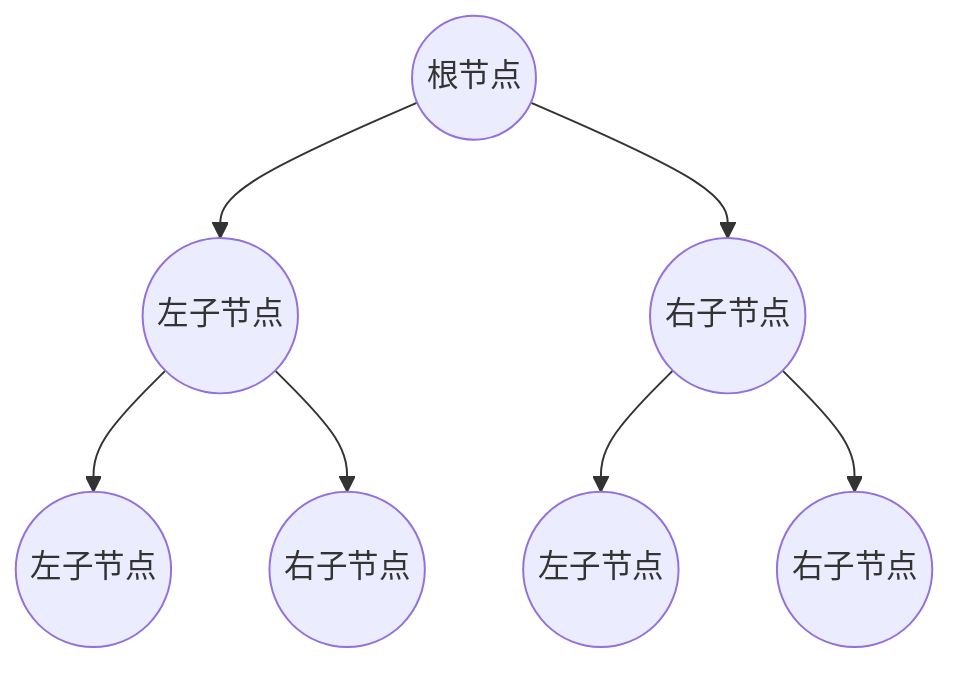

## 什么是二叉树？

二叉树（Binary Tree）是一种非线性数据结构，它由节点（Node）组成，每个节点最多有两个子节点，分别称为左子节点和右子节点。二叉树是树形结构的一种特殊形式，广泛应用于算法和数据结构中。

### 二叉树的基本结构

二叉树的基本结构如下：

- **根节点（Root）**：树的顶部节点，没有父节点。
- **子节点（Child）**：每个节点可以有最多两个子节点，左子节点和右子节点。
- **叶子节点（Leaf）**：没有子节点的节点。
- **父节点（Parent）**：每个子节点都有一个父节点。



### 二叉树的类型

二叉树有多种类型，常见的包括：

1. **满二叉树（Full Binary Tree）**：每个节点都有 0 或 2 个子节点。
2. **完全二叉树（Complete Binary Tree）**：除了最后一层，其他层都是满的，且最后一层的节点尽可能靠左。
3. **平衡二叉树（Balanced Binary Tree）**：左右子树的高度差不超过 1。
4. **二叉搜索树（Binary Search Tree, BST）**：左子节点的值小于父节点，右子节点的值大于父节点。

### 二叉树的遍历

二叉树的遍历是指按照某种顺序访问树中的所有节点。常见的遍历方式有三种：

1. **前序遍历（Pre-order Traversal）**：根节点 -> 左子树 -> 右子树。
2. **中序遍历（In-order Traversal）**：左子树 -> 根节点 -> 右子树。
3. **后序遍历（Post-order Traversal）**：左子树 -> 右子树 -> 根节点。

以下是一个二叉树的遍历示例：

```python
class Node:
    def __init__(self, value):
        self.value = value
        self.left = None
        self.right = None

def pre_order_traversal(node):
    if node:
        print(node.value, end=" ")
        pre_order_traversal(node.left)
        pre_order_traversal(node.right)

def in_order_traversal(node):
    if node:
        in_order_traversal(node.left)
        print(node.value, end=" ")
        in_order_traversal(node.right)

def post_order_traversal(node):
    if node:
        post_order_traversal(node.left)
        post_order_traversal(node.right)
        print(node.value, end=" ")

# 创建一个简单的二叉树
root = Node(1)
root.left = Node(2)
root.right = Node(3)
root.left.left = Node(4)
root.left.right = Node(5)

print("前序遍历:")
pre_order_traversal(root)
print("\n中序遍历:")
in_order_traversal(root)
print("\n后序遍历:")
post_order_traversal(root)
```

**输出结果：**

```
前序遍历:
1 2 4 5 3 
中序遍历:
4 2 5 1 3 
后序遍历:
4 5 2 3 1 
```

### 二叉树的实际应用

二叉树在计算机科学中有广泛的应用，以下是一些常见的应用场景：

1. **二叉搜索树（BST）**：用于快速查找、插入和删除数据。
2. **堆（Heap）**：用于实现优先队列。
3. **表达式树（Expression Tree）**：用于表示数学表达式。
4. **哈夫曼树（Huffman Tree）**：用于数据压缩。

:::tip
二叉搜索树（BST）是一种特殊的二叉树，它的左子节点的值小于父节点，右子节点的值大于父节点。这种特性使得 BST 在查找、插入和删除操作中非常高效。
:::

### 总结

二叉树是一种重要的非线性数据结构，广泛应用于算法和数据处理中。通过理解二叉树的基本结构、遍历方式及其应用场景，你可以更好地掌握这一概念，并将其应用于实际问题中。

### 附加资源与练习

1. **练习**：尝试实现一个二叉搜索树，并实现插入、查找和删除操作。
2. **进一步学习**：了解平衡二叉树（如 AVL 树和红黑树）及其应用。
3. **挑战**：编写一个程序，判断给定的二叉树是否为平衡二叉树。

:::caution
在实现二叉树时，务必注意内存管理和递归深度，避免栈溢出等问题。
:::