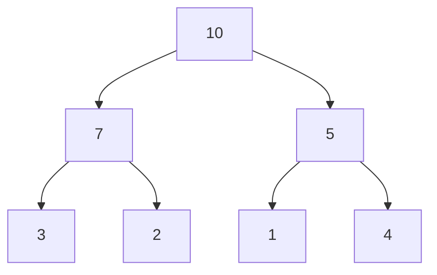

# 堆的操作

堆（Heap）是一种特殊的树形数据结构，通常用于实现优先队列。堆分为最大堆和最小堆两种类型。在最大堆中，父节点的值总是大于或等于其子节点的值；而在最小堆中，父节点的值总是小于或等于其子节点的值。堆的常见操作包括插入、删除和堆排序。

## 堆的基本概念

堆是一种完全二叉树，这意味着除了最后一层，其他层都是完全填满的，并且最后一层的节点都尽可能地靠左排列。堆的一个重要特性是，堆中的每个节点都满足堆的性质（最大堆或最小堆）。

### 最大堆和最小堆

- **最大堆**：父节点的值大于或等于其子节点的值。
- **最小堆**：父节点的值小于或等于其子节点的值。



上图展示了一个最大堆的示例，其中每个父节点的值都大于其子节点的值。

## 堆的操作

### 插入操作

在堆中插入一个新元素时，通常会将新元素添加到堆的末尾，然后通过“上浮”（Heapify Up）操作将其调整到正确的位置，以保持堆的性质。

#### 插入操作的步骤：
1. 将新元素添加到堆的末尾。
2. 比较新元素与其父节点的值。
3. 如果新元素的值大于（最大堆）或小于（最小堆）其父节点的值，则交换它们的位置。
4. 重复步骤2和3，直到新元素到达正确的位置。

```python
def insert(heap, value):
    heap.append(value)
    current = len(heap) - 1
    while current > 0:
        parent = (current - 1) // 2
        if heap[current] > heap[parent]:  # 最大堆
            heap[current], heap[parent] = heap[parent], heap[current]
            current = parent
        else:
            break
```

**示例：**
```python
heap = [10, 7, 5, 3, 2, 1, 4]
insert(heap, 8)
print(heap)  # 输出: [10, 8, 5, 7, 2, 1, 4, 3]
```

### 删除操作

删除堆中的元素通常是指删除堆顶元素（最大堆中的最大值或最小堆中的最小值）。删除操作通过将堆的最后一个元素移动到堆顶，然后通过“下沉”（Heapify Down）操作将其调整到正确的位置，以保持堆的性质。

#### 删除操作的步骤：
1. 将堆顶元素与堆的最后一个元素交换。
2. 删除最后一个元素（即原来的堆顶元素）。
3. 从堆顶开始，比较当前节点与其子节点的值。
4. 如果当前节点的值小于（最大堆）或大于（最小堆）其子节点的值，则与较大的子节点（最大堆）或较小的子节点（最小堆）交换。
5. 重复步骤3和4，直到当前节点到达正确的位置。

```python
def delete(heap):
    if not heap:
        return None
    heap[0], heap[-1] = heap[-1], heap[0]
    deleted_value = heap.pop()
    current = 0
    while True:
        left_child = 2 * current + 1
        right_child = 2 * current + 2
        largest = current
        if left_child < len(heap) and heap[left_child] > heap[largest]:
            largest = left_child
        if right_child < len(heap) and heap[right_child] > heap[largest]:
            largest = right_child
        if largest != current:
            heap[current], heap[largest] = heap[largest], heap[current]
            current = largest
        else:
            break
    return deleted_value
```

**示例：**
```python
heap = [10, 8, 5, 7, 2, 1, 4, 3]
deleted_value = delete(heap)
print(deleted_value)  # 输出: 10
print(heap)  # 输出: [8, 7, 5, 3, 2, 1, 4]
```

### 堆排序

堆排序是一种基于堆的排序算法，其时间复杂度为 O(n log n)。堆排序的基本思想是将待排序的数组构建成一个最大堆，然后依次将堆顶元素（最大值）与堆的最后一个元素交换，并调整堆，直到所有元素有序。

#### 堆排序的步骤：
1. 构建最大堆。
2. 将堆顶元素与堆的最后一个元素交换。
3. 调整堆，使其重新满足最大堆的性质。
4. 重复步骤2和3，直到堆中只剩下一个元素。

```python
def heap_sort(arr):
    def heapify(arr, n, i):
        largest = i
        left = 2 * i + 1
        right = 2 * i + 2
        if left < n and arr[left] > arr[largest]:
            largest = left
        if right < n and arr[right] > arr[largest]:
            largest = right
        if largest != i:
            arr[i], arr[largest] = arr[largest], arr[i]
            heapify(arr, n, largest)

    n = len(arr)
    for i in range(n // 2 - 1, -1, -1):
        heapify(arr, n, i)
    for i in range(n - 1, 0, -1):
        arr[i], arr[0] = arr[0], arr[i]
        heapify(arr, i, 0)
    return arr
```

**示例：**
```python
arr = [12, 11, 13, 5, 6, 7]
sorted_arr = heap_sort(arr)
print(sorted_arr)  # 输出: [5, 6, 7, 11, 12, 13]
```

## 实际应用场景

堆在实际中有广泛的应用，例如：

- **优先队列**：堆可以高效地实现优先队列，支持快速插入和删除最高优先级的元素。
- **调度算法**：在操作系统中，堆可以用于实现任务调度算法，确保高优先级的任务优先执行。
- **图算法**：堆可以用于实现Dijkstra算法中的优先队列，以找到图中的最短路径。

## 总结

堆是一种非常重要的数据结构，广泛应用于优先队列、排序算法和图算法等领域。通过本文，我们学习了堆的基本概念、插入、删除和堆排序等操作。掌握这些操作对于理解和使用堆至关重要。

## 附加资源与练习

- **练习1**：实现一个最小堆，并编写插入和删除操作的代码。
- **练习2**：使用堆排序对一个随机数组进行排序，并分析其时间复杂度。
- **附加资源**：阅读《算法导论》中关于堆的章节，深入了解堆的更多应用和变种。

:::tip
堆的操作是许多高级算法的基础，理解并掌握这些操作将为你未来的编程学习打下坚实的基础。
:::