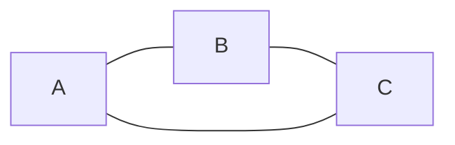
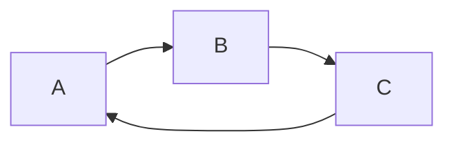
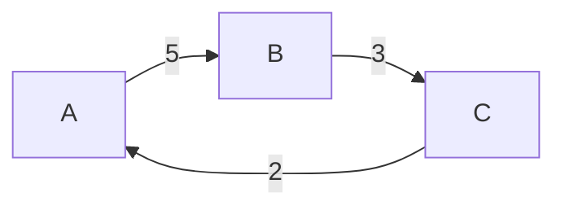

## 介绍

图（Graph）是一种非线性数据结构，用于表示对象之间的关系。图由**节点（Node）**（也称为顶点，Vertex）和**边（Edge）**组成。节点表示实体，边表示实体之间的关系。图在计算机科学中有广泛的应用，例如社交网络、地图导航、推荐系统等。

:::note
图是一种非常灵活的数据结构，可以用来表示复杂的关系网络。
:::

## 图的组成部分

### 1. 节点（Vertex）
节点是图的基本单位，通常用来表示实体。例如，在社交网络中，每个用户可以表示为一个节点。

### 2. 边（Edge）
边是连接两个节点的线，表示节点之间的关系。边可以是有向的（Directed）或无向的（Undirected）。有向边表示单向关系，而无向边表示双向关系。

### 3. 权重（Weight）
边可以带有权重，表示节点之间的某种度量。例如，在地图导航中，边的权重可以表示两个地点之间的距离或时间。

## 图的类型

### 1. 无向图（Undirected Graph）
无向图中的边没有方向，表示双向关系。例如，在社交网络中，如果两个人是朋友，那么他们之间的关系是无向的。



### 2. 有向图（Directed Graph）
有向图中的边有方向，表示单向关系。例如，在网页链接中，一个网页指向另一个网页的链接是有向的。



### 3. 加权图（Weighted Graph）
加权图中的边带有权重。例如，在地图导航中，边的权重可以表示距离或时间。



## 图的表示方法

### 1. 邻接矩阵（Adjacency Matrix）
邻接矩阵是一个二维数组，用于表示图中节点之间的连接关系。矩阵的行和列分别表示节点，矩阵中的值表示节点之间是否有边。

```python
# 无向图的邻接矩阵表示
graph = [
    [0, 1, 1],
    [1, 0, 1],
    [1, 1, 0]
]
```

### 2. 邻接表（Adjacency List）
邻接表是一种更节省空间的表示方法，使用链表或数组来存储每个节点的邻居。

```python
# 无向图的邻接表表示
graph = {
    'A': ['B', 'C'],
    'B': ['A', 'C'],
    'C': ['A', 'B']
}
```

## 实际应用场景

### 1. 社交网络
在社交网络中，用户是节点，用户之间的关系（如好友关系）是边。图可以用来分析社交网络中的社区结构、影响力传播等。

### 2. 地图导航
在地图导航中，地点是节点，道路是边，边的权重可以表示距离或时间。图算法可以用来计算最短路径。

### 3. 推荐系统
在推荐系统中，用户和商品是节点，用户与商品之间的交互（如购买、点击）是边。图可以用来分析用户行为，生成个性化推荐。

## 总结

图是一种强大的数据结构，用于表示复杂的关系网络。通过理解图的基本概念、组成部分和表示方法，你可以更好地应用图来解决实际问题。

:::tip
如果你想进一步学习图的相关算法，可以尝试实现图的遍历算法（如深度优先搜索和广度优先搜索）或最短路径算法（如Dijkstra算法）。
:::

## 附加资源

- [图论基础](https://en.wikipedia.org/wiki/Graph_theory)
- [图的遍历算法](https://www.geeksforgeeks.org/graph-data-structure-and-algorithms/)
- [最短路径算法](https://www.geeksforgeeks.org/dijkstras-shortest-path-algorithm-greedy-algo-7/)

## 练习

1. 实现一个无向图的邻接矩阵表示。
2. 编写代码，使用邻接表表示一个有向图。
3. 尝试实现图的深度优先搜索（DFS）算法。
