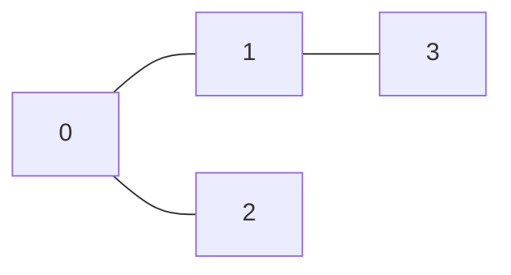

# 图的表示方法

图（Graph）是一种非常重要的非线性数据结构，用于表示对象之间的关系。图由**顶点（Vertex）**和**边（Edge）**组成，顶点表示对象，边表示对象之间的关系。图的表示方法有多种，其中最常用的两种是**邻接矩阵**和**邻接表**。本文将详细介绍这两种表示方法，并通过实际案例帮助你理解它们的应用场景。

## 什么是图？

图是由一组顶点和一组边组成的数据结构。顶点可以表示任何对象，例如城市、人物或网页，而边则表示这些对象之间的关系，例如道路、朋友关系或超链接。图可以分为**有向图**和**无向图**：

- **有向图**：边有方向，表示从一个顶点到另一个顶点的单向关系。
- **无向图**：边没有方向，表示两个顶点之间的双向关系。

## 图的表示方法

### 1. 邻接矩阵

邻接矩阵是一种使用二维数组表示图的方法。对于一个有 `n` 个顶点的图，邻接矩阵是一个 `n x n` 的矩阵。矩阵中的每个元素 `matrix[i][j]` 表示顶点 `i` 和顶点 `j` 之间是否存在边。

- 对于无向图，邻接矩阵是对称的，因为边是双向的。
- 对于有向图，邻接矩阵不一定对称。

#### 示例

假设我们有一个无向图，包含 4 个顶点（0, 1, 2, 3），边为 `(0, 1)`、`(0, 2)` 和 `(1, 3)`。其邻接矩阵表示如下：



对应的邻接矩阵为：

```
[
  [0, 1, 1, 0],
  [1, 0, 0, 1],
  [1, 0, 0, 0],
  [0, 1, 0, 0]
]
```

#### 代码实现

以下是使用 Python 实现邻接矩阵的代码：

```python
# 定义图的顶点数
n = 4

# 初始化邻接矩阵
adj_matrix = [[0] * n for _ in range(n)]

# 添加边
edges = [(0, 1), (0, 2), (1, 3)]
for u, v in edges:
    adj_matrix[u][v] = 1
    adj_matrix[v][u] = 1  # 无向图需要双向标记

# 打印邻接矩阵
for row in adj_matrix:
    print(row)
```

**输出：**

```
[0, 1, 1, 0]
[1, 0, 0, 1]
[1, 0, 0, 0]
[0, 1, 0, 0]
```

:::note
邻接矩阵的优点是查询两个顶点之间是否有边的效率很高，时间复杂度为 `O(1)`。缺点是空间复杂度为 `O(n^2)`，对于稀疏图（边数远小于顶点数的平方）来说，会浪费大量空间。
:::

### 2. 邻接表

邻接表是一种使用链表或数组的数组表示图的方法。对于每个顶点，邻接表存储一个列表，列表中包含与该顶点直接相连的所有顶点。

- 对于无向图，每条边会被存储两次。
- 对于有向图，每条边只存储一次。

#### 示例

继续使用上面的无向图示例，其邻接表表示如下：

```
0 -> [1, 2]
1 -> [0, 3]
2 -> [0]
3 -> [1]
```

#### 代码实现

以下是使用 Python 实现邻接表的代码：

```python
# 定义图的顶点数
n = 4

# 初始化邻接表
adj_list = [[] for _ in range(n)]

# 添加边
edges = [(0, 1), (0, 2), (1, 3)]
for u, v in edges:
    adj_list[u].append(v)
    adj_list[v].append(u)  # 无向图需要双向添加

# 打印邻接表
for i in range(n):
    print(f"{i} -> {adj_list[i]}")
```

**输出：**

```
0 -> [1, 2]
1 -> [0, 3]
2 -> [0]
3 -> [1]
```

:::tip
邻接表的优点是空间复杂度为 `O(V + E)`，其中 `V` 是顶点数，`E` 是边数。对于稀疏图来说，邻接表比邻接矩阵更节省空间。缺点是查询两个顶点之间是否有边的效率较低，时间复杂度为 `O(degree)`，其中 `degree` 是顶点的度数。
:::

## 实际应用场景

### 社交网络

在社交网络中，用户可以被表示为图的顶点，好友关系可以被表示为边。邻接表非常适合表示这种稀疏图，因为大多数用户的好友数量远小于总用户数。

### 路径规划

在地图应用中，城市可以被表示为顶点，道路可以被表示为边。邻接矩阵适合表示这种稠密图，因为城市之间的道路连接通常较多。

## 总结

- **邻接矩阵**适合表示稠密图，查询边的效率高，但空间复杂度较高。
- **邻接表**适合表示稀疏图，空间复杂度较低，但查询边的效率较低。

根据实际问题的需求，选择合适的图的表示方法非常重要。

## 附加资源与练习

- **练习 1**：实现一个有向图的邻接矩阵和邻接表表示。
- **练习 2**：编写一个函数，判断两个顶点之间是否存在边（分别使用邻接矩阵和邻接表实现）。
- **推荐阅读**：
  - 《算法导论》中的图算法章节
  - LeetCode 上的图相关问题（如“岛屿数量”、“课程表”等）

通过不断练习和应用，你将更好地掌握图的表示方法及其在实际问题中的应用。