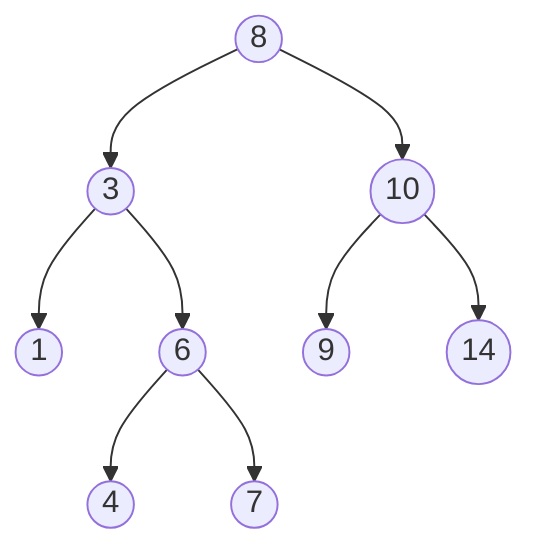

# 二叉搜索树

二叉搜索树（Binary Search Tree，简称 BST）是一种特殊的二叉树数据结构，它能够高效地存储和检索数据。二叉搜索树的主要特点是：对于树中的每个节点，其左子树中的所有节点的值都小于该节点的值，而右子树中的所有节点的值都大于该节点的值。这一特性使得二叉搜索树在查找、插入和删除操作中具有较高的效率。

## 二叉搜索树的基本概念

### 节点结构
二叉搜索树的每个节点通常包含以下三个部分：
- **值（Value）**：节点存储的数据。
- **左子节点（Left Child）**：指向左子树的指针，左子树中的所有节点的值都小于当前节点的值。
- **右子节点（Right Child）**：指向右子树的指针，右子树中的所有节点的值都大于当前节点的值。

### 二叉搜索树的性质
1. **左子树性质**：左子树中的所有节点的值都小于根节点的值。
2. **右子树性质**：右子树中的所有节点的值都大于根节点的值。
3. **递归性质**：左子树和右子树本身也是二叉搜索树。

## 二叉搜索树的操作

### 查找操作
在二叉搜索树中查找一个值的过程类似于二分查找。从根节点开始，比较目标值与当前节点的值：
- 如果目标值等于当前节点的值，则查找成功。
- 如果目标值小于当前节点的值，则在左子树中继续查找。
- 如果目标值大于当前节点的值，则在右子树中继续查找。

```python
def search(root, target):
    if root is None or root.value == target:
        return root
    if target < root.value:
        return search(root.left, target)
    else:
        return search(root.right, target)
```

### 插入操作
插入操作与查找操作类似。从根节点开始，找到合适的位置插入新节点：
- 如果树为空，则新节点成为根节点。
- 如果目标值小于当前节点的值，则在左子树中继续查找插入位置。
- 如果目标值大于当前节点的值，则在右子树中继续查找插入位置。

```python
def insert(root, value):
    if root is None:
        return TreeNode(value)
    if value < root.value:
        root.left = insert(root.left, value)
    else:
        root.right = insert(root.right, value)
    return root
```

### 删除操作
删除操作稍微复杂一些，需要考虑三种情况：
1. **删除的节点是叶子节点**：直接删除该节点。
2. **删除的节点有一个子节点**：用子节点替换该节点。
3. **删除的节点有两个子节点**：找到右子树中的最小节点（或左子树中的最大节点），用该节点的值替换当前节点的值，然后删除该最小节点。

```python
def delete(root, value):
    if root is None:
        return root
    if value < root.value:
        root.left = delete(root.left, value)
    elif value > root.value:
        root.right = delete(root.right, value)
    else:
        if root.left is None:
            return root.right
        elif root.right is None:
            return root.left
        temp = find_min(root.right)
        root.value = temp.value
        root.right = delete(root.right, temp.value)
    return root

def find_min(node):
    current = node
    while current.left is not None:
        current = current.left
    return current
```

## 实际应用场景

二叉搜索树在许多实际应用中都有广泛的使用，例如：
- **数据库索引**：二叉搜索树可以用于实现数据库的索引结构，以加快数据的检索速度。
- **字典实现**：二叉搜索树可以用于实现字典数据结构，支持快速的查找、插入和删除操作。
- **排序算法**：通过中序遍历二叉搜索树，可以得到一个有序的序列。

## 总结

二叉搜索树是一种高效的数据结构，特别适用于需要频繁查找、插入和删除操作的场景。通过理解二叉搜索树的基本概念和操作，你可以更好地应用它来解决实际问题。

:::tip 提示
在实际应用中，二叉搜索树的性能取决于树的平衡性。如果树不平衡，操作的时间复杂度可能会退化为 O(n)。因此，平衡二叉搜索树（如 AVL 树、红黑树）在实际应用中更为常见。
:::

## 附加资源与练习

- **练习**：尝试实现一个二叉搜索树，并测试其查找、插入和删除操作。
- **进一步学习**：了解平衡二叉搜索树（如 AVL 树、红黑树）及其实现。



通过以上内容，你应该对二叉搜索树有了一个全面的了解。继续练习和探索，你将能够更熟练地应用这一数据结构。