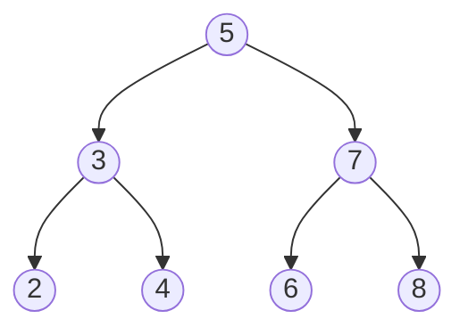
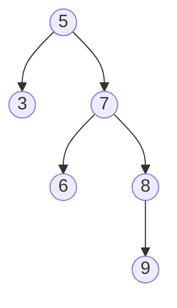
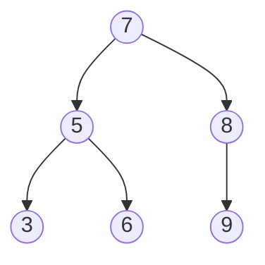

# 平衡二叉树

## 介绍

平衡二叉树（Balanced Binary Tree）是一种特殊的二叉搜索树（BST），它的左右子树的高度差不超过1。这种特性使得平衡二叉树在插入、删除和查找操作中能够保持较高的效率，避免了普通二叉搜索树可能退化为链表的情况。

:::note
平衡二叉树的主要目标是确保树的高度尽可能低，从而提高操作的效率。
:::

## 为什么需要平衡二叉树？

在普通的二叉搜索树中，如果插入的数据是有序的（例如递增或递减），树可能会退化为链表，导致查找、插入和删除操作的时间复杂度从O(log n)退化为O(n)。平衡二叉树通过自动调整树的结构，确保树的高度始终保持在O(log n)级别。

## 平衡二叉树的类型

常见的平衡二叉树包括：
- **AVL树**：通过旋转操作保持平衡。
- **红黑树**：通过颜色标记和旋转操作保持平衡。

本文将重点介绍AVL树。

## AVL树的基本概念

AVL树是一种自平衡二叉搜索树，它的每个节点的左右子树高度差（平衡因子）不超过1。如果插入或删除操作导致某个节点的平衡因子超过1，AVL树会通过旋转操作重新平衡树。

### 平衡因子

平衡因子（Balance Factor）是某个节点的左子树高度减去右子树高度的值。平衡因子的绝对值不超过1时，树是平衡的。



在上面的AVL树中，每个节点的平衡因子都是0、1或-1。

## AVL树的旋转操作

当插入或删除操作导致某个节点的平衡因子超过1时，AVL树会通过以下四种旋转操作来恢复平衡：

1. **左旋（Left Rotation）**
2. **右旋（Right Rotation）**
3. **左右旋（Left-Right Rotation）**
4. **右左旋（Right-Left Rotation）**

### 左旋示例



在上面的树中，节点7的平衡因子为-2，需要进行左旋操作。



左旋后，树重新平衡。

## 代码示例

以下是一个简单的AVL树的Python实现：

```python
class TreeNode:
    def __init__(self, key):
        self.key = key
        self.left = None
        self.right = None
        self.height = 1

class AVLTree:
    def insert(self, root, key):
        if not root:
            return TreeNode(key)
        elif key < root.key:
            root.left = self.insert(root.left, key)
        else:
            root.right = self.insert(root.right, key)

        root.height = 1 + max(self.getHeight(root.left), self.getHeight(root.right))

        balance = self.getBalance(root)

        if balance > 1 and key < root.left.key:
            return self.rightRotate(root)
        if balance < -1 and key > root.right.key:
            return self.leftRotate(root)
        if balance > 1 and key > root.left.key:
            root.left = self.leftRotate(root.left)
            return self.rightRotate(root)
        if balance < -1 and key < root.right.key:
            root.right = self.rightRotate(root.right)
            return self.leftRotate(root)

        return root

    def leftRotate(self, z):
        y = z.right
        T2 = y.left

        y.left = z
        z.right = T2

        z.height = 1 + max(self.getHeight(z.left), self.getHeight(z.right))
        y.height = 1 + max(self.getHeight(y.left), self.getHeight(y.right))

        return y

    def rightRotate(self, z):
        y = z.left
        T3 = y.right

        y.right = z
        z.left = T3

        z.height = 1 + max(self.getHeight(z.left), self.getHeight(z.right))
        y.height = 1 + max(self.getHeight(y.left), self.getHeight(y.right))

        return y

    def getHeight(self, root):
        if not root:
            return 0
        return root.height

    def getBalance(self, root):
        if not root:
            return 0
        return self.getHeight(root.left) - self.getHeight(root.right)
```

## 实际应用场景

平衡二叉树广泛应用于需要高效查找、插入和删除操作的场景，例如：
- 数据库索引
- 内存中的有序数据结构
- 编译器中的符号表

## 总结

平衡二叉树通过保持树的平衡，确保了高效的查找、插入和删除操作。AVL树是其中一种常见的实现方式，通过旋转操作来维持平衡。理解平衡二叉树的概念和实现，对于掌握更复杂的数据结构和算法至关重要。

## 附加资源与练习

- **练习**：尝试实现一个AVL树，并测试其插入、删除和查找操作的性能。
- **进一步阅读**：
  - 《算法导论》中的平衡二叉树章节
  - 红黑树的实现与应用

:::tip
通过动手实现和调试平衡二叉树，你将更深入地理解其工作原理和优势。
:::