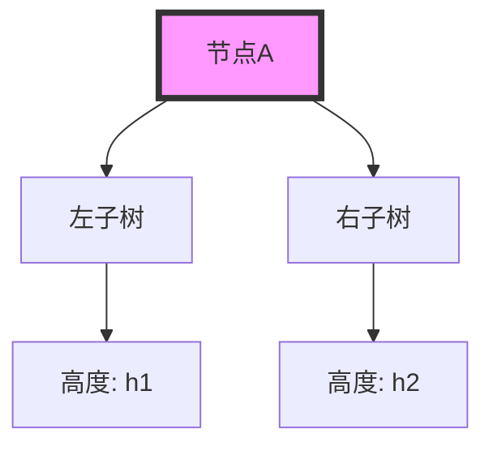
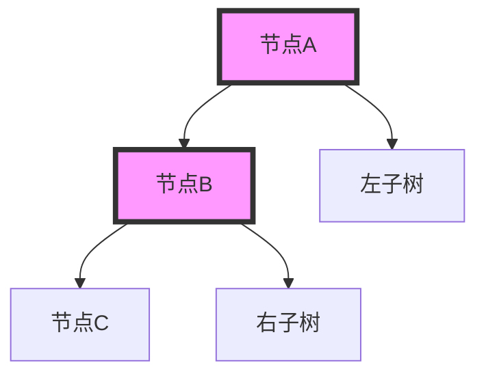
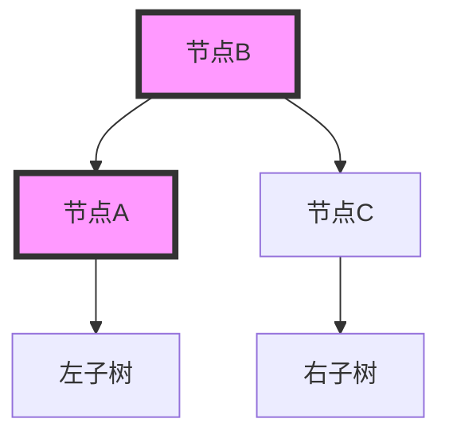
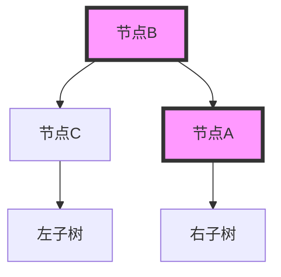

# AVL树

AVL树（Adelson-Velsky和Landis树）是一种自平衡二叉搜索树（BST）。它的主要特点是能够通过旋转操作自动保持树的平衡，从而确保在最坏情况下也能保持O(log n)的时间复杂度。AVL树在数据库、文件系统和内存管理等领域有广泛应用。

## 什么是AVL树？

AVL树是一种二叉搜索树，其中每个节点的左右子树高度差（平衡因子）不超过1。如果某个节点的平衡因子超过1或小于-1，树会通过旋转操作重新平衡。

### 平衡因子

平衡因子是节点的左子树高度减去右子树高度。对于AVL树，平衡因子的绝对值必须小于或等于1。



在上图中，节点A的平衡因子为 `h1 - h2`。

## AVL树的旋转操作

当插入或删除节点导致树不平衡时，AVL树会通过以下四种旋转操作之一来恢复平衡：

1. **左旋（Left Rotation）**
2. **右旋（Right Rotation）**
3. **左右旋（Left-Right Rotation）**
4. **右左旋（Right-Left Rotation）**

### 左旋

左旋用于处理右子树过高的情况。假设节点A的右子树B过高，我们可以通过左旋将B提升为新的根节点，A成为B的左子树。



左旋后：



### 右旋

右旋用于处理左子树过高的情况。假设节点A的左子树B过高，我们可以通过右旋将B提升为新的根节点，A成为B的右子树。


右旋后：



### 左右旋和右左旋

左右旋和右左旋是复合旋转操作，用于处理更复杂的不平衡情况。

## 代码示例

以下是一个简单的AVL树实现，包含插入和旋转操作。

```python
class Node:
    def __init__(self, key):
        self.key = key
        self.left = None
        self.right = None
        self.height = 1

class AVLTree:
    def insert(self, root, key):
        if not root:
            return Node(key)
        elif key < root.key:
            root.left = self.insert(root.left, key)
        else:
            root.right = self.insert(root.right, key)

        root.height = 1 + max(self.getHeight(root.left), self.getHeight(root.right))

        balance = self.getBalance(root)

        if balance > 1 and key < root.left.key:
            return self.rightRotate(root)

        if balance < -1 and key > root.right.key:
            return self.leftRotate(root)

        if balance > 1 and key > root.left.key:
            root.left = self.leftRotate(root.left)
            return self.rightRotate(root)

        if balance < -1 and key < root.right.key:
            root.right = self.rightRotate(root.right)
            return self.leftRotate(root)

        return root

    def leftRotate(self, z):
        y = z.right
        T2 = y.left

        y.left = z
        z.right = T2

        z.height = 1 + max(self.getHeight(z.left), self.getHeight(z.right))
        y.height = 1 + max(self.getHeight(y.left), self.getHeight(y.right))

        return y

    def rightRotate(self, z):
        y = z.left
        T3 = y.right

        y.right = z
        z.left = T3

        z.height = 1 + max(self.getHeight(z.left), self.getHeight(z.right))
        y.height = 1 + max(self.getHeight(y.left), self.getHeight(y.right))

        return y

    def getHeight(self, root):
        if not root:
            return 0
        return root.height

    def getBalance(self, root):
        if not root:
            return 0
        return self.getHeight(root.left) - self.getHeight(root.right)
```

### 输入和输出

假设我们插入以下键值：10, 20, 30, 40, 50, 25。

```python
avl = AVLTree()
root = None
keys = [10, 20, 30, 40, 50, 25]

for key in keys:
    root = avl.insert(root, key)
```

输出将是一个平衡的AVL树。

## 实际应用场景

AVL树在以下场景中有广泛应用：

1. **数据库索引**：AVL树用于快速查找、插入和删除记录。
2. **内存管理**：操作系统使用AVL树来管理内存块。
3. **文件系统**：文件系统使用AVL树来快速查找文件和目录。

## 总结

AVL树是一种高效的自平衡二叉搜索树，能够确保在最坏情况下也能保持O(log n)的时间复杂度。通过旋转操作，AVL树能够在插入或删除节点后自动恢复平衡。

## 附加资源

- [AVL树维基百科](https://en.wikipedia.org/wiki/AVL_tree)
- [AVL树可视化工具](https://www.cs.usfca.edu/~galles/visualization/AVLtree.html)

## 练习

1. 实现一个AVL树的删除操作。
2. 编写一个函数，检查给定的二叉树是否是AVL树。
3. 尝试在AVL树中插入大量随机数据，并观察树的平衡性。

:::tip
提示：在实现AVL树时，确保每次插入或删除后都检查并调整树的平衡。
:::