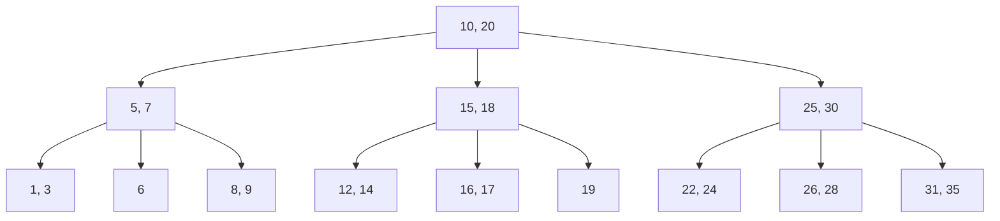
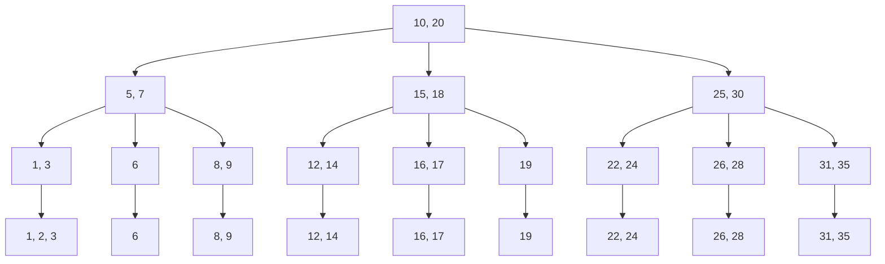

# B树与B+树

## 介绍

B树和B+树是两种常见的**自平衡树**数据结构，广泛用于数据库和文件系统中。它们的设计目的是为了高效地管理大量数据，并支持快速的查找、插入和删除操作。B树和B+树的主要区别在于它们的节点结构和数据存储方式。

- **B树**：每个节点可以存储多个键和子节点，数据分布在所有节点中。
- **B+树**：只有叶子节点存储数据，内部节点仅存储键和指向子节点的指针。

这两种树结构都通过保持树的平衡来确保操作的时间复杂度为O(log n)，其中n是树中元素的数量。

## B树

### 结构

B树是一种多路搜索树，每个节点可以包含多个键和多个子节点。B树的定义如下：

- 每个节点最多有`m`个子节点，其中`m`称为B树的阶。
- 每个节点（除了根节点）至少有`ceil(m/2)`个子节点。
- 根节点至少有2个子节点（除非它是叶子节点）。
- 所有叶子节点位于同一层。



### 操作

#### 查找

在B树中查找一个键的过程类似于二叉搜索树，但由于每个节点有多个键，因此需要在节点内部进行线性或二分查找。

#### 插入

插入操作可能会导致节点分裂，从而保持树的平衡。具体步骤如下：

1. 从根节点开始，找到合适的叶子节点插入键。
2. 如果叶子节点的键数未超过上限，则直接插入。
3. 如果叶子节点的键数超过上限，则进行分裂，并将中间键提升到父节点。
4. 如果父节点的键数也超过上限，则继续向上分裂，直到根节点。

#### 删除

删除操作可能会导致节点合并或重新分配键，以保持树的平衡。具体步骤如下：

1. 找到要删除的键所在的节点。
2. 如果键在叶子节点中，则直接删除。
3. 如果键在内部节点中，则用后继键替换，并删除后继键。
4. 如果删除后节点的键数低于下限，则从兄弟节点借键或与兄弟节点合并。

### 代码示例

以下是一个简单的B树插入操作的Python代码示例：

```python
class BTreeNode:
    def __init__(self, leaf=True):
        self.keys = []
        self.children = []
        self.leaf = leaf

class BTree:
    def __init__(self, t):
        self.root = BTreeNode()
        self.t = t

    def insert(self, key):
        root = self.root
        if len(root.keys) == (2 * self.t) - 1:
            new_root = BTreeNode(leaf=False)
            new_root.children.append(self.root)
            self._split_child(new_root, 0)
            self.root = new_root
        self._insert_non_full(self.root, key)

    def _insert_non_full(self, node, key):
        i = len(node.keys) - 1
        if node.leaf:
            node.keys.append(None)
            while i >= 0 and key < node.keys[i]:
                node.keys[i + 1] = node.keys[i]
                i -= 1
            node.keys[i + 1] = key
        else:
            while i >= 0 and key < node.keys[i]:
                i -= 1
            i += 1
            if len(node.children[i].keys) == (2 * self.t) - 1:
                self._split_child(node, i)
                if key > node.keys[i]:
                    i += 1
            self._insert_non_full(node.children[i], key)

    def _split_child(self, parent, index):
        t = self.t
        child = parent.children[index]
        new_child = BTreeNode(leaf=child.leaf)
        parent.keys.insert(index, child.keys[t - 1])
        parent.children.insert(index + 1, new_child)
        new_child.keys = child.keys[t:(2 * t) - 1]
        child.keys = child.keys[0:t - 1]
        if not child.leaf:
            new_child.children = child.children[t:2 * t]
            child.children = child.children[0:t]

# 示例使用
btree = BTree(3)
btree.insert(10)
btree.insert(20)
btree.insert(5)
btree.insert(6)
btree.insert(12)
btree.insert(30)
```

## B+树

### 结构

B+树与B树的主要区别在于：

- 所有数据都存储在叶子节点中，内部节点仅存储键和指向子节点的指针。
- 叶子节点通过指针连接，形成一个有序链表，便于范围查询。



### 操作

#### 查找

B+树的查找操作与B树类似，但由于所有数据都存储在叶子节点中，因此查找最终都会到达叶子节点。

#### 插入

B+树的插入操作与B树类似，但插入后需要确保叶子节点之间的链表连接正确。

#### 删除

B+树的删除操作也与B树类似，但删除后需要确保叶子节点之间的链表连接正确。

### 实际应用

B+树广泛应用于数据库系统中，特别是用于索引的实现。由于B+树的叶子节点形成了有序链表，因此非常适合范围查询。

:::tip
**范围查询**：在数据库中，如果需要查询某个范围内的数据，B+树的叶子节点链表可以快速定位到起始点，并顺序遍历到结束点。
:::

## 总结

B树和B+树是两种重要的数据结构，它们在数据库和文件系统中扮演着关键角色。B树适合随机访问，而B+树则更适合范围查询。理解这两种树的结构和操作对于深入学习数据库和文件系统至关重要。

## 附加资源

- [B树与B+树的详细讲解](https://en.wikipedia.org/wiki/B-tree)
- [B树与B+树的实现代码](https://github.com/your-repo/b-tree-implementation)
- [数据库索引与B+树](https://www.geeksforgeeks.org/introduction-of-b-tree/)

## 练习

1. 实现一个B树的删除操作。
2. 比较B树和B+树在范围查询中的性能差异。
3. 在数据库中，为什么B+树比B树更适合作为索引结构？